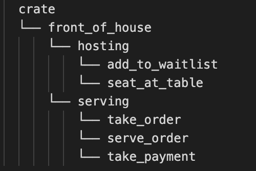
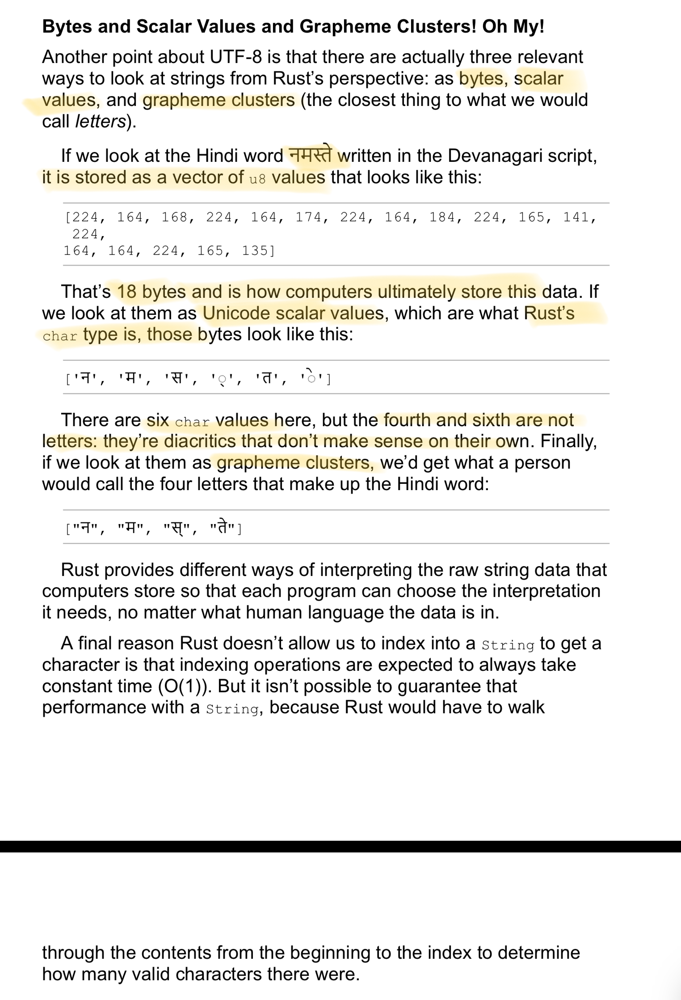

- [Introduction](#introduction)
- [Chapter 1](#chapter-1)
    - [Installing Rust](#installing-rust)
    - [Intro to Cargo](#intro-to-cargo)
- [Chapter 2](#chapter-2)
    - [The `use` Statement](#the-use-statement)
    - [Cargo](#cargo)
    - [Match Expressions](#match-expressions)
    - [Shadowing](#shadowing)
- [Chapter 3](#chapter-3)
    - [Variables](#variables)
    - [Constants](#constants)
    - [Shadowing](#shadowing-1)
    - [Scalar Data Types](#scalar-data-types)
    - [Compound Data Types](#compound-data-types)
    - [Functions](#functions)
    - [Parameters](#parameters)
    - [Statements and Expressions](#statements-and-expressions)
    - [Functions with Return Values](#functions-with-return-values)
    - [Comments](#comments)
    - [Control Flow](#control-flow)
    - [Loops](#loops)
- [Chapter 4](#chapter-4)
    - [Ownership](#ownership)
    - [References](#references)
    - [Mutable References](#mutable-references)
    - [Dangling References](#dangling-references)
    - [The Rules of References](#the-rules-of-references)
      - [The Slice Type](#the-slice-type)
      - [Other Slices](#other-slices)
- [Chapter 5](#chapter-5)
    - [Structs](#structs)
    - [Tuple Structs](#tuple-structs)
    - [Unit-Like Structs without Any Fields](#unit-like-structs-without-any-fields)
    - [Methods](#methods)
    - [Methods with more parameters](#methods-with-more-parameters)
    - [Associated Functions](#associated-functions)
- [Chapter 6](#chapter-6)
    - [Enums](#enums)
    - [Option Enum](#option-enum)
    - [The match Control Flow Construct](#the-match-control-flow-construct)
    - [Patterns that bind to values](#patterns-that-bind-to-values)
    - [Matching with `Option<T>`](#matching-with-optiont)
    - [Catch-All Patterns and the \_ Placeholder](#catch-all-patterns-and-the-_-placeholder)
    - [Concise Control Flow with if let](#concise-control-flow-with-if-let)
- [Chapter 7](#chapter-7)
    - [Packages and Crates](#packages-and-crates)
    - [Defining Modules to Control Scope and Privacy](#defining-modules-to-control-scope-and-privacy)
    - [Paths for Referring to an item in a Module Tree](#paths-for-referring-to-an-item-in-a-module-tree)
    - [Starting Relative Paths with super](#starting-relative-paths-with-super)
    - [Making Structs and Enums Public](#making-structs-and-enums-public)
    - [Bringing Paths into Scope with the use Keyword](#bringing-paths-into-scope-with-the-use-keyword)
    - [Re-exporting Names with pub use](#re-exporting-names-with-pub-use)
    - [Using External Packages](#using-external-packages)
    - [Using Nested Paths to Clean Up Large use Lists](#using-nested-paths-to-clean-up-large-use-lists)
    - [The Glob Operator](#the-glob-operator)
    - [Separating Modules into Different Files](#separating-modules-into-different-files)
- [Chapter 8](#chapter-8)
  - [Vectors](#vectors)
    - [Storing Lists of Values with Vectors](#storing-lists-of-values-with-vectors)
    - [Updating a vector](#updating-a-vector)
    - [Reading Elements of Vectors](#reading-elements-of-vectors)
    - [Iterating Over the Values in a Vector](#iterating-over-the-values-in-a-vector)
    - [Using an Enum to Store Multiple Values](#using-an-enum-to-store-multiple-values)
    - [Dropping a Vector Drops Its Elements](#dropping-a-vector-drops-its-elements)
  - [Strings](#strings)
    - [Storing UTF-8 Encoded Text with Strings](#storing-utf-8-encoded-text-with-strings)
    - [What is a String?](#what-is-a-string)
    - [Creating a new String](#creating-a-new-string)
    - [Updating a String](#updating-a-string)
    - [Concat with + or format! Macro](#concat-with--or-format-macro)
    - [Indexing into Strings](#indexing-into-strings)
    - [Bytes and Scalar Values and Grapheme Clusters](#bytes-and-scalar-values-and-grapheme-clusters)
    - [Slicing Strings](#slicing-strings)
    - [Methods for Iterating Over Strings](#methods-for-iterating-over-strings)
  - [Storing Keys with Associated Values in Hash Maps](#storing-keys-with-associated-values-in-hash-maps)
    - [Creating a New Hash Map](#creating-a-new-hash-map)
    - [Accesssing Values in a Hash Map](#accesssing-values-in-a-hash-map)
    - [HashMaps and Ownership](#hashmaps-and-ownership)
    - [Updating a Hash Map](#updating-a-hash-map)
    - [Overwriting a value](#overwriting-a-value)
    - [Adding a Key and Value Only if a Key Isn't Present](#adding-a-key-and-value-only-if-a-key-isnt-present)
    - [Updating a Value Based on the Old Value](#updating-a-value-based-on-the-old-value)
- [Chapter 9](#chapter-9)
    - [Unrecoverable Errors with panic!](#unrecoverable-errors-with-panic)
    - [Recoverable Errors with Result](#recoverable-errors-with-result)
    - [Matching on Different Errors](#matching-on-different-errors)
    - [Alternatives to Using match with Result\<T, E\>](#alternatives-to-using-match-with-resultt-e)
    - [Shortcuts for Panic on Error: unwrap and expect](#shortcuts-for-panic-on-error-unwrap-and-expect)
    - [Propagating Errors](#propagating-errors)
    - [A Shortcut for Propagating Errors: The ? Operator](#a-shortcut-for-propagating-errors-the--operator)
    - [Where the ? Operator Can Be Used](#where-the--operator-can-be-used)
    - [To panic! or Not to panic!](#to-panic-or-not-to-panic)
    - [Guidelines for Error Handling](#guidelines-for-error-handling)
    - [Creating Custom Types for Validation](#creating-custom-types-for-validation)

# Introduction

* Rust is designed to write fast AND safe code whose compiler works *with* you to help you.
* The Rust compiler catches errors that might occur with low-level development where you're managing your own memory.
* Every two or three years, the Rust team produces a new Rust edition. Each edition brings together the features that have landed into a clear package with fully updated documentation and tooling. Default edition is 2015 if not defined in the cargo.toml file.
* `cargo` is the included dependency manager and build tool that makes adding, compiling, and managing dependencies painless and consistent across the Rust ecosystem.
* `rust-analyzer` is Rust's language server and provides features like IntelliSense.
* `rustc` is the Rust compiler.
* `rustdoc` is the documentation tool.
* `rustfmt` is the formatting tool.
  * `rustfmt` allows finer-grained control and `cargo-fmt` understands conventions of a project that uses Cargo. 
* `rustup` is a command line tool for managing Rust versions and associated tools.
* Clippy is Rust's static analyzer.
* `cargo fix` automatically upgrades your code to a new edition.

# Chapter 1

### Installing Rust
* The version of curl that is installed by homebrew does not support the `-tls` option, so removing it from the default rust install command line fixed the error: "curl: (4) A requested feature, protocol or option was not found built-in in this libcurl due to a build-time decision." 

### Intro to Cargo
* TOML stands for Tom's Obvious, Minimal Language.
* Packages of code are referred to as crates.
  * There's binaary crates and library crates.
* We can create a project using `cargo new`.
* We can build a project using `cargo build`.
  * TO build it for release, we use `cargo build --release`.
* We can build and run a project in one step using `cargo run`.
* We can build a project without producing a binary to check for errors using `cargo check`.
* Instead of saving the result of the build in the same directory as our code, Cargo stores it in the target/debug directory.

# Chapter 2

### The `use` Statement
* By default, Rust has a set of items defined in the standard library that it brings into the scope of every program. This set is called the prelude.
  * If a type you want to use isn’t in the prelude, you have to bring that type into scope explicitly with a `use` statement.

### Cargo
* When we include an external dependency, Cargo fetches the latest versions of everything that dependency needs from the registry, which is a copy of data from Crates.io.
* After updating the registry, Cargo checks the `[dependencies]` section and downloads any crates listed that aren’t already downloaded.
* Cargo.lock is usually checked into source control to ensure reproducible builds.
  * When you build a project for the first time, Cargo figures out all the versions of the dependencies that fit the criteria and then writes them to the Cargo.lock file. When you build your project in the future, Cargo will see that the Cargo.lock file exists and will use the versions specified there rather than doing all the work of figuring out versions again. This lets you have a reproducible build automatically. In other words, your project will remain at 0.8.5 until you explicitly upgrade, thanks to the Cargo.lock file. Because the Cargo.lock file is important for reproducible builds, it’s often checked into source control with the rest of the code in your project.


### Match Expressions
* A `match` expression is made up of arms. An arm consists of a pattern to match against, and the code that should be run if the value given to `match` fits that arm’s pattern. Rust takes the value given to `match` and looks through each arm’s pattern in turn. Patterns and the `match` construct are powerful Rust features: they let you express a variety of situations your code might encounter and they make sure you handle them all.


### Shadowing
* Rust allows us to shadow/reuse varibale names rather than forcing us to create two unique variables.

# Chapter 3

### Variables
* Variables are immutable by default and the `mut` keyword can be used to make them mutable.

### Constants
* `const` keyword can be used to declare a constant. Its value cannot change and we cannot use `mut` keyword with `const`s.
  * `const`s aren't just immutable by default, they are always immutable.
* They are declared using the `const` keyword, not `let`.
* We must always annotate the type for constants.
* Constants can only be set to a constant expression, not the result of a value that could only be computed at run time.

### Shadowing
* The second varibale overshadows the first, taking any uses of the variable name to itself until either it itself is shadowed or the scope ends.
* Shadowing != making a variable `mut`.
* When we shadow a variable, we can change the type of the value but reuse the same name.
  * But if we try to use the same name with `mut` and have a different type in the variable that is shadowing, we'll get a mismatched types compiler error.

### Scalar Data Types
* Rust is statically typed language, which means we must know the types of all variables at compile time.
  * ```Rust
    // we need to mention the type annotation `u32` otherwise the compiler won't know which type to parse "42" into
    let guess: u32 = "42".parse().expect("Not a number!");
    ```
* Integers
  * Unsigned integers; `u8`, `u16`, ..., `u128`, `usize`
  * Signed integers: `i8`, `i16`, ..., `i128`, `isize`
  * We can have Integer literals:
    * Decimal 98_000
    * Hex 0xff
    * Octal 0o77
    * Binary 0b1111_0000
    * Byte (u8 only) b'A'
  * `i32` is the default
  * We might use `isize` or `usize` when indexing some sort of collection.
  * Integer overflow: If our program results in an integer overflow in debug mode, our program will panic, but in release mode, Rust will perform two's complement wrapping so our program won't panic, but we might also not get the value we were expecting.
* Floating-point numbers
  * `f32` and `f64` (default)
  * All floating-point numbers are signed.
* Booleans
  * 1 byte in size; `true` or `false`
* Characters
  * Specified by single quotes; 4 bytes in size
  * They represent scalar values, which means it can represent a lot more than ASCII: accented letters, Chinese, emojis, etc.

### Compound Data Types
* Tuples
  * Tuples have a fixed size that cannot change once defined.
  * Each value in the tuple can be of a different type.
  * We can destructure a tuple or access a particular value at an index in the tuple.
  * The tuple without any values is called a "unit".
* Array
  * All values in the array must be of the same type.
  * Data is allocated on the stack.
  * An array is of fixed size too.
    * Vector type can grow and shrink.
  * We can initialize each element of an array to the same value as well.
  * If you access an out-of-bounds index from an array at runtime, Rust panics and gives an error instead of letting you access the memory you shouldn't be accessing.

### Functions
* Rust convention is to use snake_case for function and variable names.
* Rust doesn't care where you define your functions, as long as you define them somewhere in the scope of the caller.

### Parameters
* Function's signature has the following structure (parameter: type) as opposed to (type paramater) in some languages
* We must declare the type of each parameter.

### Statements and Expressions
* Statements are instructions that perform some action and do not return a value.
* Expressions evaluate to a resultant value.
  * Expressions do not include ending semicolons
  * ```Rust
    let y = {
      let x = 3;
      x + 1
    }
    ```

### Functions with Return Values
* We need to specify the return type after the `->` in the function signature.
* We can just have expressions in the function body without even a `return` or a `;` and that expression would be evaluated and the result be returned.

### Comments
* `//` idiomatic comment style
* Rust also supports documentation comments.

### Control Flow
* `if` Expressions
  * Standard `if`, `else`, and `else if`
  * We can use `if` in a `let` statement
  * Blocks of code associated with the conditions in `if` expressions are called arms,
    but each arm's value must be of the same type.
  * Rust will not evaluate a non-boolean to a boolean like so:
    ```Rust
    if number % 2 { };
    // So, we must do the following
    if number % 2 == 0 { };
    ```

### Loops
* `loop`
  * We can return values from `loop` by adding that expression after the `break` expression; see ch3/ch3/src/main.rs
  * For loops within loops, `break` and `continue` apply to the innermost loop by default.
  * We can have a loop label to specify a certain `break` or `continue` applies to which loop instead of the innermost one.
  * Loop labels begin with a `'`.
  
* `while`
  * conditional loop
  * can be implemented using `loop`, `if`, `else`, and `break` but `while` is much more common and better.
  
* `for`
  * conditional loop
  * loop through a collection like an array. We can do this using `while` as we check for the index being <= our array's length, but `for` is cleaner, better, and safer.

# Chapter 4

### Ownership
* Memory in Rust is managed through a system of ownership with a set of rules that the compiler enforces.
* Keeping track of what parts of code are using what data on the heap, minimizing the amount of duplicate data on the heap, and cleaning up unused data on the heap so we don't run out of space are all problems that ownership addresses.
* Rules:
  * Each value in Rust has an owner
  * There can only be one owner at a time
  * When the owner goes out of scope, the value will be dropped
* `String` type can be mutated but String literals cannot and that is because of the difference in how these two types deal with memory (stack vs heap).
  * When the size of a string is known as compile time, like literals, they are hardcoded in the final executable, so their size cannot change.
  * When the size of a String is unknown at compile time and can change during the program's execution, they are allocated on the heap during runtime.
* Some languages have a garbage collector and some require the programmer to manage the memory (`allocate` and `free`). In Rust, the memory is automatically returned once the variable that owns it goes out of scope, using a function called `drop`.
* When we do something like the following:
    ```Rust
    let s1 = String::from("Hello");
    let s2 = s1;
    ```
  The data from the stack is `move`d into s1 instead of making a shallow copy. This means that when s1 and s2 go out of scope, Rust doesn't try to `drop` the same memory twice. This also means that after `let s2 = s1;`, we cannot use `s1` anymore.
* Rust never creates deep copies of data automatically, instead we use `clone()` to make a deep copy, which is more expensive than `move`.
* For data types with known size at compile type (e.g. integers), we don't have to call clone and nothing is moved into the new variable but a copy of the value is made. This copy is inexpensive since we already know the size of the variable at compile time and the values are stored on the stack.
  * `Copy` trait can be placed on types that are stored on the stack that makes the variable's values being copied instead of `move`d.
  * We cannot add `Copy` trait to types that implement the `Drop` trait.
* Passing a variable to a function will move or copy, just as assignment does.
* Returning values can also transfer ownership.
* The ownership of a variable follows the same pattern every time: assigning a value to another variable moves it. When a variable that includes data on the heap goes out of scope, the value will be cleaned up by `drop` unless ownership of the data has been moved to another variable.

### References
* Taking ownership and then returning ownership with every function is tedious.
* References let us let a function use a value but not take ownership.
* A reference is like a pointer in that it's an address we can follow to access the data stored at that address; the data is owned by some other variable.
* Unlike a pointer, a reference is guaranteed to point to a valid value of a particular type for the life of that reference.
*  A reference's scope starts where it is introduced and continues through the last time that reference is used.
* Because a function that takes in a reference does not have ownership to what was passed into it, the value pointed to by the reference is not dropped when the reference is last used.
* Just as variables are immutable by default, so are references.

### Mutable References
* Using `mut`, we can make references mutable.
* Mutable references have one big restriction: if you have a mutable reference to a value, you can have no other references to that value AT THE SAME TIME. We cannot borrow a reference as mutable more than once or have a mutable and a non-mutable reference at the same time.
* Having this restriction prevents data races at compile time.
* Data races occur when:
  * Two or more pointers access the same data at the same time.
  * At least one of the pointers is being used to write to the data.
  * There’s no mechanism being used to synchronize access to the data.
* We can create a new scope using {} to allow multiple mutable references, just not simulatenous ones.
* We also cannot have a mutable reference while we have an immutable one to the same value -- Users of an immutable reference do not expect the value to suddenly change out from under them!
* Multiple immutable references are allowed because no one who is just reading the data has the ability to change the value and affect anyone else's reading of data.
* If scopes of references don't overlap, we can borrow a value with a mutable reference after the immutable reference's scope ends.
* **Important: At any given time, you can have either one mutable reference or any number of immutable references.**
  
### Dangling References
* In languages with pointers, it is easy to mistakenly create a dangling pointer by freeing some memory while preserving a pointer to that memory, but not in Rust!

### The Rules of References
#### The Slice Type
* Slices let you reference a contigious sequence of elements in a collection rather than the whole collection.
* A slice is a kind of a reference, so it does not have ownership.
* `iter()` is a method that returns each element in a collection and `enumerate()` wraps the result of `iter()` and returns each element as part of a tuple. The first element is the index and the second is a reference to the element.
* `first_space_index()` in main.rs is a good solution but since the return value `usize` is separate from the input `string`, there's no guarantee that it will still be valid in the future. Look at the caller of `first_space_index()`. In other words, `usize` isn't tied to the state of the `string` that could lead to bugs.
* Rust has a solution to this problem: string slices, which is a reference to part of a string: `&string[starting_index..ending_index]`, where `ending_index` is one more than the index you want the slice to end.
* Using the slice version `_string_slice()` will throw a compile error helping us catch the problem at compile time since we now return `&str` instead of a `usize`.
* String slices' type is `&str`.
* `[0..2]` and `[..2]` are equal. You can drop the 0 if you want to start at 0 with this range syntax. `[3..]` means 3 onwards to the last index and `[..]` means the slice of the entire string.
* **Note:** if we try to create a slice in the middle of multibyte character, the program will exit with an error.
* We can improve the signature from `fn string_slice(string: &String) -> &str` to `fn string_slice(string: &str) -> &str`.
  * If we have a string slice, we can pass that directly instead of having to convert to a `String` with `to_string()`.
  * If we have a String, we can pass a slice of that String or a reference to the String, since Strings are `str`s.
  * This flexibility takes advantage of "deref coersions" -- covered later.
  * Defining a function to take a string slice instead of a reference to a String makes our API more general.
* String literals are string slices already.

#### Other Slices
*  There's a more general type of slice as well.
*  We can slice an array of `i32`
   *  ```Rust
      let a = [1,2,3];
      let slice = &a[0..2]; // slice will be [1,2] and of type &[i32]
      ```

# Chapter 5

### Structs
* Structs allow us to structure custom, related values into a meaningful group.
* Like in tuples, the values in structs can have different data types.
* Unlike in tuples, we can name these groups of values so we don't have to rely on the order of the values.
* We create an `instance` of a `struct` using `{}` and the ending curly brace has  a `;`.
* To access a specific value in the struct, we use the dot notation.
* If the instance is mutable, we can use dot notation to change the value in that instance.
* The entire instance should be mutable; Rust doesn't allow certain fields to be mutable.
* As with any expression, we can construct a new instance of the struct as the last expression in the function body to implicitly return a new instance.
  * It makes sense to name the function parameters with the same name as the struct fields, but if there's many fields in the Struct, this can be tedious.
  * There's a solution: "Field Init Shorthand"
    * If the parameters are exactly the same as the struct field names, we can use the field init shorthand. See `build_user_2`.
* Sometimes, we want to create a new instance of a struct that includes most of the values from another instance but changes some. We can do this with the "Struct Update Syntax"
    * ``` Rust
      let user2 = User {
        email: String::from("new@test.com"),
        ..user1 // this must come last
      };
      ```
  * But now, data from `user1` has moved into `user2` so we can no longer use `user1`. Specifically, the `String` in `user1` was moved into `user2`.
  * If we had used new values for both `email` and `username` and thus only used values for `active` and `sign_in_count` from `user1` to construct `user2`, then `user1` would still be valid because that data implements the `Copy` trait and "Stack-Only Data: Copy" occurs for them.
* The `println!` macro uses `Display` formatting as the default when we use `{}`. This is output intended for direct end user consumption.
  * The primitive types implement `Display` by default.
  * Using `{:?}` says we want to use an output format called `Debug`, which we can add using `#[derive(Debug)]` on the Struct. Rust includes functionality for us to print out debugging informating but we need to opt-in to use it.
    * `{:#?}` will print the output a little more prettier.
  * Or we can use the `dbg!` macro too
    * It takes ownership of an expression (as opposed to `println!` that takes a reference), prints the file and line number of where that `dbg!` macro call occurs along with the resultant value of that expression and returns ownership of the value.
    * It prints to the `stderr`.
    * We can do something like the following since `dbg!` returns ownership, `radius` would have the same value as it would without `dbg!`.
      * ```Rust 
        let circle = Circle(radius: dbg!{1 * scale});
        ```

### Tuple Structs
* Tuple structs have the added meaning the struct name provides, but they don't have names with each field in the struct; rather each field just has types.
* Tuple structs are useful when you want to give the whole tuple a name and make the tuple a different type from other tuples.
* Each tuple struct is its own type even when the types of the fields in structs might be the same.
* We can use the index after the `.` to access each field.

### Unit-Like Structs without Any Fields
* Unit-like structs are structs that don't have nay fields.
* They behave similarly to `()`: the unit type.
* They are useful when you need to implement a trait on some type but don't have any data that you want to store in the type itself.
* We don't need `{}` when defining or instantiating unit-like structs.


### Methods
* Our `area_struct()` function in rectangles/src/main.rs is specific to Rectangles.
* Methods are similar to functions: we declare them with `fn` and a name, they can have parameters and a return value, and they run some code when the method is called from somewhere.
* Unlike functions, methods are defined within the context of a struct (or an enum or a trait object), and their first parameter is always `self`, which represents the instance of the struct the method is being called on.
* To define a method within the context of a struct etc, we use the `impl` block. Each struct is allowed to have more than 1 `impl` blocks.
* Methods can take ownership of `self`, borrow `self` immutably, or borrow `self` mutably, just ask they can any other parameter.
* `&self` is short for `self: Self` and within an `impl` block, the type `Self` is an alias for the type that the `impl` block is for. 
  * Methods must have a parameter named `self` of type `Self` for their first parameter, so Rust lets us abbreviate this with only the first name `self` in the first parameter spot.
  * `&self` in the method parameter means we don't want to take ownership; we want to just read the data.
  * `self` would mean we would take ownership.
  * `&mut self` would mean we'd take ownership to modify.
* We can choose to give the method the same name as one of our fields. These are usually used as getters. Like `rect1.width()`.
* `->`
  * In C and C++, we use `.` if we're calling a method on the object and `->` if we're calling a method on the pointer to an job and need to dereference it first. Like:
    ```C++
    // these 2 are the same in C++, but 1 is cleaner
    object->something();
    (*object).something();
    ```
  * Rust has something called "automatic referencing and dereferencing". When we call a method with `object.something()`, Rust automatically adds `&`, `&mut`, or `*` so `object` matches the signature of the method. Like:
    ```Rust
    // these 2 are the same in Rust, but 1 is cleaner
    p1.distance(&p2);
    (&p1).distance(&p2);
    ```
  * Given the receiver and the name of the  method, Rust can figure out whether the method is reading `&self`, mutating (`&mut self`), or consuming (`self`).

### Methods with more parameters
* See rectangles/src/main.rs

### Associated Functions
* All functions within an `impl` block are called associated functions since they're associated with the type names after `impl`.
* We can define associated functions that don't have `self` as their first parameter (and thus not methods) because they don't need an instance of the type to work with.
* Associated functions that aren't methods are often used for constructors that will use a create instance of the struct.

# Chapter 6

### Enums
* Enums allow you to define a type by enumerating its possible variants. It is a way of saying that a value is a one of a possible set of values.
* Variants of the enum are namespaced under its identifier, and we use `::` to separate the two. All values in an enum are of the same type.
* Rather than an enum inside a struct, we can put data directly into each enum variant. Because we attach data to each variant of the enum directly, there is no need for an extra struct.
  * This way, the name of each enum variant that we define also becomes a function that constructs an instance of that enum.
  * This has another advantage over using the enum in the struct: each variant can have different types and amounts associated data. E.g. in our `IpAddr` example, `V4` can have 4 numeric components between 0 and 255, while `V6` can still be constructed with a String.
  * You can put any kind of data inside an enum variant: strings, numeric types, structs, or even another enum. Look at `enum Message` in ch6/src/main.rs.
* We're also able to define methods on enums using `impl` as we are with structs.

### Option Enum
* The `Option<T>` type encodes the very common scenario in which a value could be something or could be nothing. It is another enum defined by the standard library.
* Rust doesn't have the null feature because if you try to use a null value as a non-null value, it would lead to errors.
  * But Rust does have the concept of a value being present or absent.
* `Option<T>` is included in the prelude and its variants `Some` and `None` that can be used **without** `Option::`.
* When we define an `Option` with `None` as its initial value, we need to give the variable an explicit type where the parameter `T` is specified so that the compiler knows what the type of variable should be.
* If we try to use `Option<T>`, even if it has a value `Some`, the compiler won't let us until we handle the case where that value could be `None`. We can do this using `match`.
* We have to convert an `Option<T>` to `T` before we can use it.

### The match Control Flow Construct
* `match` allows us to compare a value against a series of patterns and execute code based on which pattern matches.
* Patterns can be literal strings, variable names, wildcards, etc.
* `match` arms have 2 parts: a pattern and some code separated by `=>`. The arms' patterns must cover **all** possibilities.

### Patterns that bind to values
* Another useful feature of match is that they can bind to the parts of the values that match the pattern.
  * ```Rust
    enum Coin {
        Penny,
        Nickel,
        Dime,
        // binded to a UsState type
        Quarter(UsState),
    }
    ```

### Matching with `Option<T>`
* Look at ch6/src/main.rs

### Catch-All Patterns and the _ Placeholder  
* Using enums, we can also take special actions for a few particular values, but for all other values take one default action.
  * We have to put the catch-all arm at the end since the arms of `match` are evaluated in order. If we put the catch-all arm in the beginning, none of the other arms will ever be executed.
  * We can use `_` if we don't want to use the value in the catch-all pattern or we can assign any name to the value and use it as we want.
  * `_` matches any value and does not bind to that value telling Rust we aren't going to use the value.
  * We can use the unit value `()` to indicate we don't want to do anything.

### Concise Control Flow with if let
* `if let` can be useful in situations where `match` is a bit wordy as it lets us handle values that match one pattern while ignoring the rest.
* `if let` prevents us from satisfying the `match` expression by adding `_ => ()`.
* `if let` means less boilerplate code, but we lose `match`'s exhaustive checking.
* We can think of `if let` that runs code when the value matches one pattern and ignores all other values.

# Chapter 7

* As our project grows, you should organize it by splitting it into multiple modules and then multiple files.
* A package can contain multiple binary crates and optionally one library crate.
* As a package grows, you can extract parts into separate crates that become external dependencies.
* For very large projects comprising a set of interrelated packages that evolve together, Cargo provides workspaces.
* Rust has a number of features that allow you to manage your code's organization, including which details are exposed, which details are private, and what names are in each scope. These features are sometimes collectively referred to as the module system & include packages, crates, modules and use, and paths.

### Packages and Crates


* Packages are a Cargo feature that lets you build, test, and share crates.
  * A package is a bundle of one or more crates that provides a set of functionality.
  * A package contains a Cargo.toml file that describes how to build those crates.
  * Cargo is actually a package that contains the binary crate for the command line tool you've been using to build those crates.
  * The Cargo package also contains a library crate that the binary crate depends on.
  * Other projects can depend on the Cargo library crate to use the same logic the Cargo command line tool uses.
  * A package can contain as many binary crates as you like, but at most one library crate.
  * A package must contain at least one crate whether it is a library crate or a binary crate.
  * Running `cargo new x` gives us a package named x.
  * A package can have multiple binary crates by placing files in src/bin directory: each file will be a seprate binary crate.
* A Crate is a tree of modules that produce a library or executable.
  * A crate is the smallest amount of code that the Rust compiler considers at a time.
  * Even if we run `rustc` instead of `cargo` and pass in a single file, it is treated as a crate.
  * Crates can contain modules and the modules may be defined in other files that get compiled with the crate.
  * A crate can come as a binary crate or a library crate.
    * Binary crates are programs you can compile to an executable that you can run.
      * Each must have a `main` function.
    * Library crates don't have a `main` function and they don't compile to an executable, but define functionality intended to be shared with multiple projects. E.g. `rand` crate.
  * The crate root is a source file that the Rust compiler starts from and makes up the root of the module of your crate.
  * Cargo follows a convention that src/main.rs is the crate root of a binary crate and src/lib.rs is the crate root for a library crate. The package name is used as the name for the executable and library crate that are built.
  * Cargo passes the crate root to `rustc` to build the binary or library.

* We can create a library crate using `crate new <name> --lib`
  * The contents of lib.rs form a module named crate at  the root of the crate's module structure known as the module tree like:
  
  * modules `hosting` and `serving` are siblings since they're defined within `front_of_house`.
  * module `hosting` is the child of module `front_of_house` and it in turn is the parent of `hosting`.

### Defining Modules to Control Scope and Privacy
* Modules (defined with `mod`) let us organize code within a crate for readability and easy reuse.
* Modules also allow us to control the privacy of items because code within a module is private by default.
  * Private items are internal implementation details not available for outside use.
  * We can make modules and the items in them public using `pub mod`, which exposes them to allow external code to use and depend on them.
* In Rust, all items (functions, methods, structs, enums, modules, and constants) are private to parent modules by default. If you want to make an item like a function or struct private, you put it in a module.
* Items in a parent module can’t use the private items inside child modules, but items in child modules can use the items in their ancestor modules.
  * This is because child modules wrap and hide their implementation details, but the child modules can see the context in which they’re defined.
* Making a module public with `pub` doesn't make its contents public.
* Since `eat_at_restaurant()` and `front_of_house` in `customer.rs` are defined in the same module (they're siblings), we don't have to add `pub` to `front_of_house` for `eat_at_restaurant()` to see it.

### Paths for Referring to an item in a Module Tree
* To show Rust where to find an item in a module tree, we use a path.
* A path can be of two forms, but both are followed by one or more identifiers followed by `::`.
  * An absolute path is the full path starting from a crate root
    * For code from an external crate, it begins with the crate name
    * For code from the current crate, it begins with `crate`
  * A relative path starts from the current module and uses `self`, `super`, or an identifier in the current module.


### Starting Relative Paths with super
* We can construct relative paths that begin in the parent module, rather than the current module or crate root by using `super` at the path's start.

### Making Structs and Enums Public
* We can also use `pub` to designate structs and enums as public, but there are a few extra details to the usage of `pub` with structs and enums. 
  * If we use `pub` before a struct definition, we make the struct public, but the struct’s fields will still be private. We can make each field public or not on a case-by-case basis.
    * Since `back_of_house::Breakfast` has a private field, the struct needs to provide a public associated function that contructs an instance of `Breakfast` (`summer` in our case), otherwise we wouldn't be able to construct an instance of `Breakfast` in `eat_at_restaurant` because we couldn't set the value of the private `seasonal_fruit` field in `eat_at_restaurant`.
  * In contrast, if we make an `enum` public, all of its variants are then public.

### Bringing Paths into Scope with the use Keyword
* `use` lets us bring a module into scope once and then use another, shorter name everywhere else in the scope.
* `use` only creates a shortcut for the particular scope in which the `use` occurs.
* Bringing the function’s parent module into scope with `use` means we have to specify the parent module when calling the function. Specifying the parent module when calling the function makes it clear that the function isn’t locally defined while still minimizing repetition of the full path.
* On the other hand, when bringing in structs, enums, and other items with `use`, it’s convention to specify the full path.
* Because Rust doesn't allow bringing 2 items with the same name into scope with `use`, we bring two types with the same name into the same scope using their parent modules or we can use `as` to specify a new local name for the type(s).

### Re-exporting Names with pub use
* When we bring a name into scope with `use`, the name is private to the scope.
* To enable the code that calls our code to refer to that name as if it had been defined in that code's scope, we can combine `pub` and `use`. This is called re-exporting since we're bringing an item into scope but also making that item available for others to bring into their scope.
* In module `customer`, if we didn't use `pub` in `pub use crate::front_of_house::hosting;`, external code would have to call `add_to_waitlist()` by using the path `restaurant::front_of_house::hosting::add_to_waitlist()`, but now it can just use `restaurant::hosting::add_to_waitlist()`.
* With `pub use`, we can write our code with one structure but expose a different structure (like here, external code doesn't have to think about `front_of_house`).


### Using External Packages
* We can add the package name and version in our Cargo.toml file which tells Cargo to download the package and any dependencies and make it available to our project.
* Then, we bring the definitions in the package into scope we use `use`.

### Using Nested Paths to Clean Up Large use Lists
* `use std::{cmp:Ordering, io}` instead of `use std::cmp::Ordering` and `use cmp::io` on separate lines.

### The Glob Operator
* If we want to bring all public items definede in a path into scope, we can specigy that path followed by the `*` operator like `use std::collection::*;`, but this can make it harder to tell what names are in scope.

### Separating Modules into Different Files
* If we put `hosting.rs` in the src directory, the compiler would expect the hosting.rs code to be in a `hosting` module declared in the crate root, and not declared as a child of the `front_of_house` module.
* Since `hosting` and `serving` are childs of `front_of_house`, we put them in a directory `src/front_of_house`.
* The compiler's rules for which files to check for which modules' code mean the directories and files more closely match the module tree.

# Chapter 8
* The data that collections point to is stored on the heap.


## Vectors

### Storing Lists of Values with Vectors
* `Vec<T>` allows you to store more than one value in a single data structure that puts all the values next to each other in memory.
* They store values of the same type.
* `let v: Vec<i32> = Vec::new()` creates a new, empty vector of type `i32` mentioned by the required type annotation to tell the compiler what data type will be stored in this vector.
* If we create the vector with initial values, we don't need the type annotation like `let v = vec![1,2,3];`.

### Updating a vector
* After making the vector `mut`, we can use `push()` to insert values in it.

### Reading Elements of Vectors
* We can use `v[index]` or `v.get(index)` to get the value at an index.
  * Out of bounds access with `v[index]` causes the program to panic.
  * Since `v.get(index)` gives us an Option, out of bounds access will give us a `None` without panicking.
  
### Iterating Over the Values in a Vector
* The rule that we can't have both mutable and immutable references to a vector at the same time applies here too.
  * **Note:** `.push()` takes a mutable borrow of the vector so we cannot use `push()` while having a immutable reference to an element in the vector like `let first = &v[0]`.
* `for i in &v {}` can be used to iterable over the elements in the vector.
  * `for i in &mut v {}` to iterate over mutable references to each element.
    * To change the value that the mutable reference refers to, we have to dereference using `*` first.
* Because of the reference to the vector that the `for` loop holds prevents us from removing or inserting items in the `for` loop body.

### Using an Enum to Store Multiple Values
* Variants of an enum are defined as the same type so when we need one type to represent elements of different types, we can define and use an enum.
* Using an enum plus a `match` expression means Rust will ensure at compile time that every possible case is handled.
* If you don't know the exhaustive set of types a program will get at runtime to store in a vector, the enum technique won't work, but we can use a Trait object.

### Dropping a Vector Drops Its Elements
* Like any other `struct`, a vector is freed when it goes out of scope.
* When the vector gets dropped, all of its contents are also dropped, meaning the integers it holds will be cleaned up.

## Strings

### Storing UTF-8 Encoded Text with Strings
* Strings are implemented as a collection of bytes, plus some methods to interpret those bytes as text.

### What is a String?
* The `String` type, which is provided by Rust’s standard library rather than coded into the core language as `str`, is a growable, mutable, owned, UTF-8 encoded string type.

### Creating a new String
* Many of the same operations available with `Vec<T>` are available with `String` as well because `String` is actually implemented as a wrapper around a vector of bytes with some extra guarantees, restrictions, and capabilities.
* We can use `String::from("string literal")` or `"string_literal".to_string()`.

### Updating a String
* `"hello".push_str("append this");` appends a String to the end of a String.
* `"hello".push('!');` appends only one character to the end.

### Concat with + or format! Macro
* We can use `+` to concat Strings. The `+` operator uses the `add()` method whose signature looks like `fn add(self, s: &str) -> String`.
* We can only add a `&str` to a `String`; we can’t add two `String` values together. But the type of `&s2` in main.rs is `&String`, not `&str`, as specified in the second parameter to `add`. So why does it compile?
  * The compiler can coerce the `&String` argument into a `&str`. When we call the `add` method, Rust uses a deref coercion, which turns `&s2 `into `&s2[..]`.
  * `&` with `str` in `add` shows `add` doesn't take ownership of `s2`. But since there's no `&` with `self`, ownership is tranferred to `add` and `s1` can no longer be used.
* For combining Strings in complicated ways, we can use the `format!` macro.
  * `format!` works like `println!` but instead of printing to the console, it returns the String with the contents.
  * `format!` doesn't take ownership either.

### Indexing into Strings
* Accessing a character in a String by index will result in an error in Rust because `String` doesn't implement the `Index<{integer}>` trait.
* This is because Rust Strings are encoded in UTF8 and each character might not be 1 byte and `string[0]` might result in an unexpected value.
  
### Bytes and Scalar Values and Grapheme Clusters
* Another point about UTF-8 is that there's actually 3 ways to look at strings in Rust: as bytes, scalar values, and grapheme clusters/letters.
* 

### Slicing Strings
* Indexing into a string is often a bad idea since we dk what the return type would be: a byte value, a character, a grapheme cluster, or a string slice.
* So, Rust allows us to use `[]` with a range to create a string slice containing particular bytes. To get the first 4 bytes:
    ```Rust
    let hello = "Здравствуйте";
    let s = &hello[0..4]; // s will be Зд
    ```

### Methods for Iterating Over Strings
* The best way to operate on pieces of strings is to be explicit about whether you want characters or bytes.
* For individual Unicode scalar values, use the `.chars()` method.
* Or, we can use `.bytes()` to return each raw byte. Remember Unicode can take more than 1 byte for a character.

## Storing Keys with Associated Values in Hash Maps
* `HashMap<K, V>` stores a mapping of keys of type `K` to values of type `V` using a hashing function.
* We need to bring it in scope first: `use std::collections:HashMap;`.
* By default, HashMap uses SipHas for its hashing function. It provides resistance to DoS attacks involving hash tables.
* We can swicth the hashing algorithm by providing our own hasher, which is a type that implements `BuildHasher`.

### Creating a New Hash Map
* To create an empty hash map: `let scores = HashMap::new()`;

### Accesssing Values in a Hash Map
* We can get the value out by providing the key to the `get()` method.
* If there's no value for a key, `None` will be returned.
* Our program in main calls `copied()` to get `Option<i32>` instead of `Option<&i32>`, then `unwrap_or()` with a default value in case the key doesn't exist in the map.
* We can iterate over the map as well:
  ```Rust
  for (key, value) in &scores {
    // do whatever
  }
  ```

### HashMaps and Ownership
* When using `insert` for example:
  * For types that implement the Copy trait like `i32`, the values are copied in to the hash map.
  * For types that do not implement Copy trait like `String`, the values will be moved into the hashmap and the hashmap will be the owner of those values.
* If we inserted references to values into the hashmap, the values won't be moved into the hashmap. The values that the references point to must be valid for at least as long as the hashmap is valid.

### Updating a Hash Map
* Each unique key can only have one value associated with it at a time, but not vice versa.
* When you want to change the data in a hash map, you have to decide how to handle the case when a key already has a value assigned.
  * You could replace the old value with the new value, completely disregarding the old value.
  * You could keep the old value and ignore the new value, only adding the new value if the key doesn’t already have a value. 
  * Or you could combine the old value and the new value.

### Overwriting a value
* If we insert a key and a value into a hash map and then insert that same key with a different value, the value associated with that key will be replaced.

### Adding a Key and Value Only if a Key Isn't Present
* `entry` takes the key you want to check. It returns an enum `Entry` that represents a value that might or might not exist.
* `scores.entry(String::from("Black")).or_insert(9);`
* `or_insert()` returns a mutable reference to the value for the corresponding `Entry` key if the key exists. If it doesn't exist, it inserts the parameter as the new value for this key and returns a mutable reference to the new value.

### Updating a Value Based on the Old Value
* See main.rs.

# Chapter 9
* In many cases Rust requires you to acknowledge the possibility of an error and take some action before your code will compile.
* Rust groups errors into two major categories: recoverable and unrecoverable errors.
  * For recoverable errors, we most likely want to report the problem to the user and retry the operation.
  * Unrecoverable operations are always symptoms of bugs, like accessing a location beyond the end of an array, so we immediately stop the program.
* Rust doesn't have exceptions.
  * Instead, it has the type `Result<T, E>` for recoverable errors and the `panic!` macro that stops execution when the program encounters an unrecoverable error.

### Unrecoverable Errors with panic!
* Rust has the `panic!` macro for when bad things happen in your code, and there’s nothing you can do about it.
* There are two ways to cause a panic:
  * by taking an action that causes our code to panic (like accessing an array past the end)
  * by explicitly calling the `panic!` macro. 
  * By default, these panics will print a failure message, unwind, clean up the stack, and quit.
* Since unwinding (walking up the stack) and cleaning up each frame when a panic occurs is too much work, Rust lets us choose an alternate: aborting, which ends the program without cleaning up.
  * The program's memory then needs to be cleaned by the operation system.
  * To make the resultant binary as small as possible, you can switch from unwinding to aborting upon a panic by adding `panic = 'abort'` to the appropriate `[profile]` sections in your Cargo.toml file. E.g., to abort on panic in release mode, add this:   
  `[profile.release]`  
  `panic = 'abort'`
* A backtrace is a list of all the functions that have been called to get to this point.
  * We read backtraces from the top and read until you see files you wrote & that's where the problem is.
  * We set environment variable `RUST_BACKTRACE` to 1 to see the backtrace like `RUST_BACKTRACE=1 cargo run`.
  * We need debug symbols to be enabled & they are by default when using `cargo run` without the `--release` flag.

### Recoverable Errors with Result
* An example of a recoverable error: if you try to open a file and the file doesn’t exist, you might want to create the file instead of terminating the process.
* Recall `Result` enum with variant `Ok(T)` and `Err(E)`
  * When opening a file, the generic parameter `T` is filled by the implementation of `File::open()` with the type of the success value, `std::fs::File`, which is a file handle.
  * The type of `E` used in the error value is `std::io::Error`.

### Matching on Different Errors
* Code from the previous section will panic no matter why we couldn't open the file, but we might want to take different actions for different failure reasons:
  * If `File::open` failed because the file doesn’t exist, we want to create the file and return the handle to the new file. 
  * If `File::open` failed for any other reason (e.g. we didn’t have permission to open the file) we still want the code to `panic!`.
  * The standard library provides `std::io::ErrorKind` with variants for different errors from an `io` operation.

### Alternatives to Using match with Result<T, E>
* We can use other ways like closures to save us from lot of indented code.
* Closures covered later.

### Shortcuts for Panic on Error: unwrap and expect
* Using `match` works well, but it can be a bit verbose.
* The `Result<T, E>` type has many helper methods defined on it to do various, more specific tasks.
* The `unwrap()` method is a shortcut method.
  * If the `Result` value is the `Ok` variant, `unwrap()` will return the value inside the `Ok`.
  * If the `Result` is the `Err` variant, `unwrap()` will call the `panic!` macro for us.
* The `expect()` method lets us also choose the `panic!` error message.
  * `expect()` is used in the same way as `unwrap()`: to return the file handle or call the `panic!` macro.
  * The error message used by `expect()` in its call to `panic!` will be the parameter that we pass to `expect()`, rather than the default `panic!` message that `unwrap()` uses.

### Propagating Errors
* Instead of handling the error within the function itself, you can return the error to the calling code so that it can decide what to do.

### A Shortcut for Propagating Errors: The ? Operator
* Propagating errors is so common in Rust that Rust provides the question mark operator `?` to make this easier.
* The `?` placed after a `Result` value is defined to work in almost the same way as the `match` expressions.
  * If the value of the `Result` is an O`k, the value inside the `Ok` will get returned from this expression, and the program will continue. 
  * If the value is an `Err`, the `Err` will be returned from the whole function as if we had used the return keyword so the error value gets propagated to the calling code.
* There is a difference between what the `match` expression does and what the `?` operator does:
  * Error values that have the `?` operator called on them go through the `from` function, defined in the `From` trait in the standard library, which is used to convert values from one type into another. 
  * When the `?` operator calls the `from` function, the error type received is converted into the error type defined in the return type of the current function.
  * This is useful when a function returns one error type to represent all the ways a function might fail, even if parts might fail for many different reasons.
  * E.g. we could change the `read_username_from_file_short()` function to return a custom error type named `OurError`.
    * If we also define `impl From<io::Error>` for `OurError` to construct an instance of `OurError` from an `io::Error`, then the `?` operator calls in the body of `read_username_from_file_short()` will call `from` and convert the error types without needing to add any more code to the function.
* We can even shorten code further by chaining method calls immediately after the `?`.
* Reading a file into a string is a fairly common operation, so the standard library provides the convenient `fs::read_to_string` function that opens the file, creates a new `String`, reads the contents of the file, puts the contents into that `String`, and returns it.

### Where the ? Operator Can Be Used
* The `?` operator can only be used in functions whose return type is compatible with the value the `?` is used on.
  * If we use `?` in a function whose return type isn't compatible, we will get a compile time error.
  * `?` can only be used in a function that returns `Result`, `Option`, or another type that implements `FromResidual`.
  * To fix the error, you have two choices:
    * Change the return type of your function to be compatible with the value you’re using the `?` on as long as you have no restrictions preventing that. 
    * Use a `match` or one of the `Result<T, E>` methods to handle the `Result<T, E>` in whatever way is appropriate.
* As with using `?` on `Result`, you can only use `?` on `Option` in a function that returns an `Option`.
  * The behavior of `?` when called on an `Option<T>` is similar to when called on a `Result<T, E>`:
    * if the value is `None`, the `None` will be returned early from the function at that point.
    * If the value is `Some`, the value inside the `Some` is the resultant value of the expression, and the function continues.
* You can use `?` on a `Result` in a function that returns `Result`, and you can it on an `Option` in a function that returns `Option`, but you can’t mix and match.
  * `?` won’t automatically convert a `Result` to an `Option` or vice versa.
  * In those cases, you can use methods like the `ok` method on `Result` or the `ok_or` method on `Option` to do the conversion explicitly.
* `main` can also return a `Result<(), E>`
  * The `Box<dyn Error>` type is a trait object.
  * `Box<dyn Error>` can be read to mean “any kind of error.”
  * Using `?` on a `Result` value in a main function with the error type `Box<dyn Error>` is allowed because it allows any `Err` value to be returned early.
  * Even though the body of this main function will only ever return errors of type `std::io::Error`, by specifying `Box<dyn Error>`, this signature will continue to be correct even if more code that returns other errors is added to the body of main.
  * The `main` function may return any types that implement the `std::process::Termination` trait, which contains a function `report` that returns an `ExitCode`.

### To panic! or Not to panic!
* You could call `panic!` for any error situation, whether there’s a possible way to recover or not, but then you’re making the decision that a situation is unrecoverable on behalf of the calling code. 
* When you choose to return a `Result` value, you give the calling code options.
  * The calling code could choose to attempt to recover in a way that’s appropriate for its situation
  * Or it could decide that an `Err` value in this case is unrecoverable, so it can call `panic!` and turn your recoverable error into an unrecoverable one.
* Therefore, returning `Result` is a good default choice when you’re defining a function that might fail.
* In situations such as examples, prototype code, and tests, it’s more appropriate to write code that panics instead of returning a `Result`.
* If you can ensure by manually inspecting the code that you’ll never have an `Err` variant, it’s perfectly acceptable to call `unwrap()`:
  ```Rust
  // since the ip address is hardcoded to a correct one, there will never be an Err,
  // but the compiler will force us to handle `Result<T, Err>` from `parse()`.
  // So in this situation, it is ok to call `unwrap()` or `expect()` (preferred).
  let home: IpAddr = "127.0.0.1"
      .parse()
      .expect("Hardcoded IP address should be valid");
  ```

### Guidelines for Error Handling
* It’s advisable to have your code panic when it’s possible that your code could end up in a bad state:
  * Wwhen some assumption, guarantee, contract, or invariant has been broken, such as when invalid values, contradictory values, or missing values are passed to your code—plus one or more of the following:
    * The bad state is something that is unexpected, as opposed to something that will likely happen occasionally, like a user entering data in the wrong format.
    * Your code after this point needs to rely on not being in this bad state, rather than checking for the problem at every step.
    * There’s not a good way to encode this information in the types you use.
* If someone calls your code and passes in values that don’t make sense, it’s best to return an error if you can so the user of the library can decide what they want to do in that case. 
* However, in cases where continuing could be insecure or harmful, the best choice might be to call `panic!` and alert the person using your library.
* `panic!` is also appropriate if you’re calling external code that is out of your control and it returns an invalid state that you have no way of fixing.
* However, when failure is expected, it’s more appropriate to return a `Result`, like
  * a parser being given malformed data
  * an HTTP request returning a status that indicates you have hit a rate limit

### Creating Custom Types for Validation
* Having lots of error checks in all of your functions would be verbose and annoying.
* So, we can use Rust’s type system: the type checking done by the compiler.
* If your function has a particular type as a parameter, you can proceed with your code’s logic knowing that the compiler has already ensured you have a valid value.
* E.g. using an unsigned integer type such as `u32`, which ensures the parameter is never negative.
* We can make a new type and put the validations in a function to create an instance of the type rather than repeating the validations everywhere. That way, it’s safe for functions to use the new type in their signatures and confidently use the values they receive.
* Look at `Guess`' implementation in src/main.rs.