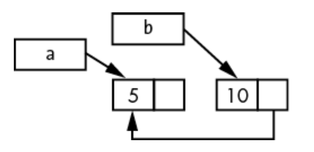

- [Introduction](#introduction)
- [Ch1 - Getting Started](#ch1---getting-started)
    - [Installing Rust](#installing-rust)
    - [Intro to Cargo](#intro-to-cargo)
- [Ch2 - Programming a Guessing Game](#ch2---programming-a-guessing-game)
    - [The `use` Statement](#the-use-statement)
    - [Cargo](#cargo)
    - [Match Expressions](#match-expressions)
    - [Shadowing](#shadowing)
- [Ch3 - Common Programming Concepts](#ch3---common-programming-concepts)
    - [Variables](#variables)
    - [Constants](#constants)
    - [Shadowing](#shadowing-1)
    - [Scalar Data Types](#scalar-data-types)
    - [Compound Data Types](#compound-data-types)
    - [Functions](#functions)
    - [Parameters](#parameters)
    - [Statements and Expressions](#statements-and-expressions)
    - [Functions with Return Values](#functions-with-return-values)
    - [Comments](#comments)
    - [Control Flow](#control-flow)
    - [Loops](#loops)
- [Ch4 - Understanding Ownership](#ch4---understanding-ownership)
    - [Ownership](#ownership)
    - [References](#references)
    - [Mutable References](#mutable-references)
    - [Dangling References](#dangling-references)
    - [The Rules of References](#the-rules-of-references)
      - [The Slice Type](#the-slice-type)
      - [Other Slices](#other-slices)
- [Ch5 - Using Structs to Structure Related Data](#ch5---using-structs-to-structure-related-data)
    - [Structs](#structs)
    - [Tuple Structs](#tuple-structs)
    - [Unit-Like Structs without Any Fields](#unit-like-structs-without-any-fields)
    - [Methods](#methods)
    - [Methods with more parameters](#methods-with-more-parameters)
    - [Associated Functions](#associated-functions)
- [Ch6 - Enums and Pattern Matching](#ch6---enums-and-pattern-matching)
    - [Enums](#enums)
    - [Option Enum](#option-enum)
    - [The match Control Flow Construct](#the-match-control-flow-construct)
    - [Patterns that bind to values](#patterns-that-bind-to-values)
    - [Matching with `Option<T>`](#matching-with-optiont)
    - [Catch-All Patterns and the \_ Placeholder](#catch-all-patterns-and-the-_-placeholder)
    - [Concise Control Flow with if let](#concise-control-flow-with-if-let)
- [Ch7 - Managing Growing Projects with Packages, Crates, and Modules](#ch7---managing-growing-projects-with-packages-crates-and-modules)
    - [Packages and Crates](#packages-and-crates)
    - [Defining Modules to Control Scope and Privacy](#defining-modules-to-control-scope-and-privacy)
    - [Paths for Referring to an item in a Module Tree](#paths-for-referring-to-an-item-in-a-module-tree)
    - [Starting Relative Paths with super](#starting-relative-paths-with-super)
    - [Making Structs and Enums Public](#making-structs-and-enums-public)
    - [Bringing Paths into Scope with the use Keyword](#bringing-paths-into-scope-with-the-use-keyword)
    - [Re-exporting Names with pub use](#re-exporting-names-with-pub-use)
    - [Using External Packages](#using-external-packages)
    - [Using Nested Paths to Clean Up Large use Lists](#using-nested-paths-to-clean-up-large-use-lists)
    - [The Glob Operator](#the-glob-operator)
    - [Separating Modules into Different Files](#separating-modules-into-different-files)
- [Ch8 - Common Collections](#ch8---common-collections)
  - [Vectors](#vectors)
    - [Storing Lists of Values with Vectors](#storing-lists-of-values-with-vectors)
    - [Updating a vector](#updating-a-vector)
    - [Reading Elements of Vectors](#reading-elements-of-vectors)
    - [Iterating Over the Values in a Vector](#iterating-over-the-values-in-a-vector)
    - [Using an Enum to Store Multiple Values](#using-an-enum-to-store-multiple-values)
    - [Dropping a Vector Drops Its Elements](#dropping-a-vector-drops-its-elements)
  - [Strings](#strings)
    - [Storing UTF-8 Encoded Text with Strings](#storing-utf-8-encoded-text-with-strings)
    - [What is a String?](#what-is-a-string)
    - [Creating a new String](#creating-a-new-string)
    - [Updating a String](#updating-a-string)
    - [Concat with + or format! Macro](#concat-with--or-format-macro)
    - [Indexing into Strings](#indexing-into-strings)
    - [Bytes and Scalar Values and Grapheme Clusters](#bytes-and-scalar-values-and-grapheme-clusters)
    - [Slicing Strings](#slicing-strings)
    - [Methods for Iterating Over Strings](#methods-for-iterating-over-strings)
  - [Storing Keys with Associated Values in Hash Maps](#storing-keys-with-associated-values-in-hash-maps)
    - [Creating a New Hash Map](#creating-a-new-hash-map)
    - [Accessing Values in a Hash Map](#accessing-values-in-a-hash-map)
    - [HashMaps and Ownership](#hashmaps-and-ownership)
    - [Updating a Hash Map](#updating-a-hash-map)
    - [Overwriting a value](#overwriting-a-value)
    - [Adding a Key and Value Only if a Key Isn't Present](#adding-a-key-and-value-only-if-a-key-isnt-present)
    - [Updating a Value Based on the Old Value](#updating-a-value-based-on-the-old-value)
- [Ch9 - Error Handling](#ch9---error-handling)
    - [Unrecoverable Errors with panic!](#unrecoverable-errors-with-panic)
    - [Recoverable Errors with Result](#recoverable-errors-with-result)
    - [Matching on Different Errors](#matching-on-different-errors)
    - [Alternatives to Using match with Result\<T, E\>](#alternatives-to-using-match-with-resultt-e)
    - [Shortcuts for Panic on Error: unwrap and expect](#shortcuts-for-panic-on-error-unwrap-and-expect)
    - [Propagating Errors](#propagating-errors)
    - [A Shortcut for Propagating Errors: The ? Operator](#a-shortcut-for-propagating-errors-the--operator)
    - [Where the ? Operator Can Be Used](#where-the--operator-can-be-used)
    - [To panic! or Not to panic!](#to-panic-or-not-to-panic)
    - [Guidelines for Error Handling](#guidelines-for-error-handling)
    - [Creating Custom Types for Validation](#creating-custom-types-for-validation)
- [Ch10 - Generic Types, Traits, and Lifetimes](#ch10---generic-types-traits-and-lifetimes)
    - [Removing Duplication by Extracting a Function](#removing-duplication-by-extracting-a-function)
    - [Generic Data Types](#generic-data-types)
      - [In Function Definitions](#in-function-definitions)
      - [In Struct Definitions](#in-struct-definitions)
      - [In Enum Definitions](#in-enum-definitions)
      - [In Method Definitions](#in-method-definitions)
    - [Performance of Code Using Generics](#performance-of-code-using-generics)
    - [Traits: Defining Shared Behavior](#traits-defining-shared-behavior)
      - [Defining a Trait](#defining-a-trait)
      - [Implementing a Trait on a Type](#implementing-a-trait-on-a-type)
      - [Default Implementations](#default-implementations)
      - [Traits as Parameters](#traits-as-parameters)
      - [Trait Bound Syntax](#trait-bound-syntax)
      - [Specifying Multiple Trait Bounds with the + Syntax](#specifying-multiple-trait-bounds-with-the--syntax)
      - [Clearer Trait Bounds with where Clauses](#clearer-trait-bounds-with-where-clauses)
      - [Returning Types That Implement Traits](#returning-types-that-implement-traits)
      - [Using Trait Bounds to Conditionally Implement Methods](#using-trait-bounds-to-conditionally-implement-methods)
    - [Validating References with Lifetimes](#validating-references-with-lifetimes)
      - [Preventing Dangling References with Lifetimes](#preventing-dangling-references-with-lifetimes)
      - [The Borrow Checker](#the-borrow-checker)
      - [Generic Lifetimes in Functions](#generic-lifetimes-in-functions)
      - [Lifetime Annotation Syntax](#lifetime-annotation-syntax)
      - [Lifetime Annotations in Function Signatures](#lifetime-annotations-in-function-signatures)
      - [Thinking in Terms of Lifetimes](#thinking-in-terms-of-lifetimes)
      - [Lifetime Annotations in Struct Definitions](#lifetime-annotations-in-struct-definitions)
      - [Lifetime Elision](#lifetime-elision)
      - [Lifetime Annotations in Method Definitions](#lifetime-annotations-in-method-definitions)
      - [The Static Lifetime](#the-static-lifetime)
      - [Generic Type Parameters, Trait Bounds, and Lifetimes Together](#generic-type-parameters-trait-bounds-and-lifetimes-together)
      - [Summary](#summary)
- [Ch11 - Writing Automated Tests](#ch11---writing-automated-tests)
    - [How to Write Tests](#how-to-write-tests)
    - [The Anatomy of a Test Function](#the-anatomy-of-a-test-function)
    - [Checking Results with the `assert!` Macro](#checking-results-with-the-assert-macro)
    - [Testing Equality with the `assert_eq!` and `assert_ne!` Macros](#testing-equality-with-the-assert_eq-and-assert_ne-macros)
    - [Adding Custom Failure Messages](#adding-custom-failure-messages)
    - [Checking for Panics with `#[should_panic]`](#checking-for-panics-with-should_panic)
    - [Using `Result<T, E>` in Tests](#using-resultt-e-in-tests)
    - [Controlling How Tests Are Run](#controlling-how-tests-are-run)
    - [Running Tests in Parallel or Consecutively](#running-tests-in-parallel-or-consecutively)
    - [Showing Function Output](#showing-function-output)
    - [Running a Subset of Tests by Name](#running-a-subset-of-tests-by-name)
    - [Ignoring Some Tests Unless Specifically Requested](#ignoring-some-tests-unless-specifically-requested)
  - [Test Organization](#test-organization)
    - [Unit Tests](#unit-tests)
    - [The Tests Module and #\[cfg(test)\]](#the-tests-module-and-cfgtest)
    - [Testing Private Functions](#testing-private-functions)
    - [Integration Tests](#integration-tests)
    - [The tests Directory](#the-tests-directory)
    - [Submodules in Integration Tests](#submodules-in-integration-tests)
    - [Integration Tests for Binary Crates](#integration-tests-for-binary-crates)
- [Ch12 - An I/O Project: Building a Command Line Program](#ch12---an-io-project-building-a-command-line-program)
    - [Reading the Argument Values](#reading-the-argument-values)
    - [Separation of Concerns for Binary Projects](#separation-of-concerns-for-binary-projects)
    - [Developing the Library’s Functionality with Test-Driven Development](#developing-the-librarys-functionality-with-test-driven-development)
    - [Fixing the Error Handling](#fixing-the-error-handling)
      - [Returning a Result Instead of Calling panic!](#returning-a-result-instead-of-calling-panic)
      - [Calling Config::build and Handling Errors](#calling-configbuild-and-handling-errors)
    - [Extracting Logic from main](#extracting-logic-from-main)
      - [Handling Errors Returned from run in main](#handling-errors-returned-from-run-in-main)
    - [Splitting Code into a Library Crate](#splitting-code-into-a-library-crate)
    - [Developing the Library’s Functionality with Test- Driven Development](#developing-the-librarys-functionality-with-test--driven-development)
      - [Writing a Failing Test](#writing-a-failing-test)
      - [Working with Environment Variables](#working-with-environment-variables)
      - [Implementing the search\_case\_insensitive Function](#implementing-the-search_case_insensitive-function)
    - [Writing Error Messages to Standard Error Instead of Standard Output](#writing-error-messages-to-standard-error-instead-of-standard-output)
    - [Checking Where Errors Are Written](#checking-where-errors-are-written)
    - [Printing Errors to Standard Error](#printing-errors-to-standard-error)
- [Ch13 - Functional Language Features: Iterators and Closures](#ch13---functional-language-features-iterators-and-closures)
  - [Closures](#closures)
    - [Closures: Anonymous Functions That Capture Their Environment](#closures-anonymous-functions-that-capture-their-environment)
    - [Capturing the Environment with Closures](#capturing-the-environment-with-closures)
    - [Closure Type Inference and Annotation](#closure-type-inference-and-annotation)
    - [Capturing References or Moving Ownership](#capturing-references-or-moving-ownership)
    - [Moving Captured Values Out of Closures and the Fn Traits](#moving-captured-values-out-of-closures-and-the-fn-traits)
    - [FnOnce](#fnonce)
    - [FnMut](#fnmut)
    - [Processing a Series of Items with Iterators](#processing-a-series-of-items-with-iterators)
    - [The Iterator Trait and the next Method](#the-iterator-trait-and-the-next-method)
    - [Methods That Consume the Iterator](#methods-that-consume-the-iterator)
    - [Methods That Produce Other Iterators](#methods-that-produce-other-iterators)
    - [Using Closures That Capture Their Environment](#using-closures-that-capture-their-environment)
    - [Improving minigrep](#improving-minigrep)
    - [Removing a clone Using an Iterator](#removing-a-clone-using-an-iterator)
    - [Using Iterator Trait Methods Instead of Indexing](#using-iterator-trait-methods-instead-of-indexing)
    - [Making Code Clearer with Iterator Adapters](#making-code-clearer-with-iterator-adapters)
    - [Choosing Between Loops and Iterators](#choosing-between-loops-and-iterators)
    - [Comparing Performance: Loops vs. Iterators](#comparing-performance-loops-vs-iterators)
- [Ch14 - More About Cargo and Crates.io](#ch14---more-about-cargo-and-cratesio)
  - [Customizing Builds with Release Profiles](#customizing-builds-with-release-profiles)
  - [Publishing a Crate to Crates.io](#publishing-a-crate-to-cratesio)
    - [Making Useful Documentation Comments](#making-useful-documentation-comments)
    - [Documentation Comments as Tests](#documentation-comments-as-tests)
    - [Commenting Contained Items](#commenting-contained-items)
    - [Exporting a Convenient Public API with pub use](#exporting-a-convenient-public-api-with-pub-use)
    - [Setting Up a Crates.io Account](#setting-up-a-cratesio-account)
    - [Adding Metadata to a New Crate](#adding-metadata-to-a-new-crate)
      - [Publishing to Crates.io](#publishing-to-cratesio)
      - [Publishing a New Version of an Existing Crate](#publishing-a-new-version-of-an-existing-crate)
      - [Deprecating Versions from Crates.io with cargo yank](#deprecating-versions-from-cratesio-with-cargo-yank)
  - [Cargo Workspaces](#cargo-workspaces)
    - [Creating a Workspace](#creating-a-workspace)
    - [Creating the Second Package in the Workspace](#creating-the-second-package-in-the-workspace)
    - [Depending on an External Package in a Workspace](#depending-on-an-external-package-in-a-workspace)
    - [Adding a Test to a Workspace](#adding-a-test-to-a-workspace)
    - [Installing Binaries with cargo install](#installing-binaries-with-cargo-install)
    - [Extending Cargo with Custom Commands](#extending-cargo-with-custom-commands)
- [Ch15 - Smart Pointers](#ch15---smart-pointers)
  - [Using Box to Point to Data on the Heap](#using-box-to-point-to-data-on-the-heap)
    - [Using Box to Store Data on the Heap](#using-box-to-store-data-on-the-heap)
    - [Enabling Recursive Types with Boxes](#enabling-recursive-types-with-boxes)
      - [Computing the Size of a Non-Recursive Type](#computing-the-size-of-a-non-recursive-type)
      - [Using `Box<T>` to Get a Recursive Type with a Known Size](#using-boxt-to-get-a-recursive-type-with-a-known-size)
  - [Treating Smart Pointers Like Regular References with Deref](#treating-smart-pointers-like-regular-references-with-deref)
    - [Following the Pointer to the Value](#following-the-pointer-to-the-value)
    - [Using Box Like a Reference](#using-box-like-a-reference)
    - [Defining Our Own Smart Pointer](#defining-our-own-smart-pointer)
    - [Implementing the Deref Trait](#implementing-the-deref-trait)
    - [Implicit Deref Coercions with Functions and Methods](#implicit-deref-coercions-with-functions-and-methods)
    - [How Deref Coercion Interacts with Mutability](#how-deref-coercion-interacts-with-mutability)
  - [Running Code on Cleanup with the Drop Trait](#running-code-on-cleanup-with-the-drop-trait)
  - [Rc, the Reference Counted Smart Pointer](#rc-the-reference-counted-smart-pointer)
    - [Using Rc to Share Data](#using-rc-to-share-data)
      - [Cloning an Rc Increases the Reference Count](#cloning-an-rc-increases-the-reference-count)
  - [RefCell and the Interior Mutability Pattern](#refcell-and-the-interior-mutability-pattern)
    - [Enforcing Borrowing Rules at Runtime with RefCell](#enforcing-borrowing-rules-at-runtime-with-refcell)
    - [Interior Mutability: A Mutable Borrow to an Immutable Value](#interior-mutability-a-mutable-borrow-to-an-immutable-value)
      - [A Use Case for Interior Mutability: Mock Objects](#a-use-case-for-interior-mutability-mock-objects)
      - [Keeping Track of Borrows at Runtime with RefCell](#keeping-track-of-borrows-at-runtime-with-refcell)
    - [Allowing Multiple Owners of Mutable Data with Rc and RefCell](#allowing-multiple-owners-of-mutable-data-with-rc-and-refcell)
  - [Reference Cycles Can Leak Memory](#reference-cycles-can-leak-memory)
    - [Creating a Reference Cycle](#creating-a-reference-cycle)
      - [Preventing Reference Cycles Using Weak](#preventing-reference-cycles-using-weak)
      - [Creating a Tree Data Structure: A Node with Child Nodes](#creating-a-tree-data-structure-a-node-with-child-nodes)
      - [Adding a Reference from a Child to Its Parent](#adding-a-reference-from-a-child-to-its-parent)
- [Ch16 - Fearless Concurrency](#ch16---fearless-concurrency)
  - [Using Threads to Run Code Simultaneously](#using-threads-to-run-code-simultaneously)
    - [Creating a New Thread with spawn](#creating-a-new-thread-with-spawn)
    - [Waiting for All Threads to Finish Using join Handles](#waiting-for-all-threads-to-finish-using-join-handles)
    - [Using move Closures with Threads](#using-move-closures-with-threads)
  - [Using Message Passing to Transfer Data Between Threads](#using-message-passing-to-transfer-data-between-threads)
    - [Channels and Ownership Transference](#channels-and-ownership-transference)
    - [Sending Multiple Values and Seeing the Receiver Waiting](#sending-multiple-values-and-seeing-the-receiver-waiting)
    - [Creating Multiple Producers by Cloning the Transmitter](#creating-multiple-producers-by-cloning-the-transmitter)
  - [Shared-State Concurrency](#shared-state-concurrency)
    - [Using Mutexes to Allow Access to Data from One Thread at a Time](#using-mutexes-to-allow-access-to-data-from-one-thread-at-a-time)
    - [The API of Mutex](#the-api-of-mutex)
    - [Sharing a Mutex Between Multiple Threads](#sharing-a-mutex-between-multiple-threads)
    - [Atomic Reference Counting with Arc](#atomic-reference-counting-with-arc)
    - [Similarities Between RefCell/Rc and Mutex/Arc](#similarities-between-refcellrc-and-mutexarc)
  - [Extensible Concurrency with the Send and Sync Traits](#extensible-concurrency-with-the-send-and-sync-traits)
    - [Allowing Transference of Ownership Between Threads with Send](#allowing-transference-of-ownership-between-threads-with-send)
    - [Allowing Access from Multiple Threads with Sync](#allowing-access-from-multiple-threads-with-sync)
    - [Implementing Send and Sync Manually Is Unsafe](#implementing-send-and-sync-manually-is-unsafe)
- [Ch17 - Object-Oriented Programming Features](#ch17---object-oriented-programming-features)
  - [Characteristics of Object-Oriented Languages](#characteristics-of-object-oriented-languages)
    - [Objects Contain Data and Behavior](#objects-contain-data-and-behavior)
    - [Encapsulation That Hides Implementation Details](#encapsulation-that-hides-implementation-details)
    - [Inheritance as a Type System and as Code Sharing](#inheritance-as-a-type-system-and-as-code-sharing)
  - [Using Trait Objects That Allow for Values of Different Types](#using-trait-objects-that-allow-for-values-of-different-types)
    - [Defining a Trait for Common Behavior](#defining-a-trait-for-common-behavior)
    - [Implementing the Trait](#implementing-the-trait)
    - [Trait Objects Perform Dynamic Dispatch](#trait-objects-perform-dynamic-dispatch)
  - [Implementing an Object-Oriented Design Pattern](#implementing-an-object-oriented-design-pattern)
    - [Defining Post and Creating a New Instance in the Draft State](#defining-post-and-creating-a-new-instance-in-the-draft-state)
    - [Storing the Text of the Post Content](#storing-the-text-of-the-post-content)
    - [Ensuring the Content of a Draft Post Is Empty](#ensuring-the-content-of-a-draft-post-is-empty)
    - [Requesting a Review Changes the Post’s State](#requesting-a-review-changes-the-posts-state)
    - [Trade-offs of the State Pattern](#trade-offs-of-the-state-pattern)
    - [Encoding States and Behavior as Types](#encoding-states-and-behavior-as-types)
      - [Implementing Transitions as Transformations into Different Types](#implementing-transitions-as-transformations-into-different-types)
- [Ch18 - Patterns and Matching](#ch18---patterns-and-matching)
  - [All the Places Patterns Can Be Used](#all-the-places-patterns-can-be-used)
    - [match Arms](#match-arms)
    - [Conditional if let Expressions](#conditional-if-let-expressions)
    - [while let Conditional Loops](#while-let-conditional-loops)
    - [for Loops](#for-loops)
    - [let Statements](#let-statements)
    - [Function Parameters](#function-parameters)
  - [Refutability: Whether a Pattern Might Fail to Match](#refutability-whether-a-pattern-might-fail-to-match)
  - [Pattern Syntax](#pattern-syntax)
    - [Matching Literals](#matching-literals)
    - [Matching Named Variables](#matching-named-variables)
    - [Multiple Patterns](#multiple-patterns)
    - [Matching Ranges of Values with ..=](#matching-ranges-of-values-with-)
    - [Destructuring to Break Apart Values](#destructuring-to-break-apart-values)
      - [Destructuring Structs](#destructuring-structs)
      - [Destructuring Enums](#destructuring-enums)
      - [Destructuring Nested Structs and Enums](#destructuring-nested-structs-and-enums)
      - [Destructuring Structs and Tuples](#destructuring-structs-and-tuples)
      - [Ignoring Values in a Pattern](#ignoring-values-in-a-pattern)
        - [An Entire Value with \_](#an-entire-value-with-_)
        - [Parts of a Value with a Nested \_](#parts-of-a-value-with-a-nested-_)
        - [An Unused Variable by Starting Its Name with \_](#an-unused-variable-by-starting-its-name-with-_)
        - [Remaining Parts of a Value with ..](#remaining-parts-of-a-value-with-)
        - [Extra Conditionals with Match Guards](#extra-conditionals-with-match-guards)
    - [@ Bindings](#-bindings)
- [Ch19 - Advanced Features](#ch19---advanced-features)
  - [Unsafe Rust](#unsafe-rust)
    - [Unsafe Superpowers](#unsafe-superpowers)
      - [Dereferencing a Raw Pointer](#dereferencing-a-raw-pointer)
      - [Calling an Unsafe Function or Method](#calling-an-unsafe-function-or-method)
      - [Creating a Safe Abstraction over Unsafe Code](#creating-a-safe-abstraction-over-unsafe-code)
      - [Using extern Functions to Call External Code](#using-extern-functions-to-call-external-code)
      - [Accessing or Modifying a Mutable Static Variable](#accessing-or-modifying-a-mutable-static-variable)
      - [Implementing an Unsafe Trait](#implementing-an-unsafe-trait)
      - [Accessing Fields of a Union](#accessing-fields-of-a-union)
  - [Advanced Traits](#advanced-traits)
    - [Associated Types](#associated-types)
      - [Default Generic Type Parameters and Operator Overloading](#default-generic-type-parameters-and-operator-overloading)
      - [Disambiguating Between Methods with the Same Name](#disambiguating-between-methods-with-the-same-name)
    - [Using Supertraits](#using-supertraits)
    - [Using the Newtype Pattern to Implement External Traits](#using-the-newtype-pattern-to-implement-external-traits)
  - [Advanced Types](#advanced-types)
    - [Using the Newtype Pattern for Type Safety and Abstraction](#using-the-newtype-pattern-for-type-safety-and-abstraction)
    - [Creating Type Synonyms with Type Aliases](#creating-type-synonyms-with-type-aliases)
    - [The Never Type That Never Returns](#the-never-type-that-never-returns)
    - [Dynamically Sized Types and the Sized Trait](#dynamically-sized-types-and-the-sized-trait)
  - [Advanced Functions and Closures](#advanced-functions-and-closures)
    - [Function Pointers](#function-pointers)
    - [Returning Closures](#returning-closures)

# Introduction

* Rust is designed to write fast AND safe code whose compiler works *with* you to help you.
* The Rust compiler catches errors that might occur with low-level development where you're managing your own memory.
* Every two or three years, the Rust team produces a new Rust edition. Each edition brings together the features that have landed into a clear package with fully updated documentation and tooling. Default edition is 2015 if not defined in the cargo.toml file.
* `cargo` is the included dependency manager and build tool that makes adding, compiling, and managing dependencies painless and consistent across the Rust ecosystem.
* `rust-analyzer` is Rust's language server and provides features like IntelliSense.
* `rustc` is the Rust compiler.
* `rustdoc` is the documentation tool.
* `rustfmt` is the formatting tool.
  * `rustfmt` allows finer-grained control and `cargo-fmt` understands conventions of a project that uses Cargo. 
* `rustup` is a command line tool for managing Rust versions and associated tools.
* Clippy is Rust's static analyzer.
* `cargo fix` automatically upgrades your code to a new edition.

# Ch1 - Getting Started

### Installing Rust
* The version of curl that is installed by homebrew does not support the `-tls` option, so removing it from the default rust install command line fixed the error: "curl: (4) A requested feature, protocol or option was not found built-in in this libcurl due to a build-time decision." 

### Intro to Cargo
* TOML stands for Tom's Obvious, Minimal Language.
* Packages of code are referred to as crates.
  * There's binaary crates and library crates.
* We can create a project using `cargo new`.
* We can build a project using `cargo build`.
  * TO build it for release, we use `cargo build --release`.
* We can build and run a project in one step using `cargo run`.
* We can build a project without producing a binary to check for errors using `cargo check`.
* Instead of saving the result of the build in the same directory as our code, Cargo stores it in the target/debug directory.

# Ch2 - Programming a Guessing Game

### The `use` Statement
* By default, Rust has a set of items defined in the standard library that it brings into the scope of every program. This set is called the prelude.
  * If a type you want to use isn’t in the prelude, you have to bring that type into scope explicitly with a `use` statement.

### Cargo
* When we include an external dependency, Cargo fetches the latest versions of everything that dependency needs from the registry, which is a copy of data from Crates.io.
* After updating the registry, Cargo checks the `[dependencies]` section and downloads any crates listed that aren’t already downloaded.
* Cargo.lock is usually checked into source control to ensure reproducible builds.
  * When you build a project for the first time, Cargo figures out all the versions of the dependencies that fit the criteria and then writes them to the Cargo.lock file. When you build your project in the future, Cargo will see that the Cargo.lock file exists and will use the versions specified there rather than doing all the work of figuring out versions again. This lets you have a reproducible build automatically. In other words, your project will remain at 0.8.5 until you explicitly upgrade, thanks to the Cargo.lock file. Because the Cargo.lock file is important for reproducible builds, it’s often checked into source control with the rest of the code in your project.


### Match Expressions
* A `match` expression is made up of arms. An arm consists of a pattern to match against, and the code that should be run if the value given to `match` fits that arm’s pattern. Rust takes the value given to `match` and looks through each arm’s pattern in turn. Patterns and the `match` construct are powerful Rust features: they let you express a variety of situations your code might encounter and they make sure you handle them all.


### Shadowing
* Rust allows us to shadow/reuse variable names rather than forcing us to create two unique variables.

# Ch3 - Common Programming Concepts

### Variables
* Variables are immutable by default and the `mut` keyword can be used to make them mutable.

### Constants
* `const` keyword can be used to declare a constant. Its value cannot change and we cannot use `mut` keyword with `const`s.
  * `const`s aren't just immutable by default, they are always immutable.
* They are declared using the `const` keyword, not `let`.
* We must always annotate the type for constants.
* Constants can only be set to a constant expression, not the result of a value that could only be computed at run time.

### Shadowing
* The second variable overshadows the first, taking any uses of the variable name to itself until either it itself is shadowed or the scope ends.
* Shadowing != making a variable `mut`.
* When we shadow a variable, we can change the type of the value but reuse the same name.
  * But if we try to use the same name with `mut` and have a different type in the variable that is shadowing, we'll get a mismatched types compiler error.

### Scalar Data Types
* Rust is statically typed language, which means we must know the types of all variables at compile time.
  * ```Rust
    // we need to mention the type annotation `u32` otherwise the compiler won't know which type to parse "42" into
    let guess: u32 = "42".parse().expect("Not a number!");
    ```
* Integers
  * Unsigned integers; `u8`, `u16`, ..., `u128`, `usize`
  * Signed integers: `i8`, `i16`, ..., `i128`, `isize`
  * We can have Integer literals:
    * Decimal 98_000
    * Hex 0xff
    * Octal 0o77
    * Binary 0b1111_0000
    * Byte (u8 only) b'A'
  * `i32` is the default
  * We might use `isize` or `usize` when indexing some sort of collection.
  * Integer overflow: If our program results in an integer overflow in debug mode, our program will panic, but in release mode, Rust will perform two's complement wrapping so our program won't panic, but we might also not get the value we were expecting.
* Floating-point numbers
  * `f32` and `f64` (default)
  * All floating-point numbers are signed.
* Booleans
  * 1 byte in size; `true` or `false`
* Characters
  * Specified by single quotes; 4 bytes in size
  * They represent scalar values, which means it can represent a lot more than ASCII: accented letters, Chinese, emojis, etc.

### Compound Data Types
* Tuples
  * Tuples have a fixed size that cannot change once defined.
  * Each value in the tuple can be of a different type.
  * We can destructure a tuple or access a particular value at an index in the tuple.
  * The tuple without any values is called a "unit".
* Array
  * All values in the array must be of the same type.
  * Data is allocated on the stack.
  * An array is of fixed size too.
    * Vector type can grow and shrink.
  * We can initialize each element of an array to the same value as well.
  * If you access an out-of-bounds index from an array at runtime, Rust panics and gives an error instead of letting you access the memory you shouldn't be accessing.

### Functions
* Rust convention is to use snake_case for function and variable names.
* Rust doesn't care where you define your functions, as long as you define them somewhere in the scope of the caller.

### Parameters
* Function's signature has the following structure (parameter: type) as opposed to (type parameter) in some languages
* We must declare the type of each parameter.

### Statements and Expressions
* Statements are instructions that perform some action and do not return a value.
* Expressions evaluate to a resultant value.
  * Expressions do not include ending semicolons
  * ```Rust
    let y = {
      let x = 3;
      x + 1
    }
    ```

### Functions with Return Values
* We need to specify the return type after the `->` in the function signature.
* We can just have expressions in the function body without even a `return` or a `;` and that expression would be evaluated and the result be returned.

### Comments
* `//` idiomatic comment style
* Rust also supports documentation comments.

### Control Flow
* `if` Expressions
  * Standard `if`, `else`, and `else if`
  * We can use `if` in a `let` statement
  * Blocks of code associated with the conditions in `if` expressions are called arms,
    but each arm's value must be of the same type.
  * Rust will not evaluate a non-boolean to a boolean like so:
    ```Rust
    if number % 2 { };
    // So, we must do the following
    if number % 2 == 0 { };
    ```

### Loops
* `loop`
  * We can return values from `loop` by adding that expression after the `break` expression; see ch3/ch3/src/main.rs
  * For loops within loops, `break` and `continue` apply to the innermost loop by default.
  * We can have a loop label to specify a certain `break` or `continue` applies to which loop instead of the innermost one.
  * Loop labels begin with a `'`.
  
* `while`
  * conditional loop
  * can be implemented using `loop`, `if`, `else`, and `break` but `while` is much more common and better.
  
* `for`
  * conditional loop
  * loop through a collection like an array. We can do this using `while` as we check for the index being <= our array's length, but `for` is cleaner, better, and safer.

# Ch4 - Understanding Ownership

### Ownership
* Memory in Rust is managed through a system of ownership with a set of rules that the compiler enforces.
* Keeping track of what parts of code are using what data on the heap, minimizing the amount of duplicate data on the heap, and cleaning up unused data on the heap so we don't run out of space are all problems that ownership addresses.
* Rules:
  1. Each value in Rust has an owner
  2. There can only be one owner at a time
  3. When the owner goes out of scope, the value will be dropped
* `String` type can be mutated but String literals cannot and that is because of the difference in how these two types deal with memory (stack vs heap).
  * When the size of a string is known as compile time, like literals, they are hardcoded in the final executable, so their size cannot change.
  * When the size of a String is unknown at compile time and can change during the program's execution, they are allocated on the heap during runtime.
* Some languages have a garbage collector and some require the programmer to manage the memory (`allocate` and `free`). In Rust, the memory is automatically returned once the variable that owns it goes out of scope, using a function called `drop`.
* When we do something like the following:
    ```Rust
    let s1 = String::from("Hello");
    let s2 = s1;
    ```
  The data from the stack is `move`d into s1 instead of making a shallow copy. This means that when s1 and s2 go out of scope, Rust doesn't try to `drop` the same memory twice. This also means that after `let s2 = s1;`, we cannot use `s1` anymore.
* Rust never creates deep copies of data automatically, instead we use `clone()` to make a deep copy, which is more expensive than `move`.
* For data types with known size at compile type (e.g. integers), we don't have to call clone and nothing is moved into the new variable but a copy of the value is made. This copy is inexpensive since we already know the size of the variable at compile time and the values are stored on the stack.
  * `Copy` trait can be placed on types that are stored on the stack that makes the variable's values being copied instead of `move`d.
  * We cannot add `Copy` trait to types that implement the `Drop` trait.
* Passing a variable to a function will move or copy, just as assignment does.
* Returning values can also transfer ownership.
* The ownership of a variable follows the same pattern every time: assigning a value to another variable moves it. When a variable that includes data on the heap goes out of scope, the value will be cleaned up by `drop` unless ownership of the data has been moved to another variable.

### References
* Taking ownership and then returning ownership with every function is tedious.
* References let us let a function use a value but not take ownership.
* A reference is like a pointer in that it's an address we can follow to access the data stored at that address; the data is owned by some other variable.
* Unlike a pointer, a reference is guaranteed to point to a valid value of a particular type for the life of that reference.
*  A reference's scope starts where it is introduced and continues through the last time that reference is used.
* Because a function that takes in a reference does not have ownership to what was passed into it, the value pointed to by the reference is not dropped when the reference is last used.
* Just as variables are immutable by default, so are references.

### Mutable References
* Using `mut`, we can make references mutable.
* Mutable references have one big restriction: if you have a mutable reference to a value, you can have no other references to that value AT THE SAME TIME. We cannot borrow a reference as mutable more than once or have a mutable and a non-mutable reference at the same time.
* Having this restriction prevents data races at compile time.
* Data races occur when:
  * Two or more pointers access the same data at the same time.
  * At least one of the pointers is being used to write to the data.
  * There’s no mechanism being used to synchronize access to the data.
* We can create a new scope using {} to allow multiple mutable references, just not simultaneous ones.
* We also cannot have a mutable reference while we have an immutable one to the same value -- Users of an immutable reference do not expect the value to suddenly change out from under them!
* Multiple immutable references are allowed because no one who is just reading the data has the ability to change the value and affect anyone else's reading of data.
* If scopes of references don't overlap, we can borrow a value with a mutable reference after the immutable reference's scope ends.
* **Important: At any given time, you can have either one mutable reference or any number of immutable references.**
  
### Dangling References
* In languages with pointers, it is easy to mistakenly create a dangling pointer by freeing some memory while preserving a pointer to that memory, but not in Rust!

### The Rules of References
#### The Slice Type
* Slices let you reference a contiguous sequence of elements in a collection rather than the whole collection.
* A slice is a kind of a reference, so it does not have ownership.
* `iter()` is a method that returns each element in a collection and `enumerate()` wraps the result of `iter()` and returns each element as part of a tuple. The first element is the index and the second is a reference to the element.
* `first_space_index()` in main.rs is a good solution but since the return value `usize` is separate from the input `string`, there's no guarantee that it will still be valid in the future. Look at the caller of `first_space_index()`. In other words, `usize` isn't tied to the state of the `string` that could lead to bugs.
* Rust has a solution to this problem: string slices, which is a reference to part of a string: `&string[starting_index..ending_index]`, where `ending_index` is one more than the index you want the slice to end.
* Using the slice version `_string_slice()` will throw a compile error helping us catch the problem at compile time since we now return `&str` instead of a `usize`.
* String slices' type is `&str`.
* `[0..2]` and `[..2]` are equal. You can drop the 0 if you want to start at 0 with this range syntax. `[3..]` means 3 onwards to the last index and `[..]` means the slice of the entire string.
* **Note:** if we try to create a slice in the middle of multibyte character, the program will exit with an error.
* We can improve the signature from `fn string_slice(string: &String) -> &str` to `fn string_slice(string: &str) -> &str`.
  * If we have a string slice, we can pass that directly instead of having to convert to a `String` with `to_string()`.
  * If we have a String, we can pass a slice of that String or a reference to the String, since Strings are `str`s.
  * This flexibility takes advantage of "deref coercions" -- covered later.
  * Defining a function to take a string slice instead of a reference to a String makes our API more general.
* String literals are string slices already.

#### Other Slices
*  There's a more general type of slice as well.
*  We can slice an array of `i32`
   *  ```Rust
      let a = [1,2,3];
      let slice = &a[0..2]; // slice will be [1,2] and of type &[i32]
      ```

# Ch5 - Using Structs to Structure Related Data

### Structs
* Structs allow us to structure custom, related values into a meaningful group.
* Like in tuples, the values in structs can have different data types.
* Unlike in tuples, we can name these groups of values so we don't have to rely on the order of the values.
* We create an `instance` of a `struct` using `{}` and the ending curly brace has  a `;`.
* To access a specific value in the struct, we use the dot notation.
* If the instance is mutable, we can use dot notation to change the value in that instance.
* The entire instance should be mutable; Rust doesn't allow certain fields to be mutable.
* As with any expression, we can construct a new instance of the struct as the last expression in the function body to implicitly return a new instance.
  * It makes sense to name the function parameters with the same name as the struct fields, but if there's many fields in the Struct, this can be tedious.
  * There's a solution: "Field Init Shorthand"
    * If the parameters are exactly the same as the struct field names, we can use the field init shorthand. See `build_user_2`.
* Sometimes, we want to create a new instance of a struct that includes most of the values from another instance but changes some. We can do this with the "Struct Update Syntax"
    * ``` Rust
      let user2 = User {
        email: String::from("new@test.com"),
        ..user1 // this must come last
      };
      ```
  * But now, data from `user1` has moved into `user2` so we can no longer use `user1`. Specifically, the `String` in `user1` was moved into `user2`.
  * If we had used new values for both `email` and `username` and thus only used values for `active` and `sign_in_count` from `user1` to construct `user2`, then `user1` would still be valid because that data implements the `Copy` trait and "Stack-Only Data: Copy" occurs for them.
* The `println!` macro uses `Display` formatting as the default when we use `{}`. This is output intended for direct end user consumption.
  * The primitive types implement `Display` by default.
  * Using `{:?}` says we want to use an output format called `Debug`, which we can add using `#[derive(Debug)]` on the Struct. Rust includes functionality for us to print out debugging information but we need to opt-in to use it.
    * `{:#?}` will print the output a little more prettier.
  * Or we can use the `dbg!` macro too
    * It takes ownership of an expression (as opposed to `println!` that takes a reference), prints the file and line number of where that `dbg!` macro call occurs along with the resultant value of that expression and returns ownership of the value.
    * It prints to the `stderr`.
    * We can do something like the following since `dbg!` returns ownership, `radius` would have the same value as it would without `dbg!`.
      * ```Rust 
        let circle = Circle(radius: dbg!{1 * scale});
        ```

### Tuple Structs
* Tuple structs have the added meaning the struct name provides, but they don't have names with each field in the struct; rather each field just has types.
* Tuple structs are useful when you want to give the whole tuple a name and make the tuple a different type from other tuples.
* Each tuple struct is its own type even when the types of the fields in structs might be the same.
* We can use the index after the `.` to access each field.

### Unit-Like Structs without Any Fields
* Unit-like structs are structs that don't have nay fields.
* They behave similarly to `()`: the unit type.
* They are useful when you need to implement a trait on some type but don't have any data that you want to store in the type itself.
* We don't need `{}` when defining or instantiating unit-like structs.


### Methods
* Our `area_struct()` function in rectangles/src/main.rs is specific to Rectangles.
* Methods are similar to functions: we declare them with `fn` and a name, they can have parameters and a return value, and they run some code when the method is called from somewhere.
* Unlike functions, methods are defined within the context of a struct (or an enum or a trait object), and their first parameter is always `self`, which represents the instance of the struct the method is being called on.
* To define a method within the context of a struct etc, we use the `impl` block. Each struct is allowed to have more than 1 `impl` blocks.
* Methods can take ownership of `self`, borrow `self` immutably, or borrow `self` mutably, just ask they can any other parameter.
* `&self` is short for `self: Self` and within an `impl` block, the type `Self` is an alias for the type that the `impl` block is for. 
  * Methods must have a parameter named `self` of type `Self` for their first parameter, so Rust lets us abbreviate this with only the first name `self` in the first parameter spot.
  * `&self` in the method parameter means we don't want to take ownership; we want to just read the data.
  * `self` would mean we would take ownership.
  * `&mut self` would mean we'd take ownership to modify.
* We can choose to give the method the same name as one of our fields. These are usually used as getters. Like `rect1.width()`.
* `->`
  * In C and C++, we use `.` if we're calling a method on the object and `->` if we're calling a method on the pointer to an job and need to dereference it first. Like:
    ```C++
    // these 2 are the same in C++, but 1 is cleaner
    object->something();
    (*object).something();
    ```
  * Rust has something called "automatic referencing and dereferencing". When we call a method with `object.something()`, Rust automatically adds `&`, `&mut`, or `*` so `object` matches the signature of the method. Like:
    ```Rust
    // these 2 are the same in Rust, but 1 is cleaner
    p1.distance(&p2);
    (&p1).distance(&p2);
    ```
  * Given the receiver and the name of the  method, Rust can figure out whether the method is reading `&self`, mutating (`&mut self`), or consuming (`self`).

### Methods with more parameters
* See rectangles/src/main.rs

### Associated Functions
* All functions within an `impl` block are called associated functions since they're associated with the type names after `impl`.
* We can define associated functions that don't have `self` as their first parameter (and thus not methods) because they don't need an instance of the type to work with.
* Associated functions that aren't methods are often used for constructors that will use a create instance of the struct.

# Ch6 - Enums and Pattern Matching

### Enums
* Enums allow you to define a type by enumerating its possible variants. It is a way of saying that a value is a one of a possible set of values.
* Variants of the enum are namespaced under its identifier, and we use `::` to separate the two. All values in an enum are of the same type.
* Rather than an enum inside a struct, we can put data directly into each enum variant. Because we attach data to each variant of the enum directly, there is no need for an extra struct.
  * This way, the name of each enum variant that we define also becomes a function that constructs an instance of that enum.
  * This has another advantage over using the enum in the struct: each variant can have different types and amounts associated data. E.g. in our `IpAddr` example, `V4` can have 4 numeric components between 0 and 255, while `V6` can still be constructed with a String.
  * You can put any kind of data inside an enum variant: strings, numeric types, structs, or even another enum. Look at `enum Message` in ch6/src/main.rs.
* We're also able to define methods on enums using `impl` as we are with structs.

### Option Enum
* The `Option<T>` type encodes the very common scenario in which a value could be something or could be nothing. It is another enum defined by the standard library.
* Rust doesn't have the null feature because if you try to use a null value as a non-null value, it would lead to errors.
  * But Rust does have the concept of a value being present or absent.
* `Option<T>` is included in the prelude and its variants `Some` and `None` that can be used **without** `Option::`.
* When we define an `Option` with `None` as its initial value, we need to give the variable an explicit type where the parameter `T` is specified so that the compiler knows what the type of variable should be.
* If we try to use `Option<T>`, even if it has a value `Some`, the compiler won't let us until we handle the case where that value could be `None`. We can do this using `match`.
* We have to convert an `Option<T>` to `T` before we can use it.

### The match Control Flow Construct
* `match` allows us to compare a value against a series of patterns and execute code based on which pattern matches.
* Patterns can be literal strings, variable names, wildcards, etc.
* `match` arms have 2 parts: a pattern and some code separated by `=>`. The arms' patterns must cover **all** possibilities.

### Patterns that bind to values
* Another useful feature of match is that they can bind to the parts of the values that match the pattern.
  * ```Rust
    enum Coin {
        Penny,
        Nickel,
        Dime,
        // binded to a UsState type
        Quarter(UsState),
    }
    ```

### Matching with `Option<T>`
* Look at ch6/src/main.rs

### Catch-All Patterns and the _ Placeholder  
* Using enums, we can also take special actions for a few particular values, but for all other values take one default action.
  * We have to put the catch-all arm at the end since the arms of `match` are evaluated in order. If we put the catch-all arm in the beginning, none of the other arms will ever be executed.
  * We can use `_` if we don't want to use the value in the catch-all pattern or we can assign any name to the value and use it as we want.
  * `_` matches any value and does not bind to that value telling Rust we aren't going to use the value.
  * We can use the unit value `()` to indicate we don't want to do anything.

### Concise Control Flow with if let
* `if let` can be useful in situations where `match` is a bit wordy as it lets us handle values that match one pattern while ignoring the rest.
* `if let` prevents us from satisfying the `match` expression by adding `_ => ()`.
* `if let` means less boilerplate code, but we lose `match`'s exhaustive checking.
* We can think of `if let` that runs code when the value matches one pattern and ignores all other values.

# Ch7 - Managing Growing Projects with Packages, Crates, and Modules

* As our project grows, you should organize it by splitting it into multiple modules and then multiple files.
* A package can contain multiple binary crates and optionally one library crate.
* As a package grows, you can extract parts into separate crates that become external dependencies.
* For very large projects comprising a set of interrelated packages that evolve together, Cargo provides workspaces.
* Rust has a number of features that allow you to manage your code's organization, including which details are exposed, which details are private, and what names are in each scope. These features are sometimes collectively referred to as the module system & include packages, crates, modules and use, and paths.

### Packages and Crates


* Packages are a Cargo feature that lets you build, test, and share crates.
  * A package is a bundle of one or more crates that provides a set of functionality.
  * A package contains a Cargo.toml file that describes how to build those crates.
  * Cargo is actually a package that contains the binary crate for the command line tool you've been using to build those crates.
  * The Cargo package also contains a library crate that the binary crate depends on.
  * Other projects can depend on the Cargo library crate to use the same logic the Cargo command line tool uses.
  * A package can contain as many binary crates as you like, but at most one library crate.
  * A package must contain at least one crate whether it is a library crate or a binary crate.
  * Running `cargo new x` gives us a package named x.
  * A package can have multiple binary crates by placing files in src/bin directory: each file will be a separate binary crate.
* A Crate is a tree of modules that produce a library or executable.
  * A crate is the smallest amount of code that the Rust compiler considers at a time.
  * Even if we run `rustc` instead of `cargo` and pass in a single file, it is treated as a crate.
  * Crates can contain modules and the modules may be defined in other files that get compiled with the crate.
  * A crate can come as a binary crate or a library crate.
    * Binary crates are programs you can compile to an executable that you can run.
      * Each must have a `main` function.
    * Library crates don't have a `main` function and they don't compile to an executable, but define functionality intended to be shared with multiple projects. E.g. `rand` crate.
  * The crate root is a source file that the Rust compiler starts from and makes up the root of the module of your crate.
  * Cargo follows a convention that src/main.rs is the crate root of a binary crate and src/lib.rs is the crate root for a library crate. The package name is used as the name for the executable and library crate that are built.
  * Cargo passes the crate root to `rustc` to build the binary or library.

* We can create a library crate using `crate new <name> --lib`
  * The contents of lib.rs form a module named crate at  the root of the crate's module structure known as the module tree like:
  
  * modules `hosting` and `serving` are siblings since they're defined within `front_of_house`.
  * module `hosting` is the child of module `front_of_house` and it in turn is the parent of `hosting`.

### Defining Modules to Control Scope and Privacy
* Modules (defined with `mod`) let us organize code within a crate for readability and easy reuse.
* Modules also allow us to control the privacy of items because code within a module is private by default.
  * Private items are internal implementation details not available for outside use.
  * We can make modules and the items in them public using `pub mod`, which exposes them to allow external code to use and depend on them.
* In Rust, all items (functions, methods, structs, enums, modules, and constants) are private to parent modules by default. If you want to make an item like a function or struct private, you put it in a module.
* Items in a parent module can’t use the private items inside child modules, but items in child modules can use the items in their ancestor modules.
  * This is because child modules wrap and hide their implementation details, but the child modules can see the context in which they’re defined.
* Making a module public with `pub` doesn't make its contents public.
* Since `eat_at_restaurant()` and `front_of_house` in `customer.rs` are defined in the same module (they're siblings), we don't have to add `pub` to `front_of_house` for `eat_at_restaurant()` to see it.

### Paths for Referring to an item in a Module Tree
* To show Rust where to find an item in a module tree, we use a path.
* A path can be of two forms, but both are followed by one or more identifiers followed by `::`.
  * An absolute path is the full path starting from a crate root
    * For code from an external crate, it begins with the crate name
    * For code from the current crate, it begins with `crate`
  * A relative path starts from the current module and uses `self`, `super`, or an identifier in the current module.


### Starting Relative Paths with super
* We can construct relative paths that begin in the parent module, rather than the current module or crate root by using `super` at the path's start.

### Making Structs and Enums Public
* We can also use `pub` to designate structs and enums as public, but there are a few extra details to the usage of `pub` with structs and enums. 
  * If we use `pub` before a struct definition, we make the struct public, but the struct’s fields will still be private. We can make each field public or not on a case-by-case basis.
    * Since `back_of_house::Breakfast` has a private field, the struct needs to provide a public associated function that constructs an instance of `Breakfast` (`summer` in our case), otherwise we wouldn't be able to construct an instance of `Breakfast` in `eat_at_restaurant` because we couldn't set the value of the private `seasonal_fruit` field in `eat_at_restaurant`.
  * In contrast, if we make an `enum` public, all of its variants are then public.

### Bringing Paths into Scope with the use Keyword
* `use` lets us bring a module into scope once and then use another, shorter name everywhere else in the scope.
* `use` only creates a shortcut for the particular scope in which the `use` occurs.
* Bringing the function’s parent module into scope with `use` means we have to specify the parent module when calling the function. Specifying the parent module when calling the function makes it clear that the function isn’t locally defined while still minimizing repetition of the full path.
* On the other hand, when bringing in structs, enums, and other items with `use`, it’s convention to specify the full path.
* Because Rust doesn't allow bringing 2 items with the same name into scope with `use`, we bring two types with the same name into the same scope using their parent modules or we can use `as` to specify a new local name for the type(s).

### Re-exporting Names with pub use
* When we bring a name into scope with `use`, the name is private to the scope.
* To enable the code that calls our code to refer to that name as if it had been defined in that code's scope, we can combine `pub` and `use`. This is called re-exporting since we're bringing an item into scope but also making that item available for others to bring into their scope.
* In module `customer`, if we didn't use `pub` in `pub use crate::front_of_house::hosting;`, external code would have to call `add_to_waitlist()` by using the path `restaurant::front_of_house::hosting::add_to_waitlist()`, but now it can just use `restaurant::hosting::add_to_waitlist()`.
* With `pub use`, we can write our code with one structure but expose a different structure (like here, external code doesn't have to think about `front_of_house`).


### Using External Packages
* We can add the package name and version in our Cargo.toml file which tells Cargo to download the package and any dependencies and make it available to our project.
* Then, we bring the definitions in the package into scope we use `use`.

### Using Nested Paths to Clean Up Large use Lists
* `use std::{cmp:Ordering, io}` instead of `use std::cmp::Ordering` and `use cmp::io` on separate lines.

### The Glob Operator
* If we want to bring all public items defined in a path into scope, we can specify that path followed by the `*` operator like `use std::collection::*;`, but this can make it harder to tell what names are in scope.

### Separating Modules into Different Files
* If we put `hosting.rs` in the src directory, the compiler would expect the hosting.rs code to be in a `hosting` module declared in the crate root, and not declared as a child of the `front_of_house` module.
* Since `hosting` and `serving` are childs of `front_of_house`, we put them in a directory `src/front_of_house`.
* The compiler's rules for which files to check for which modules' code mean the directories and files more closely match the module tree.

# Ch8 - Common Collections
* The data that collections point to is stored on the heap.

## Vectors

### Storing Lists of Values with Vectors
* `Vec<T>` allows you to store more than one value in a single data structure that puts all the values next to each other in memory.
* They store values of the same type.
* `let v: Vec<i32> = Vec::new()` creates a new, empty vector of type `i32` mentioned by the required type annotation to tell the compiler what data type will be stored in this vector.
* If we create the vector with initial values, we don't need the type annotation like `let v = vec![1,2,3];`.

### Updating a vector
* After making the vector `mut`, we can use `push()` to insert values in it.

### Reading Elements of Vectors
* We can use `v[index]` or `v.get(index)` to get the value at an index.
  * Out of bounds access with `v[index]` causes the program to panic.
  * Since `v.get(index)` gives us an Option, out of bounds access will give us a `None` without panicking.
  
### Iterating Over the Values in a Vector
* The rule that we can't have both mutable and immutable references to a vector at the same time applies here too.
  * **Note:** `.push()` takes a mutable borrow of the vector so we cannot use `push()` while having a immutable reference to an element in the vector like `let first = &v[0]`.
* `for i in &v {}` can be used to iterable over the elements in the vector.
  * `for i in &mut v {}` to iterate over mutable references to each element.
    * To change the value that the mutable reference refers to, we have to dereference using `*` first.
* Because of the reference to the vector that the `for` loop holds prevents us from removing or inserting items in the `for` loop body.

### Using an Enum to Store Multiple Values
* Variants of an enum are defined as the same type so when we need one type to represent elements of different types, we can define and use an enum.
* Using an enum plus a `match` expression means Rust will ensure at compile time that every possible case is handled.
* If you don't know the exhaustive set of types a program will get at runtime to store in a vector, the enum technique won't work, but we can use a Trait object.

### Dropping a Vector Drops Its Elements
* Like any other `struct`, a vector is freed when it goes out of scope.
* When the vector gets dropped, all of its contents are also dropped, meaning the integers it holds will be cleaned up.

## Strings

### Storing UTF-8 Encoded Text with Strings
* Strings are implemented as a collection of bytes, plus some methods to interpret those bytes as text.

### What is a String?
* The `String` type, which is provided by Rust’s standard library rather than coded into the core language as `str`, is a growable, mutable, owned, UTF-8 encoded string type.

### Creating a new String
* Many of the same operations available with `Vec<T>` are available with `String` as well because `String` is actually implemented as a wrapper around a vector of bytes with some extra guarantees, restrictions, and capabilities.
* We can use `String::from("string literal")` or `"string_literal".to_string()`.

### Updating a String
* `"hello".push_str("append this");` appends a String to the end of a String.
* `"hello".push('!');` appends only one character to the end.

### Concat with + or format! Macro
* We can use `+` to concat Strings. The `+` operator uses the `add()` method whose signature looks like `fn add(self, s: &str) -> String`.
* We can only add a `&str` to a `String`; we can’t add two `String` values together. But the type of `&s2` in main.rs is `&String`, not `&str`, as specified in the second parameter to `add`. So why does it compile?
  * The compiler can coerce the `&String` argument into a `&str`. When we call the `add` method, Rust uses a deref coercion, which turns `&s2 `into `&s2[..]`.
  * `&` with `str` in `add` shows `add` doesn't take ownership of `s2`. But since there's no `&` with `self`, ownership is transferred to `add` and `s1` can no longer be used.
* For combining Strings in complicated ways, we can use the `format!` macro.
  * `format!` works like `println!` but instead of printing to the console, it returns the String with the contents.
  * `format!` doesn't take ownership either.

### Indexing into Strings
* Accessing a character in a String by index will result in an error in Rust because `String` doesn't implement the `Index<{integer}>` trait.
* This is because Rust Strings are encoded in UTF8 and each character might not be 1 byte and `string[0]` might result in an unexpected value.
  
### Bytes and Scalar Values and Grapheme Clusters
* Another point about UTF-8 is that there's actually 3 ways to look at strings in Rust: as bytes, scalar values, and grapheme clusters/letters.
* 

### Slicing Strings
* Indexing into a string is often a bad idea since we dk what the return type would be: a byte value, a character, a grapheme cluster, or a string slice.
* So, Rust allows us to use `[]` with a range to create a string slice containing particular bytes. To get the first 4 bytes:
    ```Rust
    let hello = "Здравствуйте";
    let s = &hello[0..4]; // s will be Зд
    ```

### Methods for Iterating Over Strings
* The best way to operate on pieces of strings is to be explicit about whether you want characters or bytes.
* For individual Unicode scalar values, use the `.chars()` method.
* Or, we can use `.bytes()` to return each raw byte. Remember Unicode can take more than 1 byte for a character.

## Storing Keys with Associated Values in Hash Maps
* `HashMap<K, V>` stores a mapping of keys of type `K` to values of type `V` using a hashing function.
* We need to bring it in scope first: `use std::collections:HashMap;`.
* By default, HashMap uses SipHas for its hashing function. It provides resistance to DoS attacks involving hash tables.
* We can switch the hashing algorithm by providing our own hasher, which is a type that implements `BuildHasher`.

### Creating a New Hash Map
* To create an empty hash map: `let scores = HashMap::new()`;

### Accessing Values in a Hash Map
* We can get the value out by providing the key to the `get()` method.
* If there's no value for a key, `None` will be returned.
* Our program in main calls `copied()` to get `Option<i32>` instead of `Option<&i32>`, then `unwrap_or()` with a default value in case the key doesn't exist in the map.
* We can iterate over the map as well:
  ```Rust
  for (key, value) in &scores {
    // do whatever
  }
  ```

### HashMaps and Ownership
* When using `insert` for example:
  * For types that implement the Copy trait like `i32`, the values are copied in to the hash map.
  * For types that do not implement Copy trait like `String`, the values will be moved into the hashmap and the hashmap will be the owner of those values.
* If we inserted references to values into the hashmap, the values won't be moved into the hashmap. The values that the references point to must be valid for at least as long as the hashmap is valid.

### Updating a Hash Map
* Each unique key can only have one value associated with it at a time, but not vice versa.
* When you want to change the data in a hash map, you have to decide how to handle the case when a key already has a value assigned.
  * You could replace the old value with the new value, completely disregarding the old value.
  * You could keep the old value and ignore the new value, only adding the new value if the key doesn’t already have a value. 
  * Or you could combine the old value and the new value.

### Overwriting a value
* If we insert a key and a value into a hash map and then insert that same key with a different value, the value associated with that key will be replaced.

### Adding a Key and Value Only if a Key Isn't Present
* `entry` takes the key you want to check. It returns an enum `Entry` that represents a value that might or might not exist.
* `scores.entry(String::from("Black")).or_insert(9);`
* `or_insert()` returns a mutable reference to the value for the corresponding `Entry` key if the key exists. If it doesn't exist, it inserts the parameter as the new value for this key and returns a mutable reference to the new value.

### Updating a Value Based on the Old Value
* See main.rs.

# Ch9 - Error Handling
* In many cases Rust requires you to acknowledge the possibility of an error and take some action before your code will compile.
* Rust groups errors into two major categories: recoverable and unrecoverable errors.
  * For recoverable errors, we most likely want to report the problem to the user and retry the operation.
  * Unrecoverable operations are always symptoms of bugs, like accessing a location beyond the end of an array, so we immediately stop the program.
* Rust doesn't have exceptions.
  * Instead, it has the type `Result<T, E>` for recoverable errors and the `panic!` macro that stops execution when the program encounters an unrecoverable error.

### Unrecoverable Errors with panic!
* Rust has the `panic!` macro for when bad things happen in your code, and there’s nothing you can do about it.
* There are two ways to cause a panic:
  * by taking an action that causes our code to panic (like accessing an array past the end)
  * by explicitly calling the `panic!` macro. 
  * By default, these panics will print a failure message, unwind, clean up the stack, and quit.
* Since unwinding (walking up the stack) and cleaning up each frame when a panic occurs is too much work, Rust lets us choose an alternate: aborting, which ends the program without cleaning up.
  * The program's memory then needs to be cleaned by the operation system.
  * To make the resultant binary as small as possible, you can switch from unwinding to aborting upon a panic by adding `panic = 'abort'` to the appropriate `[profile]` sections in your Cargo.toml file. E.g., to abort on panic in release mode, add this:   
  `[profile.release]`  
  `panic = 'abort'`
* A backtrace is a list of all the functions that have been called to get to this point.
  * We read backtraces from the top and read until you see files you wrote & that's where the problem is.
  * We set environment variable `RUST_BACKTRACE` to 1 to see the backtrace like `RUST_BACKTRACE=1 cargo run`.
  * We need debug symbols to be enabled & they are by default when using `cargo run` without the `--release` flag.

### Recoverable Errors with Result
* An example of a recoverable error: if you try to open a file and the file doesn’t exist, you might want to create the file instead of terminating the process.
* Recall `Result` enum with variant `Ok(T)` and `Err(E)`
  * When opening a file, the generic parameter `T` is filled by the implementation of `File::open()` with the type of the success value, `std::fs::File`, which is a file handle.
  * The type of `E` used in the error value is `std::io::Error`.

### Matching on Different Errors
* Code from the previous section will panic no matter why we couldn't open the file, but we might want to take different actions for different failure reasons:
  * If `File::open` failed because the file doesn’t exist, we want to create the file and return the handle to the new file. 
  * If `File::open` failed for any other reason (e.g. we didn’t have permission to open the file) we still want the code to `panic!`.
  * The standard library provides `std::io::ErrorKind` with variants for different errors from an `io` operation.

### Alternatives to Using match with Result<T, E>
* We can use other ways like closures to save us from lot of indented code.
* Closures covered later.

### Shortcuts for Panic on Error: unwrap and expect
* Using `match` works well, but it can be a bit verbose.
* The `Result<T, E>` type has many helper methods defined on it to do various, more specific tasks.
* The `unwrap()` method is a shortcut method.
  * If the `Result` value is the `Ok` variant, `unwrap()` will return the value inside the `Ok`.
  * If the `Result` is the `Err` variant, `unwrap()` will call the `panic!` macro for us.
* The `expect()` method lets us also choose the `panic!` error message.
  * `expect()` is used in the same way as `unwrap()`: to return the file handle or call the `panic!` macro.
  * The error message used by `expect()` in its call to `panic!` will be the parameter that we pass to `expect()`, rather than the default `panic!` message that `unwrap()` uses.

### Propagating Errors
* Instead of handling the error within the function itself, you can return the error to the calling code so that it can decide what to do.

### A Shortcut for Propagating Errors: The ? Operator
* Propagating errors is so common in Rust that Rust provides the question mark operator `?` to make this easier.
* The `?` placed after a `Result` value is defined to work in almost the same way as the `match` expressions.
  * If the value of the `Result` is an O`k, the value inside the `Ok` will get returned from this expression, and the program will continue. 
  * If the value is an `Err`, the `Err` will be returned from the whole function as if we had used the return keyword so the error value gets propagated to the calling code.
* There is a difference between what the `match` expression does and what the `?` operator does:
  * Error values that have the `?` operator called on them go through the `from` function, defined in the `From` trait in the standard library, which is used to convert values from one type into another. 
  * When the `?` operator calls the `from` function, the error type received is converted into the error type defined in the return type of the current function.
  * This is useful when a function returns one error type to represent all the ways a function might fail, even if parts might fail for many different reasons.
  * E.g. we could change the `read_username_from_file_short()` function to return a custom error type named `OurError`.
    * If we also define `impl From<io::Error>` for `OurError` to construct an instance of `OurError` from an `io::Error`, then the `?` operator calls in the body of `read_username_from_file_short()` will call `from` and convert the error types without needing to add any more code to the function.
* We can even shorten code further by chaining method calls immediately after the `?`.
* Reading a file into a string is a fairly common operation, so the standard library provides the convenient `fs::read_to_string` function that opens the file, creates a new `String`, reads the contents of the file, puts the contents into that `String`, and returns it.

### Where the ? Operator Can Be Used
* The `?` operator can only be used in functions whose return type is compatible with the value the `?` is used on.
  * If we use `?` in a function whose return type isn't compatible, we will get a compile time error.
  * `?` can only be used in a function that returns `Result`, `Option`, or another type that implements `FromResidual`.
  * To fix the error, you have two choices:
    * Change the return type of your function to be compatible with the value you’re using the `?` on as long as you have no restrictions preventing that. 
    * Use a `match` or one of the `Result<T, E>` methods to handle the `Result<T, E>` in whatever way is appropriate.
* As with using `?` on `Result`, you can only use `?` on `Option` in a function that returns an `Option`.
  * The behavior of `?` when called on an `Option<T>` is similar to when called on a `Result<T, E>`:
    * if the value is `None`, the `None` will be returned early from the function at that point.
    * If the value is `Some`, the value inside the `Some` is the resultant value of the expression, and the function continues.
* You can use `?` on a `Result` in a function that returns `Result`, and you can it on an `Option` in a function that returns `Option`, but you can’t mix and match.
  * `?` won’t automatically convert a `Result` to an `Option` or vice versa.
  * In those cases, you can use methods like the `ok` method on `Result` or the `ok_or` method on `Option` to do the conversion explicitly.
* `main` can also return a `Result<(), E>`
  * The `Box<dyn Error>` type is a trait object.
  * `Box<dyn Error>` can be read to mean “any kind of error.”
  * Using `?` on a `Result` value in a main function with the error type `Box<dyn Error>` is allowed because it allows any `Err` value to be returned early.
  * Even though the body of this main function will only ever return errors of type `std::io::Error`, by specifying `Box<dyn Error>`, this signature will continue to be correct even if more code that returns other errors is added to the body of main.
  * The `main` function may return any types that implement the `std::process::Termination` trait, which contains a function `report` that returns an `ExitCode`.

### To panic! or Not to panic!
* You could call `panic!` for any error situation, whether there’s a possible way to recover or not, but then you’re making the decision that a situation is unrecoverable on behalf of the calling code. 
* When you choose to return a `Result` value, you give the calling code options.
  * The calling code could choose to attempt to recover in a way that’s appropriate for its situation
  * Or it could decide that an `Err` value in this case is unrecoverable, so it can call `panic!` and turn your recoverable error into an unrecoverable one.
* Therefore, returning `Result` is a good default choice when you’re defining a function that might fail.
* In situations such as examples, prototype code, and tests, it’s more appropriate to write code that panics instead of returning a `Result`.
* If you can ensure by manually inspecting the code that you’ll never have an `Err` variant, it’s perfectly acceptable to call `unwrap()`:
  ```Rust
  // since the ip address is hardcoded to a correct one, there will never be an Err,
  // but the compiler will force us to handle `Result<T, Err>` from `parse()`.
  // So in this situation, it is ok to call `unwrap()` or `expect()` (preferred).
  let home: IpAddr = "127.0.0.1"
      .parse()
      .expect("Hardcoded IP address should be valid");
  ```

### Guidelines for Error Handling
* It’s advisable to have your code panic when it’s possible that your code could end up in a bad state:
  * When some assumption, guarantee, contract, or invariant has been broken, such as when invalid values, contradictory values, or missing values are passed to your code—plus one or more of the following:
    * The bad state is something that is unexpected, as opposed to something that will likely happen occasionally, like a user entering data in the wrong format.
    * Your code after this point needs to rely on not being in this bad state, rather than checking for the problem at every step.
    * There’s not a good way to encode this information in the types you use.
* If someone calls your code and passes in values that don’t make sense, it’s best to return an error if you can so the user of the library can decide what they want to do in that case. 
* However, in cases where continuing could be insecure or harmful, the best choice might be to call `panic!` and alert the person using your library.
* `panic!` is also appropriate if you’re calling external code that is out of your control and it returns an invalid state that you have no way of fixing.
* However, when failure is expected, it’s more appropriate to return a `Result`, like
  * a parser being given malformed data
  * an HTTP request returning a status that indicates you have hit a rate limit

### Creating Custom Types for Validation
* Having lots of error checks in all of your functions would be verbose and annoying.
* So, we can use Rust’s type system: the type checking done by the compiler.
* If your function has a particular type as a parameter, you can proceed with your code’s logic knowing that the compiler has already ensured you have a valid value.
* E.g. using an unsigned integer type such as `u32`, which ensures the parameter is never negative.
* We can make a new type and put the validations in a function to create an instance of the type rather than repeating the validations everywhere. That way, it’s safe for functions to use the new type in their signatures and confidently use the values they receive.
* Look at `Guess`' implementation in src/main.rs.

# Ch10 - Generic Types, Traits, and Lifetimes
* Generic functions differ in the types of their parameters so we can run the same code on multiple concrete values.
* Traits are used to define behavior in a generic way. You can combine traits with generic types to constrain a generic type to accept only those types that have a particular behavior, as opposed to just any type.
* Lifetimes allow us to give the compiler enough information about borrowed values so that it can ensure references will be valid in more situations than it could without our help.

### Removing Duplication by Extracting a Function
* See ch10/src/main.rs.

### Generic Data Types
* We use generics to create definitions for items like function signatures or structs, which we can then use with many different concrete data types.

#### In Function Definitions
* When defining a function that uses generics, we place the generics in the signature of the function where we would usually specify the data types of the parameters and return value.
* To define a generic function, we place type name declarations inside angle brackets, `<>`, between the name of the function and the parameter list.
  * ` fn find_largest<T>(list: &[T]) -> &T`
  * We read this as: the function `find_largest` is generic over some type `T`. This function has one parameter named list, which is a slice of values of type `T`. The `find_largest` function will return a reference to a value of the same type `T`.
* We need to make use of `std::cmp::PartialOrd`, which is a trait.
  * Because we want to compare values of type `T` in the body, we can only use types whose values can be ordered.
  * To enable comparisons, the standard library has the `std::cmp::PartialOrd` trait that you can implement on types.
  * By restricting the types valid for `T` to only those that implement `PartialOrd`, our example will compile, because the standard library implements `PartialOrd` on both `i32` and `char`.

#### In Struct Definitions
* We can also define structs to use a generic type parameter in one or more fields using the `<>` syntax.
  * We declare the name of the type parameter inside `<>` just after the name of the struct.
  * Then we use the generic type in the struct definition where we would otherwise specify concrete data types.
  * To define a `Point` struct where `x` and `y` are both generics but could have different types, we can use multiple generic type parameters.

#### In Enum Definitions
* As we did with structs, we can define enums to hold generic data types in their variants, for example:
  ```Rust
  enum Option<T> {
    Some(T),
    None
  }

  enum Result<T, E> {
    Ok(T),
    Err(E),
  }
  ```

#### In Method Definitions
* We can implement methods on structs and enums and use generic types in their definitions too.
* `impl<T> Point<T> {`
  * We have to declare `T` just after `impl` so we can use `T` to specify that we’re implementing methods on the type` Point<T>`.
  * By declaring `T` as a generic type after `impl`, Rust can identify that the type in the angle brackets in `Point` is a generic type rather than a concrete type.
  * Using the same name for this generic parameter than the generic parameter declared in the struct definition.
  * Methods written within an `impl` that declares the generic type will be defined on any instance of the type, no matter what concrete type ends up substituting for the generic type.
* We can also specify constraints on generic types when defining methods on the type. 
  * For example, implement methods only on `Point<f32>` instances rather than on `Point<T>` instances with any generic type in its own `impl` block than in `impl<T>`.
* Generic type parameters in a struct definition aren’t always the same as those you use in that same struct’s method signatures. 
  * Like we can use generic types `X1` and `Y1` for the `Point` struct and `X2` `Y2` for the `mix_points` method signature to make the example clearer. 
  * The method creates a new `Point` instance with the `x` value from the `self Point` (of type `X1`) and the `y` value from the passed-in `Point` (of type `Y2`).
  * See `mix_points` in ch10/src/main.rs

### Performance of Code Using Generics
* Using generic types won’t make your program run any slower than it would with concrete types.
  * Rust accomplishes this by performing *monomorphsization* of the code using generics at compile time.
  * Monomorphization is the process of turning generic code into specific code by filling in the concrete types that are used when compiled.
  * E.g. The generic `Option<T>` is replaced with the specific definitions created by the compiler. Because Rust compiles generic code into code that specifies the type in each instance, we pay no runtime cost for using generics.

### Traits: Defining Shared Behavior
* A *trait* defines the functionality a particular type has and can share with other types. 
* We can use traits to define shared behavior in an abstract way. We can use *trait bounds* to specify that a generic type can be any type that has certain behavior.
  * Kinda similar to *interfaces* in other languages but with some differences.

#### Defining a Trait
* A type’s behavior consists of the methods we can call on that type.
* Different types share the same behavior if we can call the same methods on all of those types.
  * Like if we could call `summarize()` on an object of `NewsArticle` and of `Tweet`.
* Trait definitions are a way to group method signatures together to define a set of behaviors necessary to accomplish some purpose.
* ```Rust
  pub trait Summary {
    fn summarize(&self) -> String;
  }
  ```
* Because we made the trait public using `pub`, crates depending on this crate can make use of this trait too.
* Each type implementing this trait must provide its own custom behavior for the body of the method. The compiler will enforce that any type that has the `Summary` trait will have the method `summarize` defined with this signature exactly.
* A trait can have multiple methods in its body: the method signatures are listed one per line, and each line ends in a semicolon.

#### Implementing a Trait on a Type
* This is how
  * ```Rust
    pub struct NewsArticle {
      pub headline: String,
      pub published: bool,
      pub author: String,
    }

    impl Summary for NewsArticle {
        fn summarize(&self) -> String {
            format!("{}, by {}", self.headline, self.author)
        }
    }
    ```
* Users of the crate can call the trait methods on instances of `NewsArticle` and `Tweet` in the same way we call regular methods. 
* The only difference is that the user must bring the trait into scope as well as the types.
  * ```Rust
    use aggregator::{Summary, Tweet};
    ```
* Other crates that depend on the `aggregator` crate can also bring the `Summary` trait into scope to implement `Summary` on their own types.
* A restriction with traits is that we can implement a trait on a type only if either the trait or the type, or both, are local to our crate.
  * E.g. we can implement standard library traits like `Display` on a custom type like `Tweet` as part of our `aggregator` crate functionality because the type `Tweet` is local to our `aggregator` crate. 
  * We can also implement `Summary` on `Vec<T>` in our `aggregator` crate because the trait `Summary` is local to our `aggregator` crate.
* But we can’t implement external traits on external types. 
  * E.g., we can’t implement the `Display` trait on `Vec<T>` within our `aggregator` crate because `Display` and `Vec<T>` are both defined in the standard library and aren’t local to our `aggregator` crate.
* This restriction is part of a property called *coherence*, and more specifically the *orphan rule*, so named because the parent type is not present. 
* This rule ensures that other people’s code can’t break your code and vice versa. 
* Without the rule, two crates could implement the same trait for the same type, and Rust wouldn’t know which implementation to use.

#### Default Implementations
* Sometimes it’s useful to have default behavior for some or all of the methods in a trait instead of requiring implementations for all methods on every type.
* Then, as we implement the trait on a particular type, we can keep or override each method’s default behavior.
* To provide a default implementation, we specify a default implementation for the trait instead of only defining the method signature.
* To use a default implementation, we specify an empty `impl` block with `impl` of the trait for a struct.
  * If your struct wants to override the default implementation, you just do it normally since the syntax for overriding a default implementation is the same as the syntax for implementing a trait method that doesn’t have a default implementation.
* Default implementations can call other methods in the same trait, even if those other methods don’t have a default implementation.
  * In this way, a trait can provide a lot of useful functionality and only require implementors to specify a small part of it.
* **Note: it isn’t possible to call the default implementation from an
overriding implementation of that same method.**

#### Traits as Parameters
* With traits as parameters, we can define functions that accept many different types.
  * ```Rust
    pub fn notify(item: &impl Summary) {
      println!("Breaking news! {}", item.summarize());
    }
    ```
* In the body of `notify`, we can call any methods on item that come from the `Summary` trait, such as `summarize()`.
* We can pass `notify()` any instance of `Tweet` or `NewsArticle`.

#### Trait Bound Syntax
* The `impl Trait` syntax works for straightforward cases but is actually syntax sugar for a longer form known as a *trait bound*; it looks like this:
  * ```Rust
    pub fn notify<T: Summary>(item: &T) {
      println!("Breaking news! {}", item.summarize());
    }
    ```
* This above example is the same as the example in "Traits as Parameters".
* With Traits as Parameters, having multiple parameters would look like:
  * ```Rust
    pub fn notify(item1: &impl Summary, item2: &impl Summary)
    ```
* But we can shorten it with Trait Bound Syntax as:
  * ```Rust
    pub fn notify<T: Summary>(item1: &T, item2: &T)
    ``` 
* The generic type `T` specified as the type of the `item1` and `item2` parameters constrains the function such that the concrete type of the value passed as an argument for `item1` and `item2` must be the same.
  
#### Specifying Multiple Trait Bounds with the + Syntax
* We can also specify more than one trait bound. 
* Say we wanted `notify` to use display formatting as well as `summarize()` on `item`: we specify in the `notify` definition that `item` must implement both `Display` and `Summary` using the `+`:
  * ```Rust
    // Traits as Parameter
    pub fn notify(item: &impl(Summary + Display))

    // Trait Bound Syntax
    pub fn notify<T: Summarize + Display>(item: T)
    ```
* With the two trait bounds specified, the body of `notify` can call `summarize` and use `{}` to format item.

#### Clearer Trait Bounds with where Clauses
* Using too many trait bounds has its downsides. 
* Each generic has its own trait bounds, so functions with multiple generic type parameters can contain lots of trait bound information between the function’s name and its parameter list, making the function signature hard to read. 
* We can use the `where` clause like so:
  * ```Rust
    // instead of doing this
    fn some_function<T: Display + Clone, U: Clone + Debug>(t: &T, u: &U) -> i32 {

    // we can do this
    fn some_function(T, U)(t: &T, u: &U) -> i32 {
      where
        T: Display + Clone,
        U: Clone + Debug,
    }
    ```

#### Returning Types That Implement Traits
* We can also use the `impl Trait` syntax in the return position to return a value of some type that implements a trait:
  * ```Rust
    fn returns_summarizable() -> impl Summary {
      Tweet {
        // ...
      }
    }
    ```
* You can only use `impl Trait` if you’re returning a single type. 
* E.g, this code that returns either a `NewsArticle` or a `Tweet` with the return type specified as `impl Summary` **wouldn’t work**:
  * ```Rust
    fn returns_summarizable(switch: bool) -> impl Summary {
      if switch {
        Tweet {
          // ...
        }
      } else {
        NewsArticle {
          // ...
        }
      }
    }
    ```
* Returning either a `NewsArticle` or a `Tweet` **isn’t allowed** due to restrictions around how the `impl Trait` syntax is implemented in the compiler.

#### Using Trait Bounds to Conditionally Implement Methods
* By using a trait bound with an `impl` block that uses generic type parameters, we can implement methods conditionally for types that implement the specified traits.
* E.g. the type `Pair<T>` always implements the `new` function to return a new instance of `Pair<T>`. But in the next `impl` block, `Pair<T>` only implements the `cmp_display` method if its inner type `T` implements the `PartialOrd` trait that enables comparison and the `Display` trait that enables printing.
  * ```Rust
    use std::fmt::Display;

    struct Pair<T> {
      x: T,
      y: T,
    }

    impl<T> Pair<T> {
      fn new(x: T, y: T) -> Self {
        Self { x, y }
      }
    }

    impl<T: Display + PartialOrd> Pair<T> {
      fn cmp_display(&self) {
        if self.x >= self.y {
          println!("The largest member is x = {}", self.x);
        } else {
          println!("The largest member is y = {}", self.y);
        }
      }
    }
    ```
* We can also conditionally implement a trait for any type that implements another trait.
* Implementations of a trait on any type that satisfies the trait bounds are called *blanket implementations* and are used a lot in the Rust standard library.
  * E.g. the standard library implements the `ToString` trait on any type that implements the `Display` trait.
  * The `impl` block in the standard library looks similar to this code:
    * ```Rust
      impl<T: Display> ToString for T {
        // ...
      }
      ```
  * Because the standard library has this blanket implementation, we can call the `to_string` method defined by the `ToString` trait on any type that implements the `Display` trait.
    * E.g. integers into their corresponding String values like this because integers implement `Display`: `let three = 3.to_string();`
  
### Validating References with Lifetimes
* Rather than ensuring that a type has the behavior we want (that Traits do for us), lifetimes ensure that references are valid as long as we need them to be.
* Every reference in Rust has a *lifetime*, which is the scope for which that reference is valid.
* Most of the time, lifetimes are implicit and inferred, just like most of the time, types are inferred. 
  * We must annotate types only when multiple types are possible.
  * In a similar way, we must annotate lifetimes when the lifetimes of references could be related in a few different ways.
  * Rust requires us to annotate the relationships using generic lifetime parameters to ensure the actual references used at runtime will definitely be valid.

#### Preventing Dangling References with Lifetimes
* The main aim of lifetimes is to prevent *dangling references*, which cause a program to reference data other than the data it’s intended to reference.
* If Rust allowed us using references to memory that has been deallocated, anything we try to do with the reference variable wouldn’t work correctly. 
* So how does Rust determine that this code is invalid? It uses a *borrow checker*.

#### The Borrow Checker
* The Rust compiler has a borrow checker that compares scopes to determine whether all borrows are valid.
  * ```Rust
    fn main() {
      let r;              // ---------+-- 'r
                          //          |
      {                   //          |
        let x = 5;        // -+-- 'x  |
        r = &x;           //  |       |
      }                   // -+       |
                          //          | 
      println!("r: {r}"); //          |
    }                     // ---------+
    ```
* At compile time, Rust compares the size of the two lifetimes and sees that `r` has a lifetime of `'r` but that it refers to memory with a lifetime of `'x`.
* The program is rejected because `'x` is shorter than `'r`: the subject of the reference doesn’t live as long as the reference.
* If `x` had a lifetime equal or greater than `'r`, that would be allowed.

#### Generic Lifetimes in Functions
* Looking at `longest()` in src/main.rs
  * `fn longest(string1: &str, string2: &str) -> &str {` doesn't compile because according to the compiler error, the return type needs a generic lifetime parameter on it because Rust can’t tell whether the reference being returned refers to `string1` or `string2`.
  * Actually, we don’t know either, because the `if` block in the body of this function returns a reference to `string1` and the `else` block returns a reference to `string2`!
  * When we’re defining this function, we don’t know the concrete values that will be passed into this function, so we don’t know whether the `if` case or the `else` case will execute.
  * We also don’t know the concrete lifetimes of the references that will be passed in, so we can’t look at the scopes as we did in the previous examples to determine whether the reference we return will always be valid.
  * The borrow checker can’t determine this either, because it doesn’t know how the lifetimes of `string1` and `string2` relate to the lifetime of the return value.
  * To fix this error, we’ll add generic lifetime parameters that define the relationship between the references so the borrow checker can perform its analysis.

#### Lifetime Annotation Syntax
* Lifetime annotations don’t change how long any of the references live. 
* Rather, they describe the relationships of the lifetimes of multiple references to each other without affecting the lifetimes.
* Just as functions can accept any type when the signature specifies a generic type parameter, functions can accept references with any lifetime by specifying a generic lifetime parameter.
* Syntax: the names of lifetime parameters must start with an apostrophe (`'`) and are usually all lowercase and very short, like generic types. 
  * Most people use the name `'a` for the first lifetime annotation.
  * We place lifetime parameter annotations after the `&` of a reference, using a space to separate the annotation from the reference’s type.
  * ```Rust
    &i32        // a reference
    &'a i32     // a reference with an explicit lifetime
    &'a mut i32 // a mutable reference with an explicit lifetime
    ```
* One lifetime annotation by itself doesn’t have much meaning because the annotations are meant to tell Rust how generic lifetime parameters of multiple references relate to each other.

#### Lifetime Annotations in Function Signatures
* To use lifetime annotations in function signatures, we need to declare the generic *lifetime* parameters inside angle brackets between the function name and the parameter list, just as we did with generic *type* parameters.
* `fn longest<'a>(string1: &'a str, string2: &'a str) -> &'a str {`
  * The function signature tells Rust that for some lifetime `'a`, the function takes two parameters, both of which are string slices that live at least as long as lifetime `'a`. 
  * The function signature also tells Rust that the string slice returned from the function will live at least as long as lifetime `'a`. 
  * **In practice, it means that the lifetime of the reference returned by the `longest()` function is the same as the smaller of the lifetimes of the values referred to by the function arguments. These relationships are what we want Rust to use when analyzing this code.**
  * We’re specifying that the borrow checker should reject any values that don’t adhere to these constraints. Note that the `longest()` function doesn’t need to know exactly how long `string1` and `string2` will live, only that some scope can be substituted for `'a` that will satisfy this signature.

#### Thinking in Terms of Lifetimes
* The way in which you need to specify lifetime parameters depends on what your function is doing. 
* E.g. if we changed the implementation of the `longest()` function to always return the first parameter rather than the longest string slice, we wouldn’t need to specify a lifetime on the `y` parameter.
  * The following code will compile: `fn longest<'a>(x: &'a str, y: &str) -> &'a str { x }`
  * We’ve specified a lifetime parameter `'a` for the parameter `x` and the return type, but not for the parameter `y`, because the lifetime of `y` does not have any relationship with the lifetime of `x` or the return value as we always return `x`.
* When returning a reference from a function, the lifetime parameter for the return type needs to match the lifetime parameter for one of the parameters. 
  * If the reference returned does not refer to one of the parameters, it must refer to a value created within this function. 
  * However, this would be a dangling reference because the value will go out of scope at the end of the function. Like this:
    * ```Rust
      fn longest<'a>(x: &str, y: &str) -> &'a str {
        let result = String::from("really long string");
        result.as_str()
      }
      ```
  * The problem is that `result` goes out of scope and gets cleaned up at the end of the `longest()` function resulting in a *dangling reference* not allowed by Rust.

#### Lifetime Annotations in Struct Definitions
* So far, the structs we’ve defined all hold owned types. 
* We can define structs to hold references, but in that case we would need to add a lifetime annotation on every reference in the struct’s definition.
  * ```Rust
    // this means an instance of `ImportantExcerpt` cannot outlive the reference it holds in its `part` field
    struct ImportantExcerpt<'a> {
    ```

#### Lifetime Elision
* Every reference has a lifetime and you need to specify lifetime parameters for functions or structs that use references. 
* The patterns programmed into Rust’s analysis of references are called the *lifetime elision rules*. 
* These aren’t rules for programmers to follow; they’re a set of particular cases that the compiler will consider, and if your code fits these cases, you don’t need to write the lifetimes explicitly.
* Like:
  * ```Rust
    fn first_word(s: &str) -> &str
    // instead of the following in pre-1.0 Rust versions
    fn first_word<'a>(s: &'a str) -> &'a str
    ```
* The elision rules don’t provide full inference. If Rust deterministically applies the rules but there is still ambiguity as to what lifetimes the references have, the compiler won’t guess what the lifetime of the remaining references should be. Instead, the compiler will give you an error that you can resolve by adding the lifetime annotations.
* Lifetimes on function or method parameters are called *input lifetimes*, and lifetimes on return values are called *output lifetimes*.
* The compiler uses three rules to figure out the lifetimes of the references when there aren’t explicit annotations.
  * The first rule applies to input lifetimes, and the second and third rules apply to output lifetimes.
  *  If the compiler gets to the end of the three rules and there are still references for which it can’t figure out lifetimes, the compiler will stop with an error.
  *  These rules apply to `fn` definitions as well as `impl` blocks.
  *  Rules:
     1. The compiler assigns a lifetime parameter to each parameter that’s a reference. In other words, a function with one parameter gets one lifetime parameter: `fn foo<'a>(x: &'a i32);` a function with two parameters gets two separate lifetime parameters: `fn foo<'a, 'b>(x: &'a i32, y: &'b i32);` and so on.
     2. If there is exactly one input lifetime parameter, that lifetime is assigned to all output lifetime parameters: `fn foo<'a>(x: &'a i32) -> &'a i32`.
     3. The third rule is that, if there are multiple input lifetime parameters, but one of them is `&self` (or `&mut self` because this is a method), the lifetime of `self` is assigned to all output lifetime parameters. This rule makes methods much nicer to read and write because fewer symbols are necessary.
* Examples:
  * Compiler can apply all 3 rules to `fn first_word(s: &str) -> &str {`
  * But it cannot apply rules 2 and 3 to `fn longest(x: &str, y: &str) -> &str {` so gives an error for the programmer to specify the lifetimes.

#### Lifetime Annotations in Method Definitions
* Lifetime names for struct fields always need to be declared after the `impl` keyword and then used after the struct’s name because those lifetimes are part of the struct’s type.
* In method signatures inside the `impl` block, references might be tied to the lifetime of references in the struct’s fields, or they might be independent.
* The lifetime elision rules often make it so that lifetime annotations aren’t necessary in method signatures.
    ```Rust
    // The lifetime parameter declaration after `impl` and its use after the type 
    // name are required, but we’re not required to annotate the lifetime of the 
    // reference to `self` because of the first elision rule.
    impl<'a> ImportantExcerpt<'a> {
      fn level(&self) -> i32 {
        3
      }
    }

    // Example where the third lifetime elision rule applies:
    impl<'a> ImportantExcerpt<'a> {
      fn announce_and_return_part(&self, announcement: &str) -> &str {
        println!("Attention please: {announcement}");
        self.part
      }
    }

    // In example 2, there are two input lifetimes, so Rust applies the first 
    // lifetime elision rule and gives both `&self` and announcement their own 
    // lifetimes. Then, because one of the parameters is `&self`, the return type 
    // gets the lifetime of `&self`, and all lifetimes have been accounted for.
    ```
#### The Static Lifetime
* `'static` lifetimes denote that the affected reference can live for the entire duration of the program. 
* All string literals have the 'static lifetime, which we can annotate like:
  * ```Rust
    let s: &'static str = "I have a static lifetime";
    ```
* The text of this string is stored directly in the program’s binary, which is always available.
* Before specifying `'static` as the lifetime for a reference, think about whether the reference you have actually lives the entire lifetime of your program or not, and whether you want it to.
  
#### Generic Type Parameters, Trait Bounds, and Lifetimes Together
* Syntax of specifying generic type parameters, trait bounds, and lifetimes all in one function:
  ```Rust
    use std::fmt::Display;

    fn longest_with_an_accouncement<a', T>(
      x: &'a str,
      y: &'a str,
      annoucement: T,
    ) -> &'a str 
    where
      T: Display,
    {
      println!("Annoucement! I am {annoucement}");
      if x.len() > y.len() {
        x
      }
      else {
        y
      }
    }
    ```

#### Summary
* Generic type parameters let you apply the code to different types. 
* Traits and trait bounds ensure that even though the types are generic, they’ll have the behavior the code needs. 
* lifetime annotations ensure that this flexible code won’t have any dangling references.
* And all of this analysis happens at compile time, which doesn’t affect runtime performance!

# Ch11 - Writing Automated Tests

### How to Write Tests
* The bodies of test functions typically perform these three actions:
  * Set up any needed data or state.
  * Run the code you want to test.
  * Assert that the results are what you expect.

### The Anatomy of a Test Function
* A test in Rust is a function that’s annotated with the `test` attribute.
* Attributes are metadata about pieces of Rust code; like the `derive` attribute.
* To change a function into a test function, add `#[test]` on the line before `fn`.
* When you run your tests with the `cargo test` command, Rust builds a test runner binary that runs the annotated functions and reports on whether each test function passes or fails.
* Whenever we make a new library project with Cargo, a test module with a test function in it is automatically generated for us.
* We can have test and non-test functions in a module.
* The overall test summary shows a few things:
    * ```Rust
      test result: ok. 1 passed; 0 failed; 0 ignored; 0 measured; 0 filtered out; finished in 0.00s
      ```
  * `ignored`: tests marked ignored don't run in a particular instance
  * `measured`: statistic is for benchmark tests that measure performance.
  * `filtered out`: shows info about tests that run only whose name matches a string.
* The next part of the test output starting at `Doc-tests`
  * Rust can compile any code examples that appear in our API documentation. This feature helps keep your docs and your code in sync!

* Tests fail when something in the test function panics.
* Each test is run in a new thread, and when the main thread sees that a test thread has died, the test is marked as failed
  
### Checking Results with the `assert!` Macro
* The `assert!` macro, provided by the standard library, ensures that some condition in a test evaluates to `true`.
* The `tests` module is a regular module that follows the usual visibility rules covered in “Paths for Referring to an Item in the Module Tree”
  * Because the `tests` module is an inner module, we need to bring the code under test in the outer module into the scope of the inner module.
  * `use super::*;` glob is used here, so anything we define in the outer module is available to this tests module.

### Testing Equality with the `assert_eq!` and `assert_ne!` Macros
* `assert_eq!` and `assert_ne!` allow us to verify functionality is to test for equality between the result of the code under test and the value you expect the code to return.
  * The order in which we specify the value we expect and the value the code produces doesn’t matter.
* When the assertions fail, these macros print their arguments using debug formatting, which means the values being compared must implement the `PartialEq` and `Debug` traits. 
  * All primitive types and most of the standard library types implement these traits. 
  * For structs and enums that you define yourself, you’ll need to implement `PartialEq` to assert equality of those types.
  * You’ll also need to implement `Debug` to print the values when the assertion fails.
  * This can be done with `#[derive(PartialEq, Debug)]` annotation to your struct or enum definition.

### Adding Custom Failure Messages
* You can also add a custom message to be printed with the failure message as optional arguments to the `assert!`, `assert_eq!`, and `assert_ne!` macros.
* Any arguments specified after the required arguments are passed along to the `format!` macro, so you can pass a format string that contains `{}` placeholders and values to go in those placeholders.

### Checking for Panics with `#[should_panic]`
* It’s important to check that our code handles error conditions as we expect.
* Tests that use `should_panic` can be imprecise. 
* A `should_panic` test would pass even if the test panics for a different reason from the one we were expecting. 
* To make `should_panic` tests more precise, we can add an optional expected parameter to the `should_panic` attribute, like `#[should_panic(expected = "between 1 and 100")]`.
* The test harness will make sure that the failure message contains the provided text.

### Using `Result<T, E>` in Tests
* We can also write tests that use `Result<T, E>`.
* Writing tests so they return a `Result<T, E>` enables you to use the question mark operator in the body of tests, which can be a convenient way to write tests that should fail if any operation within them returns an `Err` variant.
* You can’t use the `#[should_panic]` annotation on tests that use `Result<T, E>`. 
* To assert that an operation returns an `Err` variant, don’t use the question mark operator on the `Result<T, E>` value. Instead, use `assert!(value.is_err())`.

### Controlling How Tests Are Run
* Just as `cargo run` compiles your code and then runs the resultant binary, `cargo test` compiles your code in test mode and runs the resultant test binary. 
* The default behavior of the binary produced by `cargo test` is to run all the tests in parallel and capture output generated during test runs, making it easier to read the output related to the test results. 
* You can specify command line options to change this default behavior.
* Some command line options go to `cargo test`, and some go to the resultant test binary.
  * To separate these two types of arguments, you list the arguments that go to `cargo test` followed by the separator `--` and then the ones that go to the test binary. 
  * Running `cargo test --help` displays the options you can use with `cargo test`.
  * Running `cargo test -- --help` displays the options you can use after the separator.

### Running Tests in Parallel or Consecutively
* By default tests run in parallel using threads.
* Because the tests are running at the same time, you must make sure your tests don’t depend on each other or on any shared state, including a shared environment, such as the current working directory or environment variables.
* If you don’t want to run the tests in parallel or if you want more fine-grained control over the number of threads used, you can send the `--test-threads` flag and the number of threads you want to use to the test binary:
  * `cargo test -- --test-threads=1`
  * It will take longer than running them in parallel, but the tests won’t interfere with each other if they share state.

### Showing Function Output
* By default, if a test passes, Rust’s test library captures anything printed to standard output. 
  * For example, if we call `println!` in a test and the test passes, we won’t see the `println!` output in the terminal; we’ll see only the line that indicates the test passed. 
  * If a test fails, we’ll see whatever was printed to standard output with the rest of the failure message.
* If we want to see printed values for passing tests as well, we can tell Rust to also show the output of successful tests:
  * `cargo test -- --show-output`

### Running a Subset of Tests by Name
* You can choose which tests to run by passing `cargo test` the name or names of the test(s) you want to run as an argument.
* Filtering to run a single test: `cargo test it_adds_two_100`.
* Filtering to run multiple tests:
  * We can specify part of a test name, and any test whose name matches that value will be run: `cargo test adds` to run all tests with `adds` in the name.
  * We can also run all tests in a module by `cargo test <module_name>`.

### Ignoring Some Tests Unless Specifically Requested
* Sometimes a few specific tests can be very time-consuming to execute, so you might want to exclude them during most runs of `cargo test`. 
* Rather than listing as arguments all tests you do want to run, you can instead annotate the time-consuming tests using the `#[ignore]` attribute to exclude them.
  * This will ignore that test each time.
  * To run only the ignored tests we can do `cargo test -- --ignored`.
  * To run all tests (ignored or not), we can do `cargo test -- --include-ignored`.

## Test Organization
### Unit Tests
* Unit tests are small and more focused, testing one module in isolation at a time, and can test private interfaces.
* You put unit tests in the `src` directory in each file with the code that they’re testing. 
* The convention is to create a module named `tests` in each file to contain the test functions and to annotate the module with `cfg(test)`.

### The Tests Module and #[cfg(test)]
* The `#[cfg(test)]` annotation on the tests module tells Rust to compile and run the test code only when you run `cargo test`, not when you run `cargo build`.
* Because unit tests go in the same files as the code, you’ll use `#[cfg(test)]` to specify that they shouldn’t be included in the compiled result.
* The attribute `cfg` stands for configuration and tells Rust that the following item should only be included given a certain configuration option.
* In the case of `#[cfg(test)]`, the configuration option is test, which is provided by Rust for compiling and running tests. By using the `cfg` attribute, Cargo compiles our test code only if we actively run the tests with `cargo test`.
* This includes any helper functions that might be within this module, in addition to the functions annotated with `#[test]`.

### Testing Private Functions
* There’s debate within the testing community about whether or not private functions should be tested directly, and other languages make it difficult or impossible to test private functions.
* Rust’s privacy rules do allow you to test private functions.

### Integration Tests
* Integration tests are entirely external to your library and use your code in the same way any other external code would, which means they can only call functions that are part of your library’s public API.
* Because integration tests go in a different directory, they don’t need the `#[cfg(test)]` annotation.
* To create integration tests, you first need a *tests* directory.

### The tests Directory
* We create a *tests* directory at the top level of our project directory, next to *src*.
* Cargo knows to look for integration test files in this directory.
* We can then make as many test files as we want, and Cargo will compile each of the files as an individual crate.
* Each file in the tests directory is a separate crate, so we need to bring our library into each test crate’s scope. For that reason we add `use adder;` at the top of the code, which we didn’t need in the unit tests.
* We don’t need to annotate any code in tests/integration_test.rs with` #[cfg(test)]`.
  * Cargo treats the tests directory specially and compiles files in this directory only when we run `cargo test`.
* Note that if any test in a section fails, the following sections will not be run.
* We can still run a particular integration test function by specifying the test function’s name as an argument to `cargo test`. 
* To run all the tests in a particular integration test file, use the `--test` argument of `cargo test` followed by the name of the file: `cargo test --test integration_test`.

### Submodules in Integration Tests
* As you add more integration tests, you might want to make more files in the tests directory to help organize them.
* For example, you can group the test functions by the functionality they’re testing. 
* Each file in the tests directory is compiled as its own separate crate, which is useful for creating separate scopes to more closely imitate the way end users will be using your crate.
* However, this means files in the *tests* directory don’t share the same behavior as files in *src* do.
  * The different behavior of *tests* directory files is most noticeable when you have a set of helper functions to use in multiple integration test files.
  * For example, if we create "tests/common.rs" and place a function named `setup` in it, we can add some code to `setup` that we want to call from multiple test functions in multiple test files.
  * When we run the tests again, we’ll see a new section in the test output for the "common.rs" file, even though this file doesn’t contain any test functions nor did we call the `setup` function from anywhere.
  * Having `common` appear in the test results with running **0 tests** displayed for it is not what we wanted. 
    * We just wanted to share some code with the other integration test files.
    * To avoid having `common` appear in the test output, instead of creating *tests/common.rs*, we’ll create *tests/common/mod.rs*.
    * This is the older naming convention that Rust also understands.
    * Naming the file this way tells Rust not to treat the `common` module as an integration test file.
    * When we move the `setup` function code into *tests/common/mod.rs* and delete the *tests/common.rs* file, the section in the test output will no longer appear. 
    * Files in subdirectories of the tests directory don’t get compiled as separate crates or have sections in the test output.
    * After we’ve created *tests/common/mod.rs*, we can use it from any of the integration test files as a module.

### Integration Tests for Binary Crates
* If our project is a binary crate that only contains a *src/main.rs* file and doesn’t have a *src/lib.rs* file, we can’t create integration tests in the tests directory and bring functions defined in the *src/main.rs* file into scope with a `use` statement. 
* Only library crates expose functions that other crates can use; binary crates are meant to be run on their own.

# Ch12 - An I/O Project: Building a Command Line Program

### Reading the Argument Values
* To enable `minigrep` to read the values of command line arguments we pass to it, we’ll need the `std::env::args` function provided in Rust’s standard library.
* This function returns an iterator of the command line arguments passed to `minigrep`, and we can call the `collect` method on an iterator to turn it into a collection, such as a vector.
* We can use the `collect` function to create many kinds of collections, so we explicitly annotate the type of `args` to specify that we want a vector of strings.

### Separation of Concerns for Binary Projects
* The Rust community has developed guidelines for splitting the separate concerns of a binary program when main starts getting large. This process has the following steps:
  * Split your program into a main.rs file and a lib.rs file and move your program’s logic to lib.rs.
  * As long as your command line parsing logic is small, it can remain in main.rs.
  * When the command line parsing logic starts getting complicated, extract it from main.rs and move it to lib.rs.
  * The responsibilities that remain in the `main` function after this process should be limited to the following:
    * Calling the command line parsing logic with the argument values
    * Setting up any other configuration
    * Calling a `run` function in lib.rs
    * Handling the error if `run` returns an error
* This pattern is about separating concerns: main.rs handles running the program and lib.rs handles all the logic of the task at hand. 
* Because you can’t test the `main` function directly, this structure lets you test all of your program’s logic by moving it into functions in lib.rs. 
* The code that remains in main.rs will be small enough to verify its correctness by reading it.

### Developing the Library’s Functionality with Test-Driven Development
* Test-driven development (TDD) process is the following steps:
  * Write a test that fails and run it to make sure it fails for the reason you expect.
  * Write or modify just enough code to make the new test pass.
  * Refactor the code you just added or changed and make sure the tests continue to pass.
  * Repeat from step 1!
  
### Fixing the Error Handling
#### Returning a Result Instead of Calling panic!
* Instead of `panic`, we can return a `Result` value that will contain a `Config` instance in the successful case and will describe the problem in the error case.
* We’re also going to change the function name from `new` to `build` because many programmers expect `new` functions to never fail.
* When `Config::build` is communicating to `main`, we can use the `Result` type to signal there was a problem.
* Then we can change `main` to convert an `Err` variant into a more practical error for our users without the surrounding text about thread `'main'` and `RUST_BACKTRACE` that a call to `panic!` causes.

#### Calling Config::build and Handling Errors
*  Using `unwrap_or_else` allows us to define some custom, non-panic! error handling. 
*  If the `Result` is an `Ok` value, this method’s behavior is similar to `unwrap`: it returns the inner value that `Ok` is wrapping. 
*  However, if the value is an `Err` value, this method calls the code in the closure, which is an anonymous function we define and pass as an argument to `unwrap_or_else`.
  
### Extracting Logic from main
#### Handling Errors Returned from run in main
* We use `if let` rather than `unwrap_or_else` to check whether run returns an `Err` value and to call `process::exit(1)` if it does. 
* The `run` function doesn’t return a value that we want to unwrap in the same way that `Config::build` returns the `Config` instance. 
* Because `run` returns `()` in the success case, we only care about detecting an error, so we don’t need `unwrap_or_else` to return the unwrapped value, which would only be `()`.

### Splitting Code into a Library Crate
* We split the *src/main.rs* file and put some code into the *src/lib.rs* file.
* That way, we can test the code and have a *src/main.rs* file with fewer responsibilities.

### Developing the Library’s Functionality with Test- Driven Development
#### Writing a Failing Test
* Notice that we need to define an explicit lifetime `'a` in the signature of `search` and use that lifetime with the `contents` argument and the return value. 
* The lifetime parameters specify which argument lifetime is connected to the lifetime of the return value. 
* In this case, we indicate that the returned vector should contain string slices that reference slices of the argument `contents` (rather than the argument `query`).
* In other words, we tell Rust that the data returned by the `search` function will live as long as the data passed into the `search` function in the `contents` argument. 
* This is important! The data referenced by a slice needs to be valid for the reference to be valid; if the compiler assumes we’re making string slices of `query` rather than `contents`, it will do its safety checking incorrectly.
* Rust can’t possibly know which of the two arguments we need, so we need to tell it explicitly.
* Because `contents` is the argument that contains all of our text and we want to return the parts of that text that match, we know `contents` is the argument that should be connected to the return value using the lifetime syntax.

#### Working with Environment Variables
* We’ll improve `minigrep` by adding an extra feature: an option for case-insensitive searching that the user can turn on via an environment variable. 
* We could make this feature a command line option and require that users enter it each time they want it to apply, but by instead making it an environment variable, we allow our users to set the environment variable once and have all their searches be case insensitive in that terminal session.

#### Implementing the search_case_insensitive Function
* We use the `var` function from the `env` module to check to see if any value has been set for an environment variable named `IGNORE_CASE` like: `env::var("IGNORE_CASE").is_ok()`.
* The `env::var` function returns a `Result` that will be the successful `Ok` variant that contains the value of the environment variable if the environment variable is set to any value. 
* It will return the `Err` variant if the environment variable is not set.
* We’re using the `is_ok` method on the `Result` to check whether the environment variable is set, which means the program should do a case-insensitive search. 
* If the `IGNORE_CASE` environment variable isn’t set to anything, `is_ok` will return `false` and the program will perform a case-sensitive search.
* We don’t care about the value of the environment variable, just whether it’s set or unset, so we’re checking `is_ok` rather than using `unwrap`, `expect`, or any of the other methods we’ve seen on `Result`.
* We can set the environment variable while running the program like: `$ IGNORE_CASE=1 cargo run -- to poem.txt`.
  
### Writing Error Messages to Standard Error Instead of Standard Output
* In most terminals, there are two kinds of output: standard output (`stdout`) for general information and standard error (`stderr`) for error messages. 
* This distinction enables users to choose to direct the successful output of a program to a file but still print error messages to the screen.
* The `println!` macro is only capable of printing to standard output.

### Checking Where Errors Are Written
* Command line programs are expected to send error messages to the standard error stream so we can still see error messages on the screen even if we redirect the standard output stream to a file.
* We can use `>` to redirect `stdout` output from the terminal to a file.
  
### Printing Errors to Standard Error
* The standard library provides the `eprintln!` macro that prints to the standard error stream.
* We still use `>` to redirect output to a file, but all errors will be printed to the screen while any other output goes to the file.

# Ch13 - Functional Language Features: Iterators and Closures
* Rust has some features that are similar to features in functional programming languages, like:
  * Closures: a function-like construct you can store in a variable
  * Iterators: a way of processing a series of elements
  * Pattern matching and Enums are also influenced by the functional style.

## Closures
### Closures: Anonymous Functions That Capture Their Environment
* Rust’s closures are anonymous functions you can save in a variable or pass as arguments to other functions.
* You can create the closure in one place and then call the closure elsewhere to evaluate it in a different context.
* Unlike functions, closures can capture values from the scope in which they’re defined.

### Capturing the Environment with Closures
* `user_preference.unwrap_or_else(|| self.most_stocked())`
* If the `Option<T>` is the `Some` variant, `unwrap_or_else` returns the value from within the `Some`.
* If the `Option<T>` is the `None` variant, `unwrap_or_else` calls the closure and returns the value returned by the closure.
* We specify the closure expression `|| self.most_stocked()` as the argument to `unwrap_or_else`. 
  * This is a closure that takes no parameters itself (if the closure had parameters, they would appear between the `||`).
  * The body of the closure calls `self.most_stocked()`.
* One interesting aspect here is that we’ve passed a closure that calls `self.most_stocked()` on the current `Inventory` instance. 
* The standard library didn’t need to know anything about the `Inventory` or `ShirtColor` types we defined, or the logic we want to use in this scenario. 
* The closure captures an immutable reference to the `self Inventory` instance and passes it with the code we specify to the `unwrap_or_else` method. 
* Functions, on the other hand, are not able to capture their environment in this way.

### Closure Type Inference and Annotation
* Closures don’t usually require you to annotate the types of the parameters or the return value like functions do.
* Type annotations are required on functions because the types are part of an explicit interface exposed to your users. 
* Closures, on the other hand, aren’t used in an exposed interface like this: they’re stored in variables and used without naming them and exposing them to users of our library.
* Closures are typically short and relevant only within a narrow context rather than in any arbitrary scenario.
* Within these limited contexts, the compiler can infer the types of the parameters and the return type.
* If we want to be more explicit, we can add type annotations to closures:
  * ```Rust
      let expensive_closure = |num: u32| -> u32 {
        println!("calculating slowly...");
        thread::sleep(Duration::from_secs(2));
        num
      };
      
      // these are all the same
      fn  add_one_v1   (x: u32) -> u32 { x + 1 }

      let add_one_v2 = |x: u32| -> u32 { x + 1 };
      let add_one_v3 = |x|             { x + 1 };
      let add_one_v4 = |x|               x + 1  ;
    ```
* Closures that don't have type annotations can only be called for the types that were used with that closure for the first time:
  * ```Rust
      // simple closure that returns what's passed in
      let example_closure = |x| x;
      let s = example_closure(String::from("hello"));

      // since the first call to example_closure was with a String, that String type
      // was locked in for the closure and the following will give us an error
      let n = example_closure(5);
    ```

### Capturing References or Moving Ownership
* Closures can capture values from their environment in three ways, which directly map to the three ways a function can take a parameter: borrowing immutably, borrowing mutably, and taking ownership. 
* The closure will decide which of these to use based on what the body of the function does with the captured values.
* To force the closure to take ownership of the values it uses in the environment even though the body of the closure doesn’t strictly need ownership, you can use the `move` keyword before the parameter list.
  * This technique is mostly useful when passing a closure to a new thread to move the data so that it’s owned by the new thread.
  * ```Rust
      thread::spawn(move || println!("From thread: {:?}", list))
          .join()
          .unwrap();
    ```
* We spawn a new thread, giving the thread a closure to run as an argument. The closure body prints out the `list`. 
* In this example, even though the closure body still only needs an immutable reference, we need to specify that `list` should be moved into the closure by putting the `move` keyword at the beginning of the closure definition. 
* The new thread might finish before the rest of the main thread finishes, or the main thread might finish first. 
* If the main thread maintains ownership of `list` but ends before the new thread and drops `list`, the immutable reference in the thread would be invalid. 
* Therefore, the compiler requires that `list` be moved into the closure given to the new thread so the reference will be valid.

### Moving Captured Values Out of Closures and the Fn Traits
* Once a closure has captured a reference or captured ownership of a value from the environment where the closure is defined (thus affecting what, if anything, is moved *into* the closure), the code in the body of the closure defines what happens to the references or values when the closure is evaluated later (thus affecting what, if anything, is moved *out* of the closure).
* A closure body can do any of the following: 
  * move a captured value out of the closure
  * mutate the captured value
  * neither move nor mutate the value
  * capture nothing from the environment to begin with
* The way a closure captures and handles values from the environment affects which traits the closure implements, and traits are how functions and structs can specify what kinds of closures they can use. 
* Closures will automatically implement one, two, or all three of these `Fn` traits, in an additive fashion, depending on how the closure’s body handles the values:
  * `FnOnce` applies to closures that can be called once. All closures implement at least this trait because all closures can be called. A closure that moves captured values out of its body will only implement `FnOnce` and none of the other `Fn` traits because it can only be called once.
  * `FnMut` applies to closures that don’t move captured values out of their body, but that might mutate the captured values. These closures can be called more than once.
  * `Fn` applies to closures that don’t move captured values out of their body and that don’t mutate captured values, as well as closures that capture nothing from their environment. These closures can be called more than once without mutating their environment, which is important in cases such as calling a closure multiple times concurrently.
  * **Note: Functions can implement all three of the `Fn` traits too. If what we want to do doesn’t require capturing a value from the environment, we can use the name of a function rather than a closure where we need something that implements one of the `Fn` traits. For example, on an `Option<Vec<T>>` value, we could call `unwrap_or_else(Vec::new)` to get a new, empty vector if the value is `None`.**

### FnOnce
  * ```Rust
      impl<T> Option<T> {
        pub fn unwrap_or_else<F>(self, f: F) -> T
        where
          F: FnOnce() -> T
        {
          match self {
            Some(x) => x,
            None => f(),
          }
        }
      }
    ```
* Recall that `T` is the generic type representing the type of the value in the `Some` variant of an `Option`. That type `T` is also the return type of the `unwrap_or_else` function: code that calls `unwrap_or_else` on an `Option<String>`, for example, will get a `String`.
* Next, notice that the `unwrap_or_else` function has the additional generic type parameter `F`. The `F` type is the type of the parameter named `f`, which is the closure we provide when calling `unwrap_or_else`.
* The trait bound specified on the generic type `F` is `FnOnce() -> T`, which means `F` must be able to be called once, take no arguments, and return a `T`. Using `FnOnce` in the trait bound expresses the constraint that `unwrap_or_else` is only going to call `f` one time, at most. In the body of `unwrap_or_else`, we can see that if the `Option` is `Some`, `f` won’t be called. If the `Option` is `None`, `f` will be called once. Because all closures implement `FnOnce`, `unwrap_or_else` accepts the largest variety of closures and is as flexible as it can be.

### FnMut
* Now let’s look at the standard library method `sort_by_key`, defined on slices, to see how that differs from `unwrap_or_else` and why `sort_by_key` uses `FnMut` instead of `FnOnce` for the trait bound.
* The closure gets one argument in the form of a reference to the current item in the slice being considered, and returns a value of type `K` that can be ordered. 
* This function is useful when you want to sort a slice by a particular attribute of each item.
  * ```Rust
      #[derive(Debug)]
      struct Rectangle {
        width: u32,
        height: u32,
      }
      
      fn main() {
        let mut list = [
            Rectangle { width: 10, height: 1 },
            Rectangle { width: 3, height: 5 },
            Rectangle { width: 7, height: 12 },
        ];
        list.sort_by_key(|r| r.width);
        println!("{:#?}", list);
      }
    ```
* The reason `sort_by_key` is defined to take an `FnMut` closure is that it calls the closure multiple times: once for each item in the slice. 
* The closure `|r| r.width` doesn’t capture, mutate, or move anything out from its environment, so it meets the trait bound requirements.
* The following example of a closure that implements just the `FnOnce` trait, because it moves a value out of the environment. The compiler won’t let us use this closure with `sort_by_key`:
  * ```Rust
      fn main() {
       let mut list = [
          Rectangle { width: 10, height: 1 },
          Rectangle { width: 3, height: 5 },
          Rectangle { width: 7, height: 12 },
        ];

        let mut sort_operations = vec![];
        let value = String::from("by key called");
        
        list.sort_by_key(|r| {
          sort_operations.push(value);
          r.width
        });
            
        println!("{:#?}", list);
      }
    ```
* The above is a contrived, convoluted way (that doesn’t work) to try and count the number of times `sort_by_key` gets called when sorting `list`. 
* The code attempts to do this counting by pushing `value` - a String from the closure’s environment - into the `sort_operations` vector. 
* The closure captures value and then moves value out of the closure by transferring ownership of value to the `sort_operations` vector. 
* This closure can be called once; trying to call it a second time wouldn’t work because `value` would no longer be in the environment to be pushed into `sort_operations` again!
* Therefore, this closure only implements `FnOnce`. When we try to compile this code, we get this error that value can’t be moved out of the closure because the closure must implement `FnMut`.

* The code above can be fixed by:
  * ```Rust
      fn main() {
        let mut num_sort_operations = 0;
        list.sort_by_key(|r| {
          // this works
          num_sort_operations += 1;
          r.width
        });
        
        println!("{:#?}, sorted in {num_sort_operations} operations", list);
      }
    ```
* The closure in the code above works with `sort_by_key` because it is only capturing a mutable reference to the `num_sort_operations` counter and can therefore be called more than once.

### Processing a Series of Items with Iterators
* The iterator pattern allows you to perform some task on a sequence of items in turn.
* An iterator is responsible for the logic of iterating over each item and determining when the sequence has finished.
* In Rust, iterators are *lazy*, meaning they have no effect until you call methods that consume the iterator to use it up.
* In the following example, we separate the creation of the iterator from the use of the iterator in the `for` loop. When the `for` loop is called using the iterator in `v1_iter`, each element in the iterator is used in one iteration of the loop, which prints out each value:
  * ```Rust
      let v1 = vec![1, 2, 3];
      let v1_iter = v1.iter();

      for val in v1_iter {
          println!("Got: {val}");
      }
    ```
* In languages that don’t have iterators provided by their standard libraries, you would likely write this same functionality by starting a variable at index 0, using that variable to index into the vector to get a value, and incrementing the variable value in a loop until it reached the total number of items in the vector.
* Iterators handle all of that logic for you, cutting down on repetitive code you could potentially mess up. Iterators give you more flexibility to use the same logic with many different kinds of sequences, not just data structures you can index into, like vectors.

### The Iterator Trait and the next Method
* All iterators implement a trait named `Iterator` that is defined in the standard library. 
* The definition of the trait looks like this:
  * ```Rust
      pub trait Iterator {
        type Item; // associated type explained in later chapters

        fn next(&mut self) -> Option<Self::Item>;
        
        // methods with default implementations elided
      }
    ```
* The above code says implementing the `Iterator` trait requires that you also define an `Item` type, and this `Item` type is used in the return type of the `next` method. 
* In other words, the `Item` type will be the type returned from the iterator.
* The `Iterator` trait only requires implementors to define one method: the `next` method, which returns one item of the iterator at a time, wrapped in `Some`, and, when iteration is over, returns `None`.
* Note that if we are calling `next` on an iterator, we needed to make it mutable: calling the `next` method on an iterator changes internal state that the iterator uses to keep track of where it is in the sequence.
* Each call to `next` eats up an item from the iterator. We didn’t need to make `v1_iter` mutable when we used a `for` loop because the loop took ownership of `v1_iter` and made it mutable behind the scenes.
* Also note that the values we get from the calls to `next` are immutable references to the values in the vector. 
* The `iter` method produces an iterator over immutable references. If we want to create an iterator that takes ownership of `v1` and returns owned values, we can call `into_iter` instead of `iter`. 
* Similarly, if we want to iterate over mutable references, we can call `iter_mut` instead of `iter`.

### Methods That Consume the Iterator
* The `Iterator` trait has a number of different methods with default implementations provided by the standard library.
* Some of these methods call the next method in their definition, which is why you’re required to implement the `next` method when implementing the `Iterator` trait.
* Methods that call `next` are called *consuming adapters* because calling them uses up the iterator. 
* One example is the `sum` method, which takes ownership of the iterator and iterates through the items by repeatedly calling `next`, thus consuming the iterator. 
* As it iterates through, it adds each item to a running total and returns the total when iteration is complete.
  * ```Rust
      let total: i32 = v1_iter.sum();
    ```
* We aren’t allowed to use `v1_iter` after the call to `sum` because sum takes ownership of the iterator we call it on.

### Methods That Produce Other Iterators
* *Iterator adapters* are methods defined on the `Iterator` trait that don’t consume the iterator. Instead, they produce different iterators by changing some aspect of the original iterator.
* Example of calling the iterator adapter method `map`, which takes a closure to call on each item as the items are iterated through. The `map` method returns a new iterator that produces the modified items. The closure here creates a new iterator in which each item from the vector will be incremented by 1:
  * ```Rust
         let v2: Vec<_> = v1.iter().map(|x| x + 1).collect();
    ```
* If we don't call `collect`, we will get a warning and the code won't do anything.
* Since iterators are *lazy*, we need to call `collect` to consume the iterator.

### Using Closures That Capture Their Environment
* Many iterator adapters take closures as arguments, and commonly the closures we’ll specify as arguments to iterator adapters will be closures that capture their environment.
* The `shoes_in_size` function takes ownership of a vector of shoes and a shoe size as parameters. It returns a vector containing only shoes of the specified size.
* In the body of `shoes_in_size`, we call `into_iter` to create an iterator that takes ownership of the vector. Then we call `filter` to adapt that iterator into a new iterator that only contains elements for which the closure returns `true`.
* The closure captures the `shoe_size` parameter from the environment and compares the value with each shoe’s size, keeping only shoes of the size specified. 
* Finally, calling `collect` gathers the values returned by the adapted iterator into a vector that’s returned by the function.

### Improving minigrep
* With knowledge about iterators, we can use them in `Config::build` and `search` for clarity.

### Removing a clone Using an Iterator
* In minigrep, we added code that took a slice of String values and created an instance of the `Config` struct by indexing into the slice and cloning the values, allowing the `Config` struct to own those values.
* We needed `clone` there because we have a slice with `String` elements in the parameter `args`, but the build function doesn’t own `args`. 
* With our new knowledge about iterators, we can change the `build` function to take ownership of an iterator as its argument instead of borrowing a slice. 
  * We’ll use the iterator functionality instead of the code that checks the length of the slice and indexes into specific locations.
  * This will clarify what the `Config::build` function is doing because the iterator will access the values.
  * Once `Config::build` takes ownership of the iterator and stops using indexing operations that borrow, we can move the `String` values from the iterator into `Config` rather than calling clone and making a new allocation.
* The `env::args()` function returns an iterator.
  * Rather than collecting the iterator values into a vector and then passing a slice to `Config::build`, now we’re passing ownership of the iterator returned from `env::args` to `Config::build` directly.
  * We then need to change the signature of `Config::build`:
    * `pub fn build(mut args: impl Iterator<Item = String>) -> Result<Config, &str> {` 
    * We’ve updated the signature so the parameter `args` has a generic type with the trait bounds `impl Iterator<Item = String>` instead of `&[String]`.
    * This usage of the `impl Trait` syntax means that `args` can be any type that implements the `Iterator` type and returns `String` items.
    * Because we’re taking ownership of `args` and we’ll be mutating `args` by iterating over it, we can add the `mut` keyword into the specification of the `args` parameter to make it mutable.

### Using Iterator Trait Methods Instead of Indexing
* We need to fix the body of `Config::build`. Because `args` implements the `Iterator` trait, we know we can call the `next` method on it.

### Making Code Clearer with Iterator Adapters
* We can also take advantage of iterators in the search function in minigrep.
* We can write the code in a more concise way using iterator adapter methods. 
  * Doing so also lets us avoid having a mutable intermediate `results` vector. 
  * The functional programming style prefers to minimize the amount of mutable state to make code clearer. 
  * Removing the mutable state might enable a future enhancement to make searching happen in parallel because we wouldn’t have to manage concurrent access to the `results` vector.

### Choosing Between Loops and Iterators
* Most Rust programmers prefer to use the iterator style. 
* It’s a bit tougher to get the hang of at first, but once you get a feel for the various iterator adapters and what they do, iterators can be easier to understand.
* Instead of fiddling with the various bits of looping and building new vectors, the code focuses on the high-level objective of the loop.

### Comparing Performance: Loops vs. Iterators
* Running a benchmark by loading the entire contents of "The Adventures of Sherlock Holmes" by Sir Arthur Conan Doyle into a String and looking for the word "the" in the contents showed the `iter` version of `search` to be faster than the `for` loop one.
* Iterators, although a high-level abstraction, get compiled down to roughly the same code as if you’d written the lower-level code yourself. 
* Iterators are one of Rust’s *zero-cost abstractions*, by which we mean that using the abstraction imposes no additional runtime overhead.
* Another example:
  * ```Rust
      let buffer: &mut [i32];
      let coefficients: [i64; 12];
      let qlp_shift: i16;

      for i in 12..buffer.len() {
        let prediction = coefficients.iter()
                                     .zip(&buffer[i - 12..i])
                                     .map(|(&c, &s)| c * s as i64
                                     .sum::<i64>() >> qlp_shift;
        let delta = buffer[i];
        buffer[i] = prediction as i32 + delta;
      }
    ```
* To calculate the value of `prediction`, this code iterates through each of the 12 values in `coefficients` and uses the `zip` method to pair the `coefficient` values with the previous 12 values in `buffer`. 
* Then, for each pair, it multiplies the values together, sums all the results, and shifts the bits in the sum `qlp_shift` bits to the right.
* Calculations in applications like audio decoders often prioritize performance most highly.
* Here, we’re creating an iterator, using two adapters, and then consuming the value.
* This code compiles down to the same assembly you’d write. There’s no loop at all corresponding to the iteration over the values in `coefficients`.
* Rust knows that there are 12 iterations, so it *“unrolls”* the loop.
  * *Unrolling* is an optimization that removes the overhead of the loop controlling code and instead generates repetitive code for each iteration of the loop.
* All of the coefficients get stored in registers, which means accessing the values is very fast. 
* There are no bounds checks on the array access at runtime. All of these optimizations that Rust is able to apply make the resultant code extremely efficient.

# Ch14 - More About Cargo and Crates.io

## Customizing Builds with Release Profiles
* Cargo has two main profiles: the `dev` profile Cargo uses when you run `cargo build`, and the `release` profile Cargo uses when you run `cargo build --release`. 
* Cargo has default settings for each of the profiles that apply when you haven’t explicitly added any `[profile.*]` sections in the project’s Cargo.toml file. 
* By adding `[profile.*]` sections for the profile to customize, you override any subset of the default settings.
* E.g., the default values for the `opt-level` setting for the `dev` and `release` profiles:
  * ```Rust
      [profile.dev]
      opt-level = 0

      [profile.release]
      opt-level = 3
    ```
* `opt-level` setting controls the number of optimizations Rust will apply to your code, with a range of 0 to 3. Applying more optimizations extends compiling time, hence `dev` is set to 0.


## Publishing a Crate to Crates.io

### Making Useful Documentation Comments
* Documentation comments generate HTML documentation. 
* The HTML displays the contents of documentation comments for public API items intended for programmers interested in knowing how to use your crate as opposed to how your crate is implemented.
* Documentation comments use three slashes, `///`, and support Markdown notation for formatting the text.
* We can generate the HTML documentation from this documentation comment by running `cargo doc`.
  * This runs the `rustdoc` tool distributed with Rust and puts the generated HTML documentation in the "target/doc" directory.
* Running `cargo doc --open` will build the HTML for your current crate’s documentation (as well as the documentation for all of your crate’s dependencies) and open the result in a web browser.
* Commonly used sections in the documentation comments Markdown are:
  1. "Examples"
  2. "Panics" The scenarios in which the function being documented could panic. Callers of the function who don’t want their programs to panic should make sure they don’t call the function in these situations.
  3. Errors If the function returns a `Result`, describing the kinds of errors that might occur and what conditions might cause those errors to be returned can be helpful to callers so they can write code to handle the different kinds of errors in different ways.
  4. Safety If the function is `unsafe` to call, there should be a section explaining why the function is unsafe and covering the invariants that the function expects callers to uphold.

### Documentation Comments as Tests
* Adding example code blocks in your documentation comments can help demonstrate how to use your library, and doing so has an additional bonus: running `cargo test` will run the code examples in your documentation as tests!
* If we change the example in the code or the function and run `cargo test`, it will catch that the documentation and code are out of sync with each other!

### Commenting Contained Items
* The doc comment `//!` adds documentation to the item that contains the comments rather than to the items following the comments. 
* We typically use these doc comments inside the crate root file (src/lib.rs by convention) or inside a module to document the crate or the module as a whole.
  * ```Rust
      //! # My Crate
      //!
      //! `my_crate` is a collection of utilities to make performing
      //! certain calculations more convenient.
      
      /// Adds one to the number given.
    ```
* Because we started the comments with `//!` instead of `///`, we’re documenting the item that contains this comment rather than an item that follows this comment. 
  * In this case, that item is the src/lib.rs file, which is the crate root. These comments describe the entire crate.
* When we run `cargo doc --open`, these comments will display on the front page of the documentation for `my_crate` above the list of public items in the crate.

### Exporting a Convenient Public API with pub use
* Re-exporting takes a public item in one location and makes it public in another location, as if it were defined in the other location instead.
* The structure of your public API is a major consideration when publishing a crate. People who use your crate are less familiar with the structure than you are and might have difficulty finding the pieces they want to use if your crate has a large module hierarchy.
* We make items public using the `pub` keyword and bring items into a scope with the `use` keyword.
* Users might be annoyed at having to enter `use my_crate::some_module::another_module::UsefulType;` rather than `use my_crate::UsefulType;`.
* But you can re-export items to make a public structure that’s different from your private structure by using `pub use`.
* See "ch14/src/lib.rs" for the example.
* Choosing `pub use` gives you flexibility in how you structure your crate internally and decouples that internal structure from what you present to your users.

### Setting Up a Crates.io Account
* Before you can publish any crates, you need to create an account on https://crates.io and get an API token.
* After getting the API key, we login with it like `cargo login abcdefghijklmnopqrstuvwxyz012345`.
* This command will inform Cargo of your API token and store it locally in "~/.cargo/credentials". 
  
### Adding Metadata to a New Crate
* Before publishing a crate, you’ll need to add some metadata in the `[package]` section of the crate’s Cargo.toml file.
* Each crate on crates.io must have a unique name.
* We can set the name of our crate in Cargo.toml like:
  * ```Rust
      [package]
      name = "guessing_game"
    ```
* Even if you’ve chosen a unique name, when you run `cargo publish` to publish the crate at this point, you’ll get a warning and then an error.
* The error is because you’re missing some crucial information: a description and license are required so people will know what your crate does and under what terms they can use it.
  * In Cargo.toml, add a description that’s just a sentence or two, because it will appear with your crate in search results.
  * The Linux Foundation’s Software Package Data Exchange (SPDX) at https://spdx.org/license s lists the identifiers you can use for this value. 
    * For example, to specify that you’ve licensed your crate using the MIT License, add the MIT identifier:
    * ```Rust
      [package]
      name = "guessing_game"
      license = "MIT"
      ```
    * If you want to use a license that doesn’t appear in the SPDX, you need to place the text of that license in a file, include the file in your project, and then use `license-file` to specify the name of that file instead of using the `license` key.
  * You can also specify multiple license identifiers separated by `OR` to have multiple licenses for your project.
    * ```Rust
      [package]
      name = "guessing_game"
      version = "0.1.0"
        
      edition = "2021"
      description = "A fun game where you guess what number the computer has chosen."
      license = "MIT OR Apache-2.0"
      ```

#### Publishing to Crates.io
* A publish is permanent: the version can never be overwritten, and the code cannot be deleted. 
* One major goal of Crates.io is to act as a permanent archive of code so that builds of all projects that depend on crates from https://crates.io will continue to work.
* There is no limit to the number of crate versions you can publish.
* Running `cargo publish` now will succeed.

#### Publishing a New Version of an Existing Crate
* When you’ve made changes to your crate and are ready to release a new version, you change the `version` value specified in your Cargo.toml file and republish.
* Use the Semantic Versioning rules at https://semver.org to decide what an appropriate next version number is, based on the kinds of changes you’ve made.

#### Deprecating Versions from Crates.io with cargo yank
* Although you can’t remove previous versions of a crate, you can prevent any future projects from adding them as a new dependency.
* This is useful when a crate version is broken for one reason or another. In such situations, Cargo supports yanking a crate version.
* Yanking a version means that all projects with a Cargo.lock will not break, and any future Cargo.lock files generated will not use the yanked version.
* To yank a version of a crate, in the directory of the crate that you’ve previously published, run `cargo yank` and specify which version you want to yank:
  * ```Rust
      cargo yank --vers 1.0.1
    ```
* By adding `--undo` to the command, you can also undo a yank and allow projects to start depending on a version again.
* A yank does not delete any code.

## Cargo Workspaces
* As your project develops, you might find that the library crate continues to get bigger and you want to split your package further into multiple library crates.
* Cargo offers a feature called workspaces that can help manage multiple related packages that are developed in tandem.

### Creating a Workspace
* A *workspace* is a set of packages that share the same Cargo.lock and output directory.
* We’ll have a workspace containing a binary and two libraries. 
* The binary, which will provide the `main` functionality, will depend on the two libraries. 
  * One library will provide an `add_one` function and the other library an `add_two` function. 
* These three crates will be part of the same workspace. 
* We’ll start by creating a new directory for the workspace: `mkdir add && cd add`.
* In the *add* directory, we create the Cargo.toml file that will configure the entire workspace.
* This file won’t have a `[package]` section. 
* Instead, it will start with a `[workspace]` section that will allow us to add members to the workspace by specifying the path to the package with our binary crate; in this case, that path is *adder*:
  * ```Rust
      [workspace]
      
      members = [
        "adder",
      ]
    ```
* Next, we’ll create the `adder` binary crate by running cargo new within the add directory: `cargo new adder`.
* The structure will look like:
  * ```Rust
      ├── Cargo.lock
      ├── Cargo.toml
      ├── adder
      │   ├── Cargo.toml
      │   └── src
      │       └── main.rs
      └── target
    ```
* The workspace has one *target* directory at the top level that the compiled artifacts will be placed into; the `adder` package doesn’t have its own target directory. 
* Even if we were to run `cargo build` from inside the `adder` directory, the compiled artifacts would still end up in "add/target" rather than "add/adder/target".
* Cargo structures the *target* directory in a workspace like this because the crates in a workspace are meant to depend on each other. 
  * If each crate had its own *target* directory, each crate would have to recompile each of the other crates in the workspace to place the artifacts in its own *target* directory. 
  * By sharing one *target* directory, the crates can avoid unnecessary rebuilding.
  
### Creating the Second Package in the Workspace
* Next, we create another member package in the workspace and call it `add_one`:
  * Change the top-level Cargo.toml to specify the add_one path in the members list:
    * ```Rust
      [workspace]
      
      members = [
        "adder",
        "add_one",
      ]
      ```
  * Then generate a new library crate named `add_one`: `cargo new add_one --lib`.
  * The *add* directory should now have these directories and files:
    * ```Rust
        ├── Cargo.lock
        ├── Cargo.toml
        ├── add_one
        │   ├── Cargo.toml
        │   └── src
        │       └── lib.rs
        ├── adder
        │   ├── Cargo.toml
        │   └── src
        │       └── main.rs
        └── target
      ```
  * In the "add_one/src/lib.rs" file, let’s add an `add_one` function:
  * Now we can have the *adder* package with our binary depend on the `add_one` package that has our library.
    * First we’ll need to add a path dependency on *add_one* to "adder/Cargo.toml":
      * ```Rust
        [dependencies]
        add_one = { path = "../add_one" }
        ```
    * Cargo doesn’t assume that crates in a workspace will depend on each other, so we need to be explicit about the dependency relationships.
  * Next, let’s use the `add_one` function (from the `add_one` crate) in the `adder` crate.
    * Open the "adder/src/main.rs" file and add a `use` line at the top to bring the new `add_one` library crate into scope. 
    * Then change the `main` function to call the `add_one` function.
    * Now we can build the workspace by running `cargo build` in the top-level *add* directory!
    * To run the binary crate from the *add* directory, we can specify which package in the workspace we want to run by using the `-p` argument and the package name with `cargo run`: `cargo run -p adder`.
    * This runs the code in "adder/src/main.rs", which depends on the `add_one` crate.
  
### Depending on an External Package in a Workspace
* Notice that the workspace has only one "Cargo.lock" file at the top level, rather than having a "Cargo.lock" in each crate’s directory.
* This ensures that all crates are using the same version of all dependencies. 
* If we add the `rand` package to the "adder/Cargo.toml" and "add_one/Cargo.toml" files, Cargo will resolve both of those to one version of `rand` and record that in the one Cargo.lock.
* Making all crates in the workspace use the same dependencies means the crates will always be compatible with each other. 
* Let’s add the `rand` crate to the `[dependencies]` section in the "add_one/Cargo.toml" file so we can use the `rand` crate in the `add_one` crate:
* We can now add `use rand;` to the "add_one/src/lib.rs" file, and building the whole workspace by running `cargo build` in the *add* directory will bring in and compile the `rand` crate. 
* The top-level "Cargo.lock" now contains information about the dependency of `add_one` on `rand`. 
  * However, even though `rand` is used somewhere in the workspace, we can’t use it in other crates in the workspace unless we add `rand` to their "Cargo.toml" files as well. 
  * For example, if we add `use rand;` to the "adder/src/main.rs" file for the `adder` package, we’ll get an error.
  * To fix this, edit the "Cargo.toml" file for the `adder` package and indicate that `rand` is a dependency for it as well.
  * Building the `adder` package will add `rand` to the list of dependencies for `adder` in "Cargo.lock", but no additional copies of `rand` will be downloaded. 
  * Cargo has ensured that every crate in every package in the workspace using the `rand` package will be using the same version, saving us space and ensuring that the crates in the workspace will be compatible with each other.

### Adding a Test to a Workspace
* For another enhancement, let’s add a test of the `add_one::add_one` function within the `add_one` crate:
* Running `cargo test` in a workspace structured like this one will run the tests for all the crates in the workspace.
  * The first section of the output shows that the `it_works` test in the `add_one` crate passed. 
  * The next section shows that zero tests were found in the `adder` crate, and then the last section shows zero documentation tests were found in the `add_one` crate.
  * We can also run tests for one particular crate in a workspace from the top-level directory by using the `-p` flag and specifying the name of the crate we want to test: `cargo test -p add_one`.
* If you publish the crates in the workspace to https://crates.io, each crate in the workspace will need to be published separately. 
* Like `cargo test`, we can publish a particular crate in our workspace by using the `-p` flag and specifying the name of the crate we want to publish.

### Installing Binaries with cargo install
* The `cargo install` command allows you to install and use binary crates locally.
* This isn’t intended to replace system packages; it’s meant to be a convenient way for Rust developers to install tools that others have shared on https://crates.io. 
* Note that you can only install packages that have binary targets.
* All binaries installed with `cargo install` are stored in the installation root’s *bin* folder.
* If you installed Rust using "rustup.rs" and don’t have any custom configurations, this directory will be $"HOME/.cargo/bin".
* To install `ripgrep`, we can run the following: `cargo install ripgrep`.
* As long as the installation directory is in your `$PATH`, as mentioned previously, you can then run `rg`.
  
### Extending Cargo with Custom Commands
* Cargo is designed so you can extend it with new subcommands without having to modify it.
* If a binary in your `$PATH` is named `cargo-something`, you can run it as if it were a Cargo subcommand by running `cargo something`.
* Custom commands like this are also listed when you run `cargo --list`. 
* Being able to use `cargo install` to install extensions and then run them just like the built-in Cargo tools is a super-convenient benefit of Cargo’s design.

# Ch15 - Smart Pointers
* A *pointer* is a general concept for a variable that contains an address in memory.
* The most common kind of pointer in Rust is a *reference*, which are indicated by the `&` symbol and borrow the value they point to. 
  * They don’t have any special capabilities other than referring to data, and they have no overhead.
* *Smart pointers*, on the other hand, are data structures that act like a pointer but also have additional metadata and capabilities.
* Rust has a variety of smart pointers defined in the standard library that provide functionality beyond that provided by references.
* Rust, with its concept of ownership and borrowing, has an additional difference between references and smart pointers:
  * while references only borrow data, in many cases smart pointers *own* the data they point to.
* Both `String` and `Vec<T>` count as smart pointers because they own some memory and allow you to manipulate it.
  * They also have metadata and extra capabilities or guarantees. 
  * E.g.` String` stores its capacity as metadata and has the extra ability to ensure its data will always be valid UTF-8.
* Smart pointers are usually implemented using structs. 
  * Unlike an ordinary struct, smart pointers implement the `Deref` and `Drop` traits. 
  * The `Deref` trait allows an instance of the smart pointer struct to behave like a reference so you can write your code to work with either references or smart pointers. 
  * The `Drop` trait allows you to customize the code that’s run when an instance of the smart pointer goes out of scope. 
* Most common smart pointers in the standard library:
  1. `Box<T>`, for allocating values on the heap.
  2. `Rc<T>`, a reference counting type that enables multiple ownership.
  3. `Ref<T>` and `RefMut<T>`, accessed through `RefCell<T>`, a type that enforces the borrowing rules at runtime instead of compile time.

## Using Box<T> to Point to Data on the Heap
* `Box<T>` allow you to store data on the heap rather than the stack. The pointer to the heap is still on the stack.
* Boxes don’t have performance overhead, other than storing their data on the heap instead of on the stack. 
* But they don’t have many extra capabilities either. 
* Situations to use a `Box<T>` in:
  1. When you have a type whose size can’t be known at compile time and you want to use a value of that type in a context that requires an exact size.
  2. When you have a large amount of data and you want to transfer ownership but ensure the data won’t be copied when you do so.
  3. When you want to own a value and you care only that it’s a type that implements a particular trait rather than being of a specific type.

### Using Box<T> to Store Data on the Heap
* `let b = Box::new(5);` defines the variable `b` to have the value of a `Box` that points to the value 5, which is allocated on the heap.
* Just like any owned value, when a box goes out of scope it will be deallocated.
* Putting a single value on the heap isn’t very useful, so you won’t use boxes by themselves in this way very often.

### Enabling Recursive Types with Boxes
* A value of a recursive type can have another value of the same type as part of itself.
* Recursive types pose an issue because, at compile time, Rust needs to know how much space a type takes up. 
* However, the nesting of values of recursive types could theoretically continue infinitely, so Rust can’t know how much space the value needs. 
* Because boxes have a known size, we can enable recursive types by inserting a box in the recursive type definition.
* An example of a recursive type is the *cons list*.
  * A *cons list* is a data structure that comes from the Lisp programming language and is made up of nested pairs.
  * It is the Lisp version of a linked list. 
  * Its name comes from the `cons` function (short for construct function) in Lisp that constructs a new pair from its two arguments. 
  * By calling `cons` on a pair consisting of a value and another pair, we can construct cons lists made up of recursive pairs.
  * Representation of a cons list containing the list 1, 2, 3 with each pair in parentheses:
   `(1, (2, (3, Nil)))`.
  * A cons list is produced by recursively calling the `cons` function.
  * ```Rust
      enum List {
       Cons(i32, List),
        Nil,
      }
    ```

#### Computing the Size of a Non-Recursive Type
* In an enum, since only one variant is used, Rust uses the size of the largest variant for the variant at compile time; `ChangeColor` from `Message` in this example.
  * ```Rust
      enum Message {
        Quit,
        Move { x: i32, y: i32 },
        Write(String),
        ChangeColor(i32, i32, i32),
      }
    ```
* The `Cons` variant holds a value of type `i32` and a value of type `List`, and this process continues infinitely for recursive types.

#### Using `Box<T>` to Get a Recursive Type with a Known Size
* If we try to compile, Rust will suggest to use *indirection*, which means that instead of storing a value directly, we should change the data structure to store the value indirectly by storing a pointer to the value instead.
  * ```Rust
       enum List {
        Cons(i32, Box<List>),
        Nil,
      }
    ```
* Because a `Box<T>` is a pointer, Rust always knows how much space a `Box<T>` needs: a pointer’s size doesn’t change based on the amount of data it is pointing to.
* This means we can put a `Box<T>` inside the `Cons` variant instead of another `List` value directly. 
* The `Box<T>` will point to the next `List` value that will be on the heap rather than inside the `Cons` variant. 
* Conceptually, we still have a list, created with lists holding other lists, but this implementation is now more like placing the items next to one another rather than inside one another.
* Boxes provide only the indirection and heap allocation; they don’t have any other special capabilities, like those we’ll see with the other smart pointer types. 
  * They also don’t have the performance overhead that these special capabilities incur, so they can be useful in cases like the cons list where the indirection is the only feature we need.
* The `Box<T>` type is a smart pointer because it implements the `Deref` trait, which allows `Box<T>` values to be treated like references.
* When a `Box<T>` value goes out of scope, the heap data that the box is pointing to is cleaned up as well because of the `Drop` trait implementation.

## Treating Smart Pointers Like Regular References with Deref
* Implementing the `Deref` trait allows you to customize the behavior of the dereference operator `*`.
* By implementing `Deref` in such a way that a smart pointer can be treated like a regular reference, you can write code that operates on references and use that code with smart pointers too.
  
### Following the Pointer to the Value
* A regular reference is a type of pointer: it is an arrow to a value stored somewhere else.
* We create a reference to an `i32` value using `&` and then use `*` to follow the reference to the value.
  * ```Rust
      let x = 5;
      let y = &x;
      println!("{}", *y);
    ```

### Using Box<T> Like a Reference
* We can rewrite the code above to use a `Box<T>` instead of a reference; the dereference operator used on the `Box<T>` in the code below functions in the same way as the dereference operator used on the reference in the code above.
* The main difference is that in the code below, we set `y` to be an instance of a box pointing to a **copied** value of `x` rather than a reference pointing to the value of `x`.
* 
  * ```Rust
      let x = 5;
      let y = Box::new(x);
      println!("{}", *y);
    ```

### Defining Our Own Smart Pointer
* The `Box<T>` type is ultimately defined as a tuple struct with one element:
* There’s one big difference between the `MyBox<T>` the real `Box<T>`: `MyBox<T>` will not store its data on the heap. We are focusing on `Deref`, so where the data is actually stored is less important than the pointer-like behavior.
  * ```Rust
      struct MyBox<T>(T);

      impl<T> MyBox<T> {
        fn new(x: T) -> MyBox<T> {
          MyBox(x) 
        }
      }
    ```
* Compiling will result in an error.
* Our `MyBox<T>` type can’t be dereferenced because we haven’t implemented that ability on our type. To enable dereferencing with the `*` operator, we implement the `Deref` trait.

### Implementing the Deref Trait
* The `Deref` trait, provided by the standard library, requires us to implement one method named `deref` that borrows `self` and returns a reference to the inner data.
  * ```Rust
      impl<T> Deref for MyBox<T> {
        type Target = T;

        fn deref(&self) -> &Self::Target {
            &self.0
        }
      }
    ```
* The `type Target = T;` syntax defines an associated type for the `Deref` trait to use.
  * Associated types are a slightly different way of declaring a generic parameter, but they will be covered later in more detail.
* We fill in the body of the `deref` method with `&self.0` so `deref` returns a reference to the value we want to access with the `*` operator; recall that `.0` accesses the first value in a tuple struct.
* Without the `Deref` trait, the compiler can only dereference `&` references. 
  * The `deref` method gives the compiler the ability to take a value of any type that implements `Deref` and call the `deref` method to get an `&` reference that it knows how to dereference.
  * When we do `*y`, Rust actually runs `*(y.deref())`.
  * The reason the `deref` method returns a reference to a value has to do with the ownership system. 
    * If the `deref` method returned the value directly instead of a reference to the value, the value would be moved out of `self`. 
    * We don’t want to take ownership of the inner value inside `MyBox<T>` in this case or in most cases where we use the dereference operator.

### Implicit Deref Coercions with Functions and Methods
* *Deref coercion* converts a reference to a type that implements the `Deref` trait into a reference to another type. 
* E.g., deref coercion can convert `&String` to `&str` because `String` implements the `Deref` trait such that it returns `&str`. 
* It happens automatically when we pass a reference to a particular type’s value as an argument to a function or method that doesn’t match the parameter type in the function or method definition.
* Deref coercion lets us write more code that can work for either references or smart pointers.
* We can call the `hello` function with a string slice as an argument, like `hello("Rust");`, Deref coercion makes it possible to call `hello` with a reference to a value of type `MyBox<String>`.
  * ```Rust
      fn hello(name: &str) {
          println!("Hello, {name}!");
      }

      fn main() {
        let m = MyBox::new(String::from("Rust"));
        hello(&m);
      }
    ```
* Because we implemented the `Deref` trait on `MyBox<T>`, Rust can turn `&MyBox<String>` into `&String` by calling `deref` in the code above.
* Rust calls `deref` again to turn the `&String` into `&str`, which matches the `hello` function’s definition. This is possible because the standard library implements `Deref` for `String`.
* The number of times that `Deref::deref` needs to be inserted is resolved at compile time, so there is no runtime penalty for taking advantage of deref coercion.
* If Rust didn’t implement deref coercion, we would have to write the following code to call `hello` with a value of type `&MyBox<String>`:
  * ```Rust
      fn main() {
        let m = MyBox::new(String::from("Rust"));
        hello(&(*m)[..]);
      }
    ```
* The `(*m)` dereferences the `MyBox<String>` into a `String`. Then the `&` and `[..]` take a string slice of the `String` that is equal to the whole string to match the signature of `hello`. 
* This code without deref coercions is harder to read, write, and understand with all of these symbols involved. Deref coercion allows Rust to handle these conversions for us automatically.

### How Deref Coercion Interacts with Mutability
* Similar to how you use the `Deref` trait to override the `*` operator on immutable references, you can use the `DerefMut` trait to override the * operator on mutable references.
* Rust does deref coercion when it finds types and trait implementations in three cases:
  1. From `&T` to `&U` when `T: Deref<Target=U>`.
  2. From `&mut T` to `&mut U` when `T: DerefMut<Target=U>`.
  3. From `&mut T` to `&U` when `T: Deref<Target=U>`.
* The first two cases are the same except that the second implements mutability.
* The first case states that if you have a `&T`, and `T` implements `Deref` to some type `U`, you can get a `&U` transparently. 
* The second case states that the same deref coercion happens for mutable references.
* The third case: Rust will also coerce a mutable reference to an immutable one. But the reverse is not possible: immutable references will never coerce to mutable references since doing this coercion can break the rule that there can't be more than 1 mutable references at a time.

## Running Code on Cleanup with the Drop Trait
* The second trait important to the smart pointer pattern is `Drop`, which lets you customize what happens when a value is about to go out of scope. 
* You can provide an implementation for the Drop trait on any type, and that code can be used to release resources like files or network connections.
* When a `Box<T>` is dropped, it will deallocate the space on the heap that the box points to.
* In Rust, you can specify that a particular bit of code be run whenever a value goes out of scope, and the compiler will insert this code automatically.
* You specify the code to run when a value goes out of scope by implementing the `Drop` trait. 
* The `Drop` trait requires you to implement one method named `drop` that takes a mutable reference to `self`. 
  * For example: 
    ```Rust
      impl Drop for CustomSmartPointer {
          fn drop(&mut self) {
            println!("Dropping CustomSmartPointer with data: {}", self.data);
          }
      }
    ``` 
* The body of the `drop` method is where you would place any logic that you wanted to run when an instance of your type goes out of scope.
* Variables are dropped in the reverse order of their creation.
* Occasionally you might want to clean up a value early. One example is when using smart pointers that manage locks: you might want to force the `drop` method that releases the lock so that other code in the same scope can acquire the lock. 
* Rust doesn’t let you call the `Drop` trait’s drop method explicitly. E.g. `c.drop()` will result in a compile error because Rust would still automatically call `drop` on the value when it goes out of scope. This would cause a double free error.
* Instead, you have to call the `std::mem::drop` function provided by the standard library if you want to force a value to be dropped before the end of its scope like `drop(c)` if we want to drop `c` manually.

## Rc<T>, the Reference Counted Smart Pointer
* There are cases when a single value might have multiple owners. For example, in graph data structures, multiple edges might point to the same node, and that node is conceptually owned by all of the edges that point to it. A node shouldn’t be cleaned up unless it doesn’t have any edges pointing to it and so has no owners.
* You have to enable multiple ownership explicitly by using the Rust type `Rc<T>`, which is an abbreviation for *reference counting*. 
* The `Rc<T>` type keeps track of the number of references to a value to determine whether or not the value is still in use. If there are zero references to a value, the value can be cleaned up without any references becoming invalid.
* We use the `Rc<T>` type when we want to allocate some data on the heap for multiple parts of our program to read and we can’t determine at compile time which part will finish using the data last.
* **Note that `Rc<T>` is only for use in single-threaded scenarios. How to do reference counting in multithreaded programs is discussed later.**

### Using Rc<T> to Share Data
* We’re not allowed to have two lists using Box<T> that try to share ownership of a third list.
* We can change our definition of `List` to use `Rc<T>` in place of `Box<T>`.
  * Each `Cons` variant will now hold a value and an `Rc<T>` pointing to a `List`. 
  * When we create `b`, instead of taking ownership of `a`, we’ll clone the `Rc<List>` that `a` is holding, thereby increasing the number of references from one to two and letting `a` and `b` share ownership of the data in that `Rc<List>`. 
  * We’ll also clone `a` when creating `c`, increasing the number of references from two to three. 
  * Every time we call `Rc::clone`, the reference count to the data within the `Rc<List>` will increase, and the data won’t be cleaned up unless there are zero references to it.
  * We could have called `a.clone()` rather than `Rc::clone(&a)`, but Rust’s convention is to use `Rc::clone` in this case.
  * The implementation of `Rc::clone` doesn’t make a deep copy of all the data like most types’ implementations of `clone` do. 
  * The call to `Rc::clone` only increments the reference count, which doesn’t take much time.

#### Cloning an Rc<T> Increases the Reference Count
* The implementation of the `Drop` trait decreases the reference count automatically when an `Rc<T>` value goes out of scope.

## RefCell<T> and the Interior Mutability Pattern
* *Interior mutability* is a design pattern in Rust that allows you to mutate data even when there are immutable references to that data; normally, this action is disallowed by the borrowing rules.
* To mutate data, the pattern uses `unsafe` code inside a data structure to bend Rust’s usual rules that govern mutation and borrowing. 
* Unsafe code indicates to the compiler that we’re checking the rules manually instead of relying on the compiler to check them for us.
* We can use types that use the interior mutability pattern only when we can ensure that the borrowing rules will be followed at runtime, even though the compiler can’t guarantee that.
* The `unsafe` code involved is then wrapped in a safe API, and the outer type is still immutable.

### Enforcing Borrowing Rules at Runtime with RefCell<T>
* Unlike `Rc<T>`, the `RefCell<T>` type represents single ownership over the data it holds. 
* So the difference between `RefCell<T>` and `Box<T>` is:
  * With references and `Box<T>`, the borrowing rules’ invariants are enforced at compile time. 
  * With `RefCell<T>`, these invariants are enforced at runtime. 
  * With references, if you break these rules, you’ll get a compiler error. 
  * With `RefCell<T>`, if you break these rules, your program will panic and exit.s
* Because some analysis is impossible (e.g. the Halting Problem), if the Rust compiler can’t be sure the code complies with the ownership rules, it might reject a correct program; in this way, it’s conservative.
* The `RefCell<T>` type is useful when you’re sure your code follows the borrowing rules but the compiler is unable to understand and guarantee that.
* Similar to `Rc<T>`, `RefCell<T>` is only for use in single-threaded scenarios and will give you a compile-time error if you try using it in a multithreaded context.
* Reasons to choose `Box<T>`, `Rc<T>`, or `RefCell<T>`:
  * `Rc<T>`
    * enables multiple owners of the same data.
    * allows only immutable borrows checked at compile time.
  * `Box<T>`
    * has a single owner.
    * allows immutable or mutable borrows checked at compile time.
  * `RefCell<T>`
    * has a single owner.
    * allows immutable or mutable borrows checked at runtime.
    * you can mutate the value inside the `RefCell<T>` even when the `RefCell<T>` is immutable.

### Interior Mutability: A Mutable Borrow to an Immutable Value
* There are situations in which it would be useful for a value to mutate itself in its methods but appear immutable to other code. 
* Code outside the value’s methods would not be able to mutate the value. 
* Using `RefCell<T>` is one way to get the ability to have interior mutability, but `RefCell<T>` doesn’t get around the borrowing rules completely: the borrow checker in the compiler allows this interior mutability, and the borrowing rules are checked at runtime instead. If you violate the rules, you’ll get a `panic!` instead of a compiler error.

#### A Use Case for Interior Mutability: Mock Objects
* Sometimes during testing a programmer will use a type in place of another type, in order to observe particular behavior and assert that it’s implemented correctly. This placeholder type is called a *test double*.
* Rust doesn’t have objects in the same sense as other languages have objects, and Rust doesn’t have mock object functionality built into the standard library as some other languages do, but we can create a struct that will serve the same purpose as a mock object.
* For `impl Messenger for MockMessenger`:
  * We can’t modify the `MockMessenger` to keep track of the messages because the `send` method takes an immutable reference to `self`
  * We also can’t take the suggestion from the error text to use `&mut self` instead because then the signature of `send` wouldn’t match the signature in the `Messenger` trait definition.
  * This is a situation in which interior mutability can help!
  * We’ll store the `sent_messages` within a `RefCell<T>`, and then the `send` method will be able to modify `sent_messages` to store the messages we’ve seen.
* The `sent_messages` field is now of type `RefCell<Vec<String>>` instead of `Vec<String>`.
* In the `new` function, we create a new `RefCell<Vec<String>>` instance around the empty vector.
* For the implementation of the `send` method, the first parameter is still an immutable borrow of `self`, which matches the trait definition.
* We call `borrow_mut` on the `RefCell<Vec<String>>` in `self.sent_messages` to get a mutable reference to the value inside the `RefCell<Vec<String>>`, which is the vector. Then we can call `push` on the mutable reference to the vector to keep track of the messages sent during the test.
  * This shows that you can mutate the value inside the `RefCell<T>` even when the `RefCell<T>` is immutable.
* We also call `borrow` on the `RefCell<Vec<String>>` to get an immutable reference to the vector to know it's size.

#### Keeping Track of Borrows at Runtime with RefCell<T>
* When creating immutable and mutable references, we use the `&` and `&mut` syntax, respectively. With `RefCell<T>`, we use the `borrow` and `borrow_mut` methods.
* The `borrow` method returns the smart pointer type `Ref<T>`, and `borrow_mut` returns the smart pointer type `RefMut<T>`. Both types implement `Deref`, so we can treat them like regular references.
* Every time we call `borrow`, the `RefCell<T>` increases its count of how many immutable borrows are active. 
* When a `Ref<T>` value goes out of scope, the count of immutable borrows goes down by 1.
* Just like the compile-time borrowing rules,` RefCell<T>` lets us have many immutable borrows or one mutable borrow at any point in time.
* But if we try to violate these rules, rather than getting a compiler error as we would with references, the implementation of` RefCell<T>` will panic at runtime.

### Allowing Multiple Owners of Mutable Data with Rc<T> and RefCell<T>
* A common way to use `RefCell<T>` is in combination with `Rc<T>`. 
* Recall that `Rc<T>` lets you have multiple owners of some data, but it only gives immutable access to that data. 
* If you have an `Rc<T>` that holds a `RefCell<T>`, you can get a value that can have multiple owners and that you can mutate!
* This technique is pretty neat! By using `RefCell<T>`, we have an outwardly immutable List value. But we can use the methods on `RefCell<T>` that provide access to its interior mutability so we can modify our data when we need to.
  
## Reference Cycles Can Leak Memory
* Rust’s memory safety guarantees make it difficult, but not impossible, to accidentally create memory that is never cleaned up: a memory leak. 
* Rust allows memory leaks by using `Rc<T>` and `RefCell<T>`: it’s possible to create references where items refer to each other in a cycle. 
* This creates memory leaks because the reference count of each item in the cycle will never reach 0, and the values will never be dropped.

### Creating a Reference Cycle
* The cycle we create in "src/main.rs" looks like:
  * 
* If you have `RefCell<T>` values that contain `Rc<T>` values or similar nested combinations of types with interior mutability and reference counting, you must ensure that you don’t create cycles; you can’t rely on Rust to catch them.

#### Preventing Reference Cycles Using Weak<T>
* Calling `Rc::clone` increases the `strong_count` of an `Rc<T>` instance, and an `Rc<T>` instance is only cleaned up if its `strong_count` is 0. 
* You can also create a weak reference to the value within an `Rc<T>` instance by calling `Rc::downgrade` and passing a reference to the `Rc<T>`. 
* Strong references are how you can share ownership of an `Rc<T>` instance. 
* Weak references don’t express an ownership relationship, and their count doesn’t affect when an `Rc<T>` instance is cleaned up. 
* They won’t cause a reference cycle because any cycle involving some weak references will be broken once the strong reference count of values involved is 0.
* When you call `Rc::downgrade`, you get a smart pointer of type `Weak<T>`. 
* Instead of increasing the `strong_count` in the `Rc<T>` instance by 1, calling `Rc::downgrade` increases the `weak_count` by 1. 
* The `Rc<T>` type uses `weak_count` to keep track of how many `Weak<T>` references exist, similar to `strong_count`. The difference is the `weak_count` doesn’t need to be 0 for the `Rc<T>` instance to be cleaned up.
* Because the value that `Weak<T>` references might have been dropped, to do anything with the value that a `Weak<T>` is pointing to you must make sure the value still exists. 
* We do this by calling the `upgrade` method on a `Weak<T>` instance, which will return an `Option<Rc<T>>`. 
* You’ll get a result of `Some` if the `Rc<T>` value has not been dropped yet and a result of `None` if the `Rc<T>` value has been dropped. 
* Because `upgrade` returns an `Option<Rc<T>>`, Rust will ensure that the `Some` case and the `None` case are handled, and there won’t be an invalid pointer.

#### Creating a Tree Data Structure: A Node with Child Nodes
* We want a `Node` to own its children, and we want to share that ownership with variables so we can access each `Node` in the tree directly. 
* To do this, we define the `Vec<T>` items to be values of type `Rc<Node>`. 
* We also want to modify which nodes are children of another node, so we have a `RefCell<T>` in children around the `Vec<Rc<Node>>`.
* We clone the `Rc<Node>` in `leaf` and store that in `branch`, meaning the `Node` in `leaf` now has two owners: `leaf` and `branch`. 
* We can get from `branch` to `leaf` through `branch.children`, but we need to implement a way to get from `leaf` to `branch`.

#### Adding a Reference from a Child to Its Parent
* To make the child node aware of its parent, we need to add a `parent` field to our `Node` struct definition.
* The trouble is in deciding what the type of `parent` should be. 
  * We know it can’t contain an` Rc<T>` because that would create a reference cycle with `leaf.parent` pointing to `branch` and `branch.children` pointing to `leaf`, which would cause their `strong_count` values to never be 0.
  * Thinking about the relationships another way, a parent node should own its children: if a parent node is dropped, its child nodes should be dropped as well. However, a child should not own its parent: if we drop a child node, the parent should still exist. This is a case for weak references!
* So, instead of `Rc<T>`, we’ll make the type of `parent` use `Weak<T>`, specifically a `RefCell<Weak<Node>>`.
* A node will be able to refer to its parent node but doesn’t own its parent.

# Ch16 - Fearless Concurrency
* Concurrent programming: different parts of a program execute independently.
* Parallel programming: different parts of a program execute at the same time.
* By leveraging ownership and type checking, many concurrency errors are compile-time errors in Rust rather than runtime errors.
* Message-passing concurrency: where channels send messages between threads.
* Shared-state concurrency: where multiple threads have access to some piece of data.

## Using Threads to Run Code Simultaneously
* Splitting the computation in your program into multiple threads to run multiple tasks at the same time can improve performance, but it also adds complexity. 
* Because threads can run simultaneously, there’s no inherent guarantee about the order in which parts of your code on different threads will run.
* This can lead to problems, such as:
  1. Race conditions, in which threads are accessing data or resources in an inconsistent order.
  2. Deadlocks, in which two threads are waiting for each other, preventing both threads from continuing.
  3. Bugs that only happen in certain situations and are hard to reproduce and fix reliably.
* The Rust standard library uses a 1:1 model of thread implementation, whereby a program uses one operating system thread per one language thread.

### Creating a New Thread with spawn
* `thread::spawn` creates a new thread and we pass it a closure containing the code we want to run in the new thread.
* `thread::sleep` force a thread to stop its execution for a short duration, allowing a different thread to run. The threads will probably take turns, but that isn’t guaranteed: it depends on how your operating system schedules the threads.

### Waiting for All Threads to Finish Using join Handles
* When the `main` thread of a Rust program completes, all spawned threads are shut down, whether or not they have finished running.
* We can fix the problem of the spawned thread not running or of it ending prematurely by saving the return value of `thread::spawn` in a variable. 
* The return type of `thread::spawn` is `JoinHandle<T>`.
* A `JoinHandle<T>` is an owned value that, when we call the `join` method on it, will wait for its thread to finish.
* Calling `join` on the handle blocks the thread currently running until the thread represented by the handle terminates.
* Having `join()` after the main thread means the main thread will wait for the spawned thread before it can exit. Moving the `join` between the printing in the main thread and printing in the spawned thread causes the main thread to not print until after the spawned thread is done. This means the print output won't be interleaved anymore.

### Using move Closures with Threads
* We use the `move` keyword with closures passed to thread::spawn because the closure will then take ownership of the values it uses from the environment, thus transferring ownership of those values from one thread to another.
*  To use data from the main thread in the spawned thread, the spawned thread’s closure must capture the values it needs.
* This shows an attempt to create a vector in the main thread and use it in the spawned thread. However, this won’t work:
  * ```Rust
      fn main() {
        let v = vec![1, 2, 3];
        let handle = thread::spawn(|| {
            println!("Here's a vector: {:?}", v);
        });
        handle.join().unwrap();
        // error[E0373]: closure may outlive the current function, but it borrows `v`, which is owned by the current function
      }
    ```
* The closure uses `v`, so it will capture `v` and make it part of the closure’s environment.
* Rust infers how to capture `v`, and because `println!` only needs a reference to `v`, the closure tries to borrow `v`. However, Rust can’t tell how long the spawned thread will run, so it doesn’t know whether the reference to `v` will always be valid.
* A scenario that’s more likely to have a reference to `v` that won’t be valid:
  * ```Rust
      fn main() {
        let v = vec![1, 2, 3];
        let handle = thread::spawn(|| {
            println!("Here's a vector: {:?}", v);
        });
        drop(v); // oh no!
        handle.join().unwrap();
      }
    ```
* If Rust allowed us to run the above code, there’s a possibility that the spawned thread would be immediately put in the background without running at all. The spawned thread has a reference to `v` inside, but the main thread drops `v`. Then, when the spawned thread starts to execute, `v` is no longer valid, so a reference to it is also invalid. Oh no!
* To fix the compiler error, we add the `move` keyword before the closure: `let handle = thread::spawn(move || {`.
* We can no longer use `v` in the main thread now since the ownership has been moved to the spawned thread.

## Using Message Passing to Transfer Data Between Threads
* One increasingly popular approach to ensuring safe concurrency is message passing, where threads or actors communicate by sending each other messages containing data. “Do not communicate by sharing memory; instead, share memory by communicating.”
* A *channel* is a general programming concept by which data is sent from one thread to another.
* A channel has two halves: a transmitter and a receiver.
* One part of your code calls methods on the transmitter with the data you want to send, and another part checks the receiving end for arriving messages. A channel is said to be *closed* if either the transmitter or receiver half is dropped.
* We create a new channel using the `mpsc::channel` function; `mpsc` stands for multiple producer, single consumer. 
* The way Rust’s standard library implements channels means a channel can have multiple sending ends that produce values but only one receiving end that consumes those values.
* The `mpsc::channel` function returns a tuple, the first element of which is the sending end—the transmitter—and the second element of which is the receiving end—the receiver. 
* The abbreviations `tx` and `rx` are traditionally used in many fields for *transmitter* and *receiver*.
* The transmitter has a `send` method that takes the value we want to send. The `send` method returns a `Result<T, E>` type, so if the receiver has already been dropped and there’s nowhere to send a value, the send operation will return an error.
* The receiver has two useful methods: `recv` and `try_recv`. 
  * We use `recv`, short for receive, which will block the main thread’s execution and wait until a value is sent down the channel. Once a value is sent, `recv` will return it in a `Result<T, E>`. When the transmitter closes, `recv` will return an error to signal that no more values will be coming.
  * The `try_recv` method doesn’t block, but will instead return a `Result<T, E>` immediately: an `Ok` value holding a message if one is available and an `Err` value if there aren’t any messages this time. 
  * Using `try_recv` is useful if this thread has other work to do while waiting for messages: we could write a loop that calls `try_recv` every so often, handles a message if one is available, and otherwise does other work for a little while until checking again.

### Channels and Ownership Transference
* The ownership rules play a vital role in message sending because they help you write safe, concurrent code.
* Once we use `send` on the transmitter to send a value, we cannot use it as its ownership has been transferred to the receiver. If Rust allowed us to modify the value after sending it, it can result in unexpected errors and inconsistent data.

### Sending Multiple Values and Seeing the Receiver Waiting
* In the main thread, we’re not calling the `recv` function explicitly anymore: instead, we’re treating `rx` as an iterator. For each value received, we’re printing it. When the channel is closed, iteration will end.
* Because we don’t have any code that pauses or delays in the `for` loop in the main thread, we can tell that the main thread is waiting to receive values from the spawned thread.

### Creating Multiple Producers by Cloning the Transmitter
* `mpsc` was an acronym for *multiple producer, single consumer*, so we can put `mpsc` to use by creating multiple threads that all send values to the same receiver by cloning the transmitter.
* Because there are 2 threads sending messages to the same receiver, depending on how our OS is handling processes, the receiver might not receive the messages in the order that we intended.
* This is what makes concurrency interesting as well as difficult.

## Shared-State Concurrency
* Message passing is a fine way to handle concurrency, but it’s not the only way. 
* Another method would be for multiple threads to access the same shared data. “Do not communicate by sharing memory.”
* In a way, channels in any programming language are similar to single ownership because once you transfer a value down a channel, you should no longer use that value.
* Shared-memory concurrency is like multiple ownership: multiple threads can access the same memory location at the same time.
* Where smart pointers made multiple ownership possible, multiple ownership can add complexity because these different owners need managing.
* Rust’s type system and ownership rules greatly assist in getting this management correct.

### Using Mutexes to Allow Access to Data from One Thread at a Time
* Mutexes are one of the more common concurrency primitives for shared memory.
* Mutex is an abbreviation for mutual exclusion, as in a mutex allows only one thread to access some data at any given time.
* To access the data in a mutex, a thread must first signal that it wants access by asking to acquire the mutex’s lock. 
* The lock is a data structure that is part of the mutex that keeps track of who currently has exclusive access to the data. Therefore, the mutex is described as guarding the data it holds via the locking system.
* Mutexes are difficult to use because you have to remember two rules:
  1. You must attempt to acquire the lock before using the data.
  2. When you’re done with the data that the mutex guards, you must unlock the data so other threads can acquire the lock.
* Management of mutexes can be incredibly tricky to get right, which is why so many people are enthusiastic about channels. However, thanks to Rust’s type system and ownership rules, you can’t get locking and unlocking wrong.
  
### The API of Mutex<T>
* We create a `Mutex<T>` using the associated function `new`.
* To access the data inside the mutex, we use the `lock` method to acquire the lock.
* This call will block the **current thread** so it can’t do any work until it’s our turn to have the lock.
* The call to `lock` would fail if another thread holding the lock panicked.
  * In that case, no one would ever be able to get the lock, so we’ve chosen to `unwrap` and have this thread panic if we’re in that situation.
* After we’ve acquired the lock, we can treat the return value as a mutable reference to the data inside.
* The type system ensures that we acquire a lock before using the value in the mutex. We can’t forget; the type system won’t let us access the inner data otherwise.
* `Mutex<T>` is a smart pointer. 
  * More accurately, the call to `lock` returns a smart pointer called `MutexGuard`, wrapped in a `LockResult` that we handled with the call to `unwrap`.
  * The `MutexGuard` smart pointer implements `Deref` to point at our inner data; the smart pointer also has a `Drop` implementation that releases the lock automatically when a `MutexGuard` goes out of scope, which happens at the end of the inner scope, in our example.
  * As a result, we don’t risk forgetting to release the lock and blocking the mutex from being used by other threads because the lock release happens automatically.

### Sharing a Mutex<T> Between Multiple Threads
* We can't move the ownership of lock `counter` into multiple threads like so:
  * ```Rust
      let counter = Mutex::new(0);

      for _ in 0..10 {
        // ERROR here because of moving ownership of `counter` to multiple threads
        thread::spawn(move || {
            let mut num = counter.lock().unwrap();
            *num += 1;
        });
      }
    ```
* We can give a value to multiple owners by using the smart pointer `Rc<T>` to create a reference counted value. 
* We can wrap the `Mutex<T>` in `Rc<T>` and clone the `Rc<T>` before moving ownership to the thread like so, but it also results in an error:
  * ```Rust
      let counter = Rc::new(Mutex::new(0));

      for _ in 0..10 {
        let counter = Rc::clone(&counter);
        // ERROR here because `Rc<Mutex<i32>> cannot be send between threads safely
        // because the `Send` trait is not implemented for `Rc<Mutex<i32>>`.
        thread::spawn(move || {
            let mut num = counter.lock().unwrap();
            *num += 1;
        });
      }
    ```
* Unfortunately,` Rc<T>` is not safe to share across threads.
  * When `Rc<T>` manages the reference count, it adds to the count for each call to `clone` and subtracts from the count when each clone is dropped.
  * But it doesn’t use any concurrency primitives to make sure that changes to the count can’t be interrupted by another thread.
  * This could lead to wrong counts—subtle bugs that could in turn lead to memory leaks or a value being dropped before we’re done with it.
  * We need a type that is exactly like `Rc<T>`, but that makes changes to the reference count in a thread-safe way.

### Atomic Reference Counting with Arc<T>
* `Arc<T>` is a type like `Rc<T>` that is safe to use in concurrent situations.
* The a stands for atomic, meaning it’s an *atomically reference-counted* type.
* Atomics work like primitive types but are safe to share across threads.
  * Then why all primitive types aren’t atomic and why standard library types aren’t implemented to use `Arc<T>` by default?
  * The reason is that thread safety comes with a performance penalty that you only want to pay when you really need to. If you’re just performing operations on values within a single thread, your code can run faster if it doesn’t have to enforce the guarantees atomics provide.
* The code now looks like this. It is thread-safe, compiles, and runs:
  * ```Rust
      let counter = Arc::new(Mutex::new(0));

      for _ in 0..10 {
        let counter = Arc::clone(&counter);
        thread::spawn(move || {
            let mut num = counter.lock().unwrap();
            *num += 1;
        });
      }
    ```

### Similarities Between RefCell<T>/Rc<T> and Mutex<T>/Arc<T>
* In the examples above, you might have noticed that `counter` is immutable, but we could get a mutable reference to the value inside it; this means `Mutex<T>` provides interior mutability, as the `Cell` family does.
* In the same way we used `RefCell<T>` in Chapter 15 to allow us to mutate contents inside an `Rc<T>`, we use `Mutex<T>` to mutate contents inside an` Arc<T>`.
* Another detail to note is that Rust can’t protect you from all kinds of logic errors when you use `Mutex<T>`.
  * Recall from Chapter 15 that using `Rc<T>` came with the risk of creating reference cycles, where two `Rc<T>` values refer to each other, causing memory leaks.
  * Similarly, `Mutex<T>` comes with the risk of creating *deadlocks*.
  * These occur when an operation needs to lock two resources and two threads have each acquired one of the locks, causing them to wait for each other forever.
  
## Extensible Concurrency with the Send and Sync Traits
* Two concurrency concepts are embedded in the Rust language: the `std::marker` traits `Send` and `Sync`.

### Allowing Transference of Ownership Between Threads with Send
* The `Send` marker trait indicates that ownership of values of the type implementing `Send` can be transferred between threads.
* Almost every Rust type is `Send`, but there are some exceptions, including `Rc<T>`:
  * this cannot be `Send` because if you cloned an `Rc<T>` value and tried to transfer ownership of the clone to another thread, both threads might update the reference count at the same time. 
  * For this reason, `Rc<T>` is implemented for use in single-threaded situations where you don’t want to pay the thread-safe performance penalty.
  * Therefore, Rust’s type system and trait bounds ensure that you can never accidentally send an `Rc<T>` value across threads unsafely.
  * Any type composed entirely of `Send` types is automatically marked as `Send` as well.
  * Almost all primitive types are `Send`, aside from raw pointers.

### Allowing Access from Multiple Threads with Sync
* The `Sync` marker trait indicates that it is safe for the type implementing `Sync` to be referenced from multiple threads. 
* In other words, any type `T` is `Sync` if `&T` (an immutable reference to `T`) is `Send`, meaning the reference can be sent safely to another thread. 
* Similar to `Send`, primitive types are `Sync`, and types composed entirely of types that are `Sync` are also `Sync`.
* The smart pointer `Rc<T>` is also **not** `Sync` for the same reasons that it’s not `Send`.
* The `RefCell<T>` type and the family of related `Cell<T>` types are **not** `Sync`.
* The implementation of borrow checking that `RefCell<T>` does at runtime is not thread-safe. 
* The smart pointer `Mutex<T>` is `Sync` and can be used to share access with multiple threads.

### Implementing Send and Sync Manually Is Unsafe
* Because types that are made up of `Send` and `Sync` traits are automatically also `Send` and `Sync`, we don’t have to implement those traits manually.
* As marker traits, they don’t even have any methods to implement. They’re just useful for enforcing invariants related to concurrency.
* Manually implementing these traits involves implementing unsafe Rust code.
* Building new concurrent types not made up of `Send` and `Sync` parts requires careful thought to uphold the safety guarantees.

# Ch17 - Object-Oriented Programming Features

## Characteristics of Object-Oriented Languages
* While there is no consensus in the programming community about what features a language must have to be considered object oriented, OOP languages share certain common characteristics, namely objects, encapsulation, and inheritance.

### Objects Contain Data and Behavior
* Object-oriented programs are made up of objects. An **object** packages both data and the procedures that operate on that data. The procedures are typically called **methods** or **operations**.
* Using this definition, Rust is object oriented: structs and enums have data, and `impl` blocks provide methods on structs and enums.
* Even though structs and enums with methods aren’t called objects, they provide the same functionality.

### Encapsulation That Hides Implementation Details
* Another aspect commonly associated with OOP is the idea of *encapsulation*, which means that the implementation details of an object aren’t accessible to code using that object.
* Therefore, the only way to interact with an object is through its public API; code using the object shouldn’t be able to reach into the object’s internals and change data or behavior directly.
* This enables the programmer to change and refactor an object’s internals without needing to change the code that uses the object.
* In Rust, we can use the `pub` keyword to decide which modules, types, functions, and methods in our code should be public, and by default everything else is private.

### Inheritance as a Type System and as Code Sharing
* *Inheritance* is a mechanism whereby an object can inherit elements from another object’s definition, thus gaining the parent object’s data and behavior without you having to define them again.
* There is no way to define a struct that inherits the parent struct’s fields and method implementations without using a macro.
* You would choose inheritance for two main reasons:
  1. For reuse of code: you can implement particular behavior for one type, and inheritance enables you to reuse that implementation for a different type. You can do this in a limited way in Rust code using default trait method implementations as when we added a default implementation of the `summarize` method on the `Summary` trait. Any type implementing the `Summary` trait would have the `summarize` method available on it without any further code. This is similar to a parent class having an implementation of a method and an inheriting child class also having the implementation of the method. We can also override the default implementation of the `summarize` method when we implement the `Summary` trait, which is similar to a child class overriding the implementation of a method inherited from a parent class.
  2. The type system: to enable a child type to be used in the same places as the parent type. This is called *polymorphism*, which means that you can substitute multiple objects for each other at runtime if they share certain characteristics. Rust instead uses generics to abstract over different possible types and trait bounds to impose constraints on what those types must provide. This is sometimes called *bounded parametric polymorphism*.

## Using Trait Objects That Allow for Values of Different Types
* To implement a gui library to draw things that we don't fully know what they could be, in a language with inheritance, we might define a class named `Component` that has a method named `draw` on it.
* The other classes, such as `Button`, `Image`, and `SelectBox`, would inherit from `Component` and thus inherit the `draw` method.
* They could each override the `draw` method to define their custom behavior, but the framework could treat all of the types as if they were `Component` instances and call `draw` on them.
* But because Rust doesn’t have inheritance, we need another way to structure the gui library to allow users to extend it with new types.

### Defining a Trait for Common Behavior
* In Rust, we can have a trait named `Draw` with one method called `draw`.
* Then we can define a vector that takes a trait object.
  * A *trait* object points to both an instance of a type implementing our specified trait and a table used to look up trait methods on that type at runtime.
  * Trait objects differ from traditional objects in that we can’t add data to a trait object.
  * We define a trait using the `trait` keyword followed by the trait name and specifying any methods for that trait inside `{}`.
  * We create a trait object by specifying some sort of pointer, such as an `&` reference or a `Box<T>` smart pointer, then the `dyn` keyword, and then specifying the relevant trait.
  * We can use trait objects in place of a generic or concrete type.
  * Wherever we use a trait object, Rust’s type system will ensure at compile time that any value used in that context will implement the trait object’s trait.
  * Consequently, we don’t need to know all the possible types at compile time.
  * ```Rust
      // Defining the `Draw` trait
      pub trait Draw {
        fn draw(&self);
      }

      // Defining of a struct `Screen` with a `components` field holding a vector of 
      // trait objects that implement the `Draw` trait.
      // This vector is of type `Box<dyn Draw>`, which is a trait object; it’s a stand-in
      // for any type inside a `Box` that implements the `Draw` trait.
      pub struct Screen {
        pub components: Vec<Box<dyn Draw>>,
      }

      impl Screen {
        pub fn run(&self) {
            for compnent in self.components.iter() {
                compnent.draw();
            }
        }
    }
    ```
* The above code is different from defining a struct that uses a generic type parameter with trait bounds.
  * A generic type parameter can be substituted with **only one** concrete type at a time, whereas trait objects allow for multiple concrete types to fill in for the trait object at runtime.
    * ```Rust
      // An **alternate** implementation of the Screen struct and its run method using
      // generics and trait bounds
      pub struct Screen<T: Draw> {
        pub components: Vec<T>,
      }
      
      impl<T> Screen<T>
      where
        T: Draw,
      {
        pub fn run(&self) {
          for component in self.components.iter() {
              component.draw();
          }
        }
      }
      ```
* **Important:** The differences in the above:
  * This restricts us to a `Screen` instance that has a list of components all of type `Button` or all of type `TextField`. If you’ll only ever have homogeneous collections, using generics and trait bounds is preferable because the definitions will be monomorphized at compile time to use the concrete types.
  * On the other hand, with the method using trait objects, one `Screen` instance can hold a `Vec<T>` that contains a `Box<Button>` as well as a `Box<TextField>`.

### Implementing the Trait
  * ```Rust
      pub struct Button {
        length: u32,
        width: u32,
        label: String,
      }

      impl Draw for Button {
        fn draw(&self) {
            println!("Drawing button");
        }
      }

      fn main() {
        let screen = Screen {
            components: vec![
              // IMPORTANT - how to use Box<T>
              Box::new(Button {
                  length: 30,
                  width: 10,
                  label: String::from("Click Me!"),
              }),
              // IMPORTANT - can have different types as long as they implement the Draw trait
              Box::new(SelectBox {
                  width: 30,
                  height: 10,
                  options: vec![String::from("1"), String::from("2")],
              }),
            ],
        };
      }
    ```
* The advantage of using trait objects and Rust’s type system is that we never have to check whether a value implements a particular method at runtime or worry about getting errors if a value doesn’t implement a method but we call it anyway. 
* Rust won’t compile our code if the values don’t implement the traits that the trait objects need.

### Trait Objects Perform Dynamic Dispatch
* When we use trait bounds on generics the compiler generates non-generic implementations of functions and methods for each concrete type that we use in place of a generic type parameter.
  * The code that results from monomorphization is doing *static dispatch*, which is when the compiler knows what method you’re calling at compile time.
* This is opposed to *dynamic dispatch*, which is when the compiler can’t tell at compile time which method you’re calling and is used for trait objects. 
  * In dynamic dispatch cases, the compiler emits code that at runtime will figure out which method to call.
  * At runtime, Rust uses the pointers inside the trait object to know which method to call.
  * This lookup incurs a **runtime cost** that doesn’t occur with static dispatch.
  * Dynamic dispatch also prevents the compiler from choosing to inline a method’s code, which in turn prevents some optimizations.

## Implementing an Object-Oriented Design Pattern
* The *state pattern* is an object-oriented design pattern.
* The crux of the pattern is that we define a set of states a value can have internally.
* The states are represented by a set of state objects, and the value’s behavior changes based on its state.
* The state objects share functionality: in Rust, we use structs and traits rather than objects and inheritance.
* Each state object is responsible for its own behavior and for governing when it should change into another state.
* The value that holds a state object knows nothing about the different behavior of the states or when to transition between states.
* The advantage of using the state pattern is that, when the business requirements of the program change, we won’t need to change the code of the value holding the state or the code that uses the value. We’ll only need to update the code inside one of the state objects to change its rules or add more state objects.

### Defining Post and Creating a New Instance in the Draft State
* When we create a new `Post`, we set its `state` field to a `Some` value that holds a `Box`.
* This `Box` points to a new instance of the `Draft` struct. This ensures that whenever we create a new instance of `Post`, it will start out as a draft.

### Storing the Text of the Post Content
* The `add_text` method doesn’t interact with the state field at all.

### Ensuring the Content of a Draft Post Is Empty
* Even after we’ve called `add_text` and added some content to our post, we still want the `content` method to return an empty string slice because the post is still in the draft state.

### Requesting a Review Changes the Post’s State
* We give `Post` a public method named `request_review` that will take a mutable reference to `self`. 
* Then we call an internal `request_review` method on the current state of `Post`, and this `request_review` method consumes the current state and returns a new state.
* We add the `request_review` method to the `State` trait; all types that implement the trait will now need to implement the `request_review` method.
* Rather than having `self`, `&self`, or `&mut self` as the first parameter of the method, we have `self: Box<Self>`.
  * This syntax means the method is only valid when called on a `Box` holding the type.
  * This syntax takes ownership of `Box<Self>`, invalidating the old state so the state value of the `Post` can transform into a new state.
* To consume the old state, the `request_review` method needs to take ownership of the state value.
  * This is where the `Option` in the state field of `Post` comes in: we call the `take` method to take the `Some` value out of the state field and leave a `None` in its place because Rust doesn’t let us have unpopulated fields in structs.
  * This lets us move the state value out of `Post` rather than borrowing it.
  * Then we’ll set the post’s state value to the result of this operation.
  * We need to set state to `None` temporarily rather than setting it directly with code like `self.state = self.state.request_review()` to get ownership of the state value. This ensures `Post` can’t use the old state value after we’ve transformed it into a new state.
* The `request_review` method on `Draft` returns a new, boxed instance of a new `PendingReview` struct, which represents the state when a post is waiting for a review.
* The `PendingReview` struct also implements the `request_review` method but doesn’t do any transformations. 
  * Rather, it returns itself because when we request a review on a post already in the `PendingReview` state, it should stay in the `PendingReview` state.
* The advantage of the state pattern: the `request_review` method on `Post` is the same no matter its state value. Each state is responsible for its own rules.
* We need to update the `content` method on `Post`.
  * We want the value returned from `content` to depend on the current state of the `Post`, so we’re going to have the `Post` delegate to a `content` method defined on its state like:
    * ```Rust
        pub fn content(&self) -> &str {
          self.state.as_ref().unwrap().content(self)
        }
      ```
* Because the goal is to keep all of these rules inside the structs that implement `State`, we call a `content` method on the value in state and pass the post instance (that is, `self`) as an argument.
  * Then we return the value that’s returned from using the `content` method on the state value.
  * We call the `as_ref` method on the `Option` because we want a reference to the value inside the `Option` rather than ownership of the value.
  * We add a default implementation for the `content` method that returns an empty string slice. That means we don’t need to implement content on the `Draft` and `PendingReview` structs.
  * The `Published` struct will override the `content` method and return the value in `post.content`.
  * Note that we need lifetime annotations on the `content` method since we are taking a reference to a post as an argument and returning a reference to part of that post, so the lifetime of the returned reference is related to the lifetime of the post argument.
* Using enums as state variants is one way of implementing this but it would result in a lot of repetition wherever we need to check the value of the enum.
  * With the state pattern, the `Post` methods and the places we use `Post` don’t need `match` expressions, and to add a new state, we would only need to add a new struct and implement the trait methods on that one struct.

### Trade-offs of the State Pattern
* One downside of the state pattern is that, because the states implement the transitions between states, some of the states are coupled to each other.
  * If we add another state between `PendingReview` and `Published`, such as `Scheduled`, we would have to change the code in `PendingReview` to transition to `Scheduled` instead.
  * It would be less work if `PendingReview` didn’t need to change with the addition of a new state.
* Another downside is that we’ve duplicated some logic. 
  * To eliminate some of the duplication, we might try to make default implementations for the `request_review` and `approve` methods on the `State` trait that return `self`.
  * However, this wouldn’t work: when using `State` as a trait object, the trait doesn’t know what the concrete self will be exactly, so the return type isn’t known at compile time.
* Other duplication includes the similar implementations of the `request_review` and `approve` methods on `Post`.
  * Both methods delegate to the implementation of the same method on the value in the state field of `Option` and set the new value of the state field to the result.
  * If we had a lot of methods on `Post` that followed this pattern, we might consider defining a macro to eliminate the repetition.
* By implementing the state pattern exactly as it’s defined for object-oriented languages, we’re not taking as full advantage of Rust’s strengths as we could.

### Encoding States and Behavior as Types
* We will now rethink the state pattern to get a different set of trade-offs.
* Rather than encapsulating the states and transitions completely so outside code has no knowledge of them, we’ll encode the states into different types.
* Consequently, Rust’s type checking system will prevent attempts to use draft posts where only published posts are allowed by issuing a compiler error.
* Instead of having a `content` method on a draft post that returns an empty string, we’ll make it so draft posts don’t have the `content` method at all.
  * That way, if we try to get a draft post’s content, we’ll get a compiler error telling us the method doesn’t exist.
  * As a result, it will be impossible for us to accidentally display draft post content in production because that code won’t even compile.
* Both the `Post2` and `DraftPost` structs have a private `content` field that stores the blog post text.
* The structs no longer have the `state` field because we’re moving the encoding of the state to the types of the structs.
* The `Post2` struct will represent a published post, and it has a `content` method that returns the content.
* We still have a `Post2::new` function, but instead of returning an instance of `Post2`, it returns an instance of `DraftPost`.
* Because `content` is private and there aren’t any functions that return `Post2`, it’s not possible to create an instance of `Post2` right now.
* The `DraftPost` struct has an `add_text` method, so we can add text to `content` as before, but note that `DraftPost` does not have a `content` method defined!
  * So now the program ensures all posts start as draft posts, and draft posts don’t have their content available for display.
  * Any attempt to get around these constraints will result in a compiler error.

#### Implementing Transitions as Transformations into Different Types
* The changes we needed to make to `main` to reassign `post2` mean that this implementation doesn’t quite follow the object-oriented state pattern anymore: the transformations between the states are no longer encapsulated entirely within the `Post2` implementation.
* However, our gain is that invalid states are now impossible because of the type system and the type checking that happens at compile time!
  * This ensures that certain bugs, such as display of the content of an unpublished post, will be discovered before they make it to production.

# Ch18 - Patterns and Matching
* Patterns are a special syntax in Rust for matching against the structure of types.
* Using patterns in conjunction with `match` expressions and other constructs gives you more control over a program’s control flow.
* A pattern consists of some combination of the following:
  1. Literals
  2. Destructured arrays, enums, structs, or tuples Variables
  3. Wildcards
  4. Placeholders
* To use a pattern, we compare it to some value.
  * If the pattern matches the value, we use the value parts in our code.
  * If it doesn’t, the code associated with the pattern won’t run.

## All the Places Patterns Can Be Used

### match Arms
* `match` expression that matches on an `Option<i32>` value in the variable `x`:
  * ```Rust
      match x {
        None => None,
        Some(i) => Some(i + 1),
      }
    ```
* The patterns in this `match` expression are the `None` and `Some(i)` to the left of each arrow.
* One requirement for `match` expressions is that they need to be *exhaustive* in the sense that all possibilities for the value in the match expression must be accounted for.
* One way to ensure you’ve covered every possibility is to have a catch-all pattern for the last arm: for example, a variable name matching any value can never fail and thus covers every remaining case.
* The particular pattern `_` will match anything, but it never binds to a variable, so it’s often used in the last match arm. The `_` pattern can be useful when you want to ignore any value not specified, for example.

### Conditional if let Expressions
* One of the ways `if let` expressions are used is as a shorter way to write the equivalent of a `match` that only matches one case.
* We can also mix and match `if let`, `else if`, and `else if let` expressions.
  * Doing so gives us more flexibility than a `match` expression in which we can express only one value to compare with the patterns.
  * Rust doesn’t require that the conditions in a series of `if let`, `else if`, and `else if let` arms relate to each other.
  * ```Rust
      let favorite_color: Option<&str> = None;
      let is_tuesday = false;
      let age: Result<u8, _> = "34".parse();
        
      if let Some(color) = favorite_color {
        println!("Using your favorite, {color}, as the background");
      } else if is_tuesday {
        println!("Tuesday is green day!");
      } else if let Ok(age) = age {
        if age > 30 {
          println!("Using purple as the background color"); }
        else {
          println!("Using orange as the background color");
        }
      } else {
        println!("Using blue as the background color");
      }
    ```
* You can see that `if let` can also introduce shadowed variables in the same way that `match` arms can: the line `if let Ok(age) = age` introduces a new shadowed `age` variable that contains the value inside the `Ok` variant.
  * This means we need to place the `if age > 30` condition within that block: we can’t combine these two conditions into `if let Ok(age) = age && age > 30` because the shadowed `age` we want to compare to 30 isn’t valid until the new scope starts with the curly bracket.
* The downside of using `if let` expressions is that the compiler doesn’t check for exhaustiveness, whereas with `match` expressions it does.

### while let Conditional Loops
* Similar in construction to `if let`, the `while let` conditional loop allows a `while` loop to run for as long as a pattern continues to match.
  * ```Rust
      let mut stack = Vec::new();
      
      stack.push(1);
      stack.push(2);
      stack.push(3);

      while let Some(top) = stack.pop() {
          println!("{top}");
      }
    ```
* The `while` loop continues running the code in its block as long as `pop` returns `Some`.
* When pop returns `None`, the loop stops.

### for Loops
* In a `for` loop, the value that directly follows the keyword `for` is a pattern. E.g. in `for x in y`, the `x` is the pattern.
  * ```Rust
      let v = vec!['a', 'b', 'c'];
      for (index, value) in v.iter().enumerate() {
        // ..
      }
    ```
* We adapt an iterator using the `enumerate` method so it produces a value and the index for that value, placed into a tuple.
* The first value produced is the tuple `(0, 'a')`.
  * When this value is matched to the pattern `(index, value)`, index will be `0` and value will be `'a'`.

### let Statements
* `let` statements look like this: `let PATTERN = EXPRESSION;`.
* `let` statements can be used to destructure tuples like so: `let (x, y, z) = (1, 2, 3);`.
  * Rust compares the value `(1, 2, 3)` to the pattern `(x, y, z)` and sees that the value matches the pattern, in that it sees that the number of elements is the same in both, so Rust binds `1` to `x`, `2` to `y`, and `3` to `z`.

### Function Parameters
  * ```Rust
      // The `x` part is a pattern
      fn foo(x: i32) {
        // ...
      }
    ```
* We can match a tuple in a function’s arguments to the pattern.
  * ```Rust
      fn print_coordinates(&(x, y): &(i32, i32)) {
        println!("Current location: ({x}, {y})");
      }

      fn main() {
        let point = (3, 5);
        print_coordinates(&point);
      }
    ```

## Refutability: Whether a Pattern Might Fail to Match
* Patterns come in two forms: *refutable* and *irrefutable*.
  * Patterns that will match for any possible value passed are irrefutable.
  * An example would be `x` in the statement `let x = 5;` because `x` matches anything and therefore cannot fail to match.
  * Patterns that can fail to match for some possible value are refutable.
  * An example would be `Some(x)` in the expression `if let Some(x) = a_value` because if the value in the `a_value` variable is `None` rather than `Some`, the `Some(x)` pattern will not match.
* Function parameters, `let` statements, and `for` loops can only accept irrefutable patterns because the program cannot do anything meaningful when values don’t match.
* The `if let` and `while let` expressions accept refutable and irrefutable patterns, but the compiler warns against irrefutable patterns because, by definition, they’re intended to handle possible failure: the functionality of a conditional is in its ability to perform differently depending on success or failure.
* When we try to use a refutable pattern where Rust requires an irrefutable pattern:
  * ```Rust
      let Some(x) = some_option_value;
    ```
* The code above doesn't compile.
* If `some_option_value` were a `None` value, it would fail to match the pattern `Some(x)`, meaning the pattern is refutable.
* However, the `let` statement can only accept an irrefutable pattern because there is nothing valid the code can do with a `None` value.
* If we have a refutable pattern where an irrefutable pattern is needed, we can fix it by changing the code that uses the pattern: instead of using `let`, we can use `if let`.
* Then, if the pattern doesn’t match, the code will just skip the code in the curly brackets, giving it a way to continue validly.
  * ```Rust
      if let Some(x) = some_option_value {
        // ...
      }
    ```
* If we give `if let` a pattern that will always match, such as `x`, the compiler will give a warning
  * ```Rust
      if let x = 5 {
        println!("{x}");
      };
    ```

## Pattern Syntax

### Matching Literals
  * ```Rust
     let x = 1;
      match x {
        1 => println!("one"),
        2 => println!("two"),
        3 => println!("three"),
        _ => println!("anything"),
    }
    ```
  
### Matching Named Variables
* Named variables are irrefutable patterns that match any value.
* However, there is a complication when you use named variables in `match` expressions.
* Because `match` starts a new scope, variables declared as part of a pattern inside the `match` expression will shadow those with the same name outside the `match` construct, as is the case with all variables.
* To create a `match` expression that compares the values of the outer `x` and `y`, rather than introducing a shadowed variable, we would need to use a match guard conditional instead.

### Multiple Patterns
* In `match` expressions, you can match multiple patterns using the `|` syntax.
  * ```Rust
      let x = 1;
      match x {
       1 | 2 => println!("one or two"),
       _ => println!("anything"),
      }
    ```
  
### Matching Ranges of Values with ..=
* The `..=` syntax allows us to match to an inclusive range of values.
  * ```Rust
      let x = 5;
      match x {
        1..=5 => println!("one through five"),
        _ => println!("something else"),
      }

      let x = 'c';
      match x {
       'a'..='j' => println!("early ASCII letter"),
       'k'..='z' => println!("late ASCII letter"),
       _ => println!("something else"),
      }
    ```

### Destructuring to Break Apart Values

#### Destructuring Structs
  * ```Rust
    struct Point {
      x: i32,
      y: i32,
    }

    let p = Point { x: 0, y: 7 };
    let Point { x: a, y: b } = p;
    
    // But we also have a shorthand for the above in Rust:
    let Point { a, b } = p;

    // We can also use it in a match statement
    match p {
      Point { x, y: 0 } => println!("On the x axis at {x}"),
      Point { x: 0, y } => println!("On the y axis at {y}"),
      Point { x, y } => {
        println!("On neither axis: ({x}, {y})");
      }
    }
    ```

#### Destructuring Enums
  * ```Rust
      enum Message {
       Quit,
       Move { x: i32, y: i32 },
       Write(String),
       ChangeColor(i32, i32, i32),
      }

      let msg = Message::ChangeColor(0, 160, 255);
      match msg {
        Message::Quit => {
          println!("The Quit variant has no data to destructur");
        }
        Message::Move { x, y } => {
          println!("Move in the x dir {x}, in the y dir {y}");
        }
        Message::Write(text) => {
          println!("Text message: {text}");
        }
        Message::ChangeColor(r, g, b) => {
          println!("Change color to red {r}, green {g}, and blue {b}");
        }
      }
    ```
* The code above will print "Change color to red 0, green 160, and blue 255".
* For enum variants without any data, like `Message::Quit`, we can’t destructure the value any further. We can only match on the literal `Message::Quit` value, and no variables are in that pattern.
* For struct-like enum variants, such as `Message::Move`, we can use a pattern similar to the pattern we specify to match structs.
* For tuple-like enum variants, like `Message::Write` that holds a tuple with one element and `Message::ChangeColor` that holds a tuple with three elements, the pattern is similar to the pattern we specify to match tuples.

#### Destructuring Nested Structs and Enums
* Matching can work on nested items too.
* In this example, we match `msg` with `Message::ChangeColor` first and then `Color::Hsv` or `Color::Rgb`.
  * ```Rust
      enum Color {
       Rgb(i32, i32, i32),
       Hsv(i32, i32, i32),
      }

      enum Message {
       Quit,
       Move { x: i32, y: i32 },
       Write(String),
       ChangeColor(Color),
      }

      let msg = Message::ChangeColor(Color::Hsv(0, 160, 255));
      match msg {
        Message::ChangeColor(Color::Rgb(r, g, b)) => {
          println!("Change color to red {r}, green {g}, and blue {b}");
        }
        Message::ChangeColor(Color::Hsv(h, s, v)) => {
          println!("Change color to hue {h}, saturation {s}, value {v}");
        }
        _ => (),
      }
    ```

#### Destructuring Structs and Tuples
  * ```Rust
     let ((feet, inches), Point { x, y }) = ((3, 10), Point { x: 3, y: -10 });
    ```

#### Ignoring Values in a Pattern
* There are a few ways to ignore entire values or parts of values in a pattern: using the `_` pattern, using the `_` pattern within another pattern, using a name that starts with an underscore, or using `..` to ignore remaining parts of a value.

##### An Entire Value with _
* The value 3 that is passed in is ignored:
  * ```Rust
      fn foo(_: i32, y: i32) {
        println!("This code only uses the y parameter: {y}");
      }

      foo(3, 4);
    ```

##### Parts of a Value with a Nested _
* We can also use `_` inside another pattern to ignore just part of a value, e.g., when we want to test for only part of a value but have no use for the other parts in the corresponding code we want to run.
* The business requirements are that the user should not be allowed to overwrite an existing customization of a setting but can unset the setting and give it a value if it is currently unset.
  * ```Rust
      let mut setting_value = Some(5);
      let new_setting_value = Some(10);
      
      match (setting_value, new_setting_value) {
        (Some(_), Some(_)) => {
          println!("Can't overwrite an existing customized value"); }
          _ => {
            setting_value = new_setting_value;
          }
      }
    ```
* In the first match arm, we don’t need to match on or use the values inside either `Some` variant, but we do need to test for the case when `setting_value` and `new_setting_value` are the `Some` variant.
* In that case, we print the reason for not changing `setting_value`, and it doesn’t get changed.
* In all other cases (if either `setting_value` or `new_setting_value` is `None`) expressed by the `_` pattern in the second arm, we want to allow `new_setting_value` to become `setting_value`.

##### An Unused Variable by Starting Its Name with _
* `let _x = 5;` starting a variable name with an `_`, you won't get a warning from Rust.
* The syntax `_x` still binds the value to the variable, whereas `_` doesn’t bind at all.
  * ```Rust
      let s = Some(String::from("Hello!"));

      if let Some(_s) = s {
        println!("found a string");
      }

      println!("{:?}", s);
    ```
* The code above will produce an error because the `s` value will still be moved into `_s`, which prevents us from using `s` again.
* We can fix it by using only an `_` so `s` doesn't get moved and we are still able to use it.

##### Remaining Parts of a Value with ..
* With values that have many parts, we can use the `..` syntax to use specific parts and ignore the rest, avoiding the need to list underscores for each ignored value.
* The `..` pattern ignores any parts of a value that we haven’t explicitly matched in the rest of the pattern.
  * ```Rust
      let numbers = (2, 4, 8, 16, 32);
       match numbers {
        (first, .., last) => {
          println!("Some numbers: {first}, {last}");
        }
      }
    ```
* The first and last values are matched with `first` and `last`. The `..` will match and ignore everything in the middle.

##### Extra Conditionals with Match Guards
* A match guard is an additional if condition, specified after the pattern in a `match` arm, that must also match for that arm to be chosen.
  * ```Rust
      let num = Some(4);
      match num {
        Some(x) if x % 2 == 0 => println!("The number {x} is even"),
        Some(x) => println!("The number {x} is odd"),
        None => (),
      }
    ```
* When `num` is compared to the pattern in the first arm, it matches because `Some(4)` matches `Some(x)`. Then the match guard checks whether the remainder of dividing `x` by 2 is equal to 0, and because it is, the first arm is selected.
* We could use match guards to solve our pattern-shadowing problem.
  * Recall that we created a new variable inside the pattern in the `match` expression instead of using the variable outside the `match`.
  * That new variable meant we couldn’t test against the value of the outer variable, but match guards can help fix the issue.
    * ```Rust
      let x = Some(5);
      let y = 10;
      match x {
        Some(50) => println!("Got 50"),
        Some(n) if n == y => println!("Matched, n = {n}"),
        _ => println!("Default case, x = {:?}", x),
      }
      
      println!("at the end: x = {:?}, y = {y}", x);
      ```
    * The code above will now print "Default case, x = Some(5)".
* You can also use the or operator `|` in a match guard to specify multiple patterns; the match guard condition will apply to all the patterns.
  * ```Rust
      let x = 4;
      let y = false;
      match x {
        4 | 5 | 6 if y => println!("yes"),
        _ => println!("no"),
      }
    ```
* The code above prints "no" because even tho `x` is 4, the match guard fails.
* We can use precedence to only apply the match guard to the last value like so: `4 | 5 | (6 if y) =>`.
  * This will print "yes".

### @ Bindings
  * ```Rust
      enum Message {
        Hello { id: i32 },
    }

    let msg = Message::Hello { id: 5 };
    match msg {
      Message::Hello {
          id: id_variable @ 3..=7,
      } => println!("Found an id in range: {id_variable}"),
      Message::Hello { id: 10..=12 } => {
          println!("Found an id in another range")
      }
      Message::Hello { id } => println!("Some other id: {id}"),
    }
    ```
* By specifying `id_variable @` before the range` 3..=7`, we’re capturing whatever value matched the range while also testing that the value matched the range pattern.
* In the second arm, where we only have a range specified in the pattern, the code associated with the arm doesn’t have a variable that contains the actual value of the `id` field. The `id` field’s value could have been 10, 11, or 12, but the code that goes with that pattern doesn’t know which it is. The pattern code isn’t able to use the value from the `id` field because we haven’t saved the `id` value in a variable.
* In the last arm, where we’ve specified a variable without a range, we do have the value available to use in the arm’s code in a variable named `id`. The reason is that we’ve used the struct field shorthand syntax. But we haven’t applied any test to the value in the `id` field in this arm, as we did with the first two arms: any value would match this pattern.

# Ch19 - Advanced Features

## Unsafe Rust
* Rust has a second language hidden inside it that doesn’t enforce these memory safety guarantees: it’s called *unsafe Rust* and works just like regular Rust, but gives us extra superpowers.
* Rust static analysis is conservative. When the compiler tries to determine whether or not code upholds the guarantees, it’s better for it to reject some valid programs than to accept some invalid programs.
* Although the code might be okay, if the Rust compiler doesn’t have enough information to be confident, it will reject the code. In these cases, you can use unsafe Rust to tell the compiler that you know what you are doing and it should let you proceed.

### Unsafe Superpowers
* We use the `unsafe` keyword and then start a new block that holds the unsafe code.
* You can take five actions in unsafe Rust that you can’t in safe Rust, which we call *unsafe superpowers*. They are:
  1. Dereference a raw pointer
  2. Call an unsafe function or method
  3. Access or modify a mutable static variable
  4. Implement an unsafe trait
  5. Access fields of `union`s
* `unsafe` doesn’t turn off the borrow checker or disable any of Rust’s other safety checks: if you use a reference in unsafe code, it will still be checked. 
* The `unsafe` keyword only gives you access to these five features that are then not checked by the compiler for memory safety. You’ll still get some degree of safety inside an unsafe block.
* `unsafe` does not mean the code inside the block is necessarily dangerous or that it will definitely have memory safety problems: the intent is that as the programmer, you’ll ensure the code inside an `unsafe` block will access memory in a valid way.
* Keeping `unsafe` blocks small helps debug memory issues when they occur.
* Parts of the standard library are implemented as safe abstractions over unsafe code that has been audited.

#### Dereferencing a Raw Pointer
* Unsafe Rust has two new types called *raw pointers* that are similar to references.
  * As with references, raw pointers can be immutable or mutable and are written as `*const T` and `*mut T`, respectively.
  * The asterisk isn’t the dereference operator; it’s part of the type name.
  * In the context of raw pointers, immutable means that the pointer can’t be directly assigned to after being dereferenced.
* Different from references and smart pointers, raw pointers:
  1. Are allowed to ignore the borrowing rules by having both immutable and mutable pointers or multiple mutable pointers to the same location
  2. Aren’t guaranteed to point to valid memory
  3. Are allowed to be null
  4. Don’t implement any automatic cleanup
  * ```Rust
      // Create an immutable and a mutable raw pointer from references by using `as` to
      // cast an immutable and a mutable reference into their corresponding raw pointer
      // types.
      let mut num = 5;
      let r1 = &num as *const i32;
      let r2 = &mut num as *mut i32;
    ```
* We don’t include the `unsafe` keyword in the code above.
* We can create raw pointers in safe code; we just can’t dereference raw pointers outside an `unsafe` block.
* Because we created the pointers above directly from references guaranteed to be valid, we know these particular raw pointers are valid, but we can’t make that assumption about just any raw pointer.
* Creating a pointer does no harm; it’s only when we try to access the value that it points at that we might end up dealing with an invalid value.
* In the code above, we created `*const i32` and `*mut i32` raw pointers that both pointed to the same memory location, where `num` is stored.
  * If we instead tried to create an immutable and a mutable reference to `num`, the code would not have compiled because Rust’s ownership rules don’t allow a mutable reference at the same time as any immutable references.
  * With raw pointers, we can create a mutable pointer and an immutable pointer to the same location and change data through the mutable pointer, potentially creating a data race.
* One major use case for raw pointers is when interfacing with C code.
* Another case is when building up safe abstractions that the borrow checker doesn’t understand.

#### Calling an Unsafe Function or Method
* The second type of operation you can perform in an `unsafe` block is calling unsafe functions.
* Unsafe functions and methods look exactly like regular functions and methods, but they have an extra `unsafe` before the rest of the definition.
* The unsafe keyword in this context indicates the function has requirements we need to uphold when we call this function, because Rust can’t guarantee we’ve met these requirements.
  * ```Rust
      unsafe fn dangerous() {}
      unsafe {
        dangerous();
      }
    ```

#### Creating a Safe Abstraction over Unsafe Code
* Just because a function contains unsafe code doesn’t mean we need to mark the entire function as unsafe.
* In fact, wrapping unsafe code in a safe function is a common abstraction.
* E.g., `split_at_mut` function from the standard library requires some unsafe code.
  * This safe method is defined on mutable slices: it takes one slice and makes it two by splitting the slice at the index given as an argument.
  * This is how we use it:
    * ```Rust
      let mut v = vec![1, 2, 3, 4, 5, 6];
      let r = &mut v[..];
      let (a, b) = r.split_at_mut(3);

      assert_eq!(a, &mut [1, 2, 3]);
      assert_eq!(b, &mut [4, 5, 6]);
      ```
* We can’t implement this function using only safe Rust. An attempt might look like the following but it won't compile because we are mutably borrowing from the same slice twice, which isn't allowed. Rust doesn't understand that we are borrowing from different parts of the slice, so it should be okay to do so.
  * ```Rust
      fn split_at_mut(
        values: &mut [i32],
        mid: usize,
      ) -> (&mut [i32], &mut [i32]) {
        let len = values.len();
        
        assert!(mid <= len);
        
        (&mut values[..mid], &mut values[mid..])
      }
    ```
* We use `unsafe` to get around this like so:
  * ```Rust
      use std::slice;
      fn split_at_mut(values: &mut [i32], mid: usize) -> (&mut [i32], &mut [i32]) {
        let len = values.len();
        let ptr = values.as_mut_ptr();
        
        assert!(mid <= len);

        unsafe {
          (
            slice::from_raw_parts_mut(ptr, mid),
            slice::from_raw_parts_mut(ptr.add(mid), len - mid),
          )
        }
      }
    ```
* We use the `len` method to get the length of a slice and the `as_mut_ptr` method to access the raw pointer of a slice.
* In this case, because we have a mutable slice to `i32` values, `as_mut_ptr` returns a raw pointer with the type` *mut i32`, which we’ve stored in the variable `ptr`.
* For the unsafe code: the `slice::from_raw_parts_mut` function takes a raw pointer and a length, and it creates a slice.
* We use it to create a slice that starts from `ptr` and is `mid` items long.
* Then we call the `add` method on `ptr` with `mid` as an argument to get a raw pointer that starts at `mid`, and we create a slice using that pointer and the remaining number of items after `mid` as the length.
* The function `slice::from_raw_parts_mut` is unsafe because it takes a raw pointer and must trust that this pointer is valid.
* The `add` method on raw pointers is also unsafe because it must trust that the offset location is also a valid pointer.
* Therefore, we had to put an `unsafe` block around our calls to `slice::from_raw_parts_mut` and `add` so we could call them.
* By looking at the code and by adding the assertion that `mid` must be less than or equal to `len`, we can tell that all the raw pointers used within the unsafe block will be valid pointers to data within the slice.
* We don’t need to mark the resultant `split_at_mut` function as `unsafe`, and we can call this function from safe Rust.
* We’ve created a safe abstraction to the unsafe code with an implementation of the function that uses `unsafe` code in a safe way, because it creates only valid pointers from the data this function has access to.
* We could remove the `unsafe` block but would then have to mark our function `unsafe`.
* **Note:** Attempting to use values as though it’s a valid slice results in undefined behavior.

#### Using extern Functions to Call External Code
* Sometimes your Rust code might need to interact with code written in another language.
* For this, Rust has the keyword `extern` that facilitates the creation and use of a *Foreign Function Interface (FFI)*, which is a way for a programming language to define functions and enable a different (foreign) programming language to call those functions.
* Functions declared within `extern` blocks are always unsafe to call from Rust code.
* The reason is that other languages don’t enforce Rust’s rules and guarantees, and Rust can’t check them, so responsibility falls on the programmer to ensure safety.
  * ```Rust
      extern "C" {
        fn abs(input: i32) -> i32;
      }

      unsafe {
        println!("Absolute value of -3 according to C: {}", abs(-3));
      }
    ```
* Within the `extern "C"` block, we list the names and signatures of external functions from another language we want to call.
* The "C" part defines which *application binary interface* (ABI) the external function uses: the ABI defines how to call the function at the assembly level.
* We can also use `extern` to create an interface that allows other languages to call Rust functions.
* Instead of creating a whole `extern` block, we add the `extern` keyword and specify the ABI to use just before the `fn` keyword for the relevant function.
* We also need to add the `#[no_mangle]` annotation to tell the Rust compiler not to mangle the name of this function.
  * *Mangling* is when a compiler changes the name we’ve given a function to a different name that contains more information for other parts of the compilation process to consume but is less human readable.
  * Every programming language compiler mangles names slightly differently, so for a Rust function to be nameable by other languages, we must disable the Rust compiler’s name mangling.
    * ```Rust
      #[no_mangle]
      pub extern "C" fn call_from_c() {
          println!("This Rust function can be called from C");
      }
      ```
* This usage of `extern` does not require `unsafe`.

#### Accessing or Modifying a Mutable Static Variable
* In Rust, global variables are called static variables.
* If two threads are accessing the same mutable global variable, it can cause a data race.
  * ```Rust
      static HELLO_WORLD: &str = "Hello, world!";
      fn main() {
        println!("value is: {HELLO_WORLD}");
      }
    ```
* Static variables are similar to constants.
* The names of static variables are in `SCREAMING_SNAKE_CASE` by convention.
* Static variables can only store references with the `'static` lifetime, which means the Rust compiler can figure out the lifetime and we aren’t required to annotate it explicitly.
* Accessing an immutable static variable is safe.
* A subtle difference between constants and immutable static variables is that values in a static variable have a fixed address in memory.
  * Using the value will always access the same data.
  * Constants, on the other hand, are allowed to duplicate their data whenever they’re used.
  * Another difference is that static variables can be mutable.
  * Accessing and modifying mutable static variables is unsafe.
  * ```Rust
      static mut COUNTER: u32 = 0;
      fn add_to_count(inc: u32) {
        unsafe {
          COUNTER += inc;
        }
      }

      add_to_count(3);
      unsafe {
        println!("COUNTER: {COUNTER}");
      }
    ```
* we specify mutability using the `mut` keyword. 
* Any code that reads or writes from `COUNTER` must be within an `unsafe` block.
* This code compiles and prints `COUNTER: 3` as we would expect because it’s single threaded. Having multiple threads access `COUNTER` would likely result in data races.
* With mutable data that is globally accessible, it’s difficult to ensure there are no data races, which is why Rust considers mutable static variables to be unsafe.

#### Implementing an Unsafe Trait
* We can use `unsafe` to implement an unsafe trait.
* A trait is unsafe when at least one of its methods has some invariant that the compiler can’t verify.
* We declare that a trait is unsafe by adding the `unsafe` keyword before trait and marking the implementation of the trait as `unsafe` too.
  * ```Rust
      unsafe trait Foo {
        // methods go here
      }

      unsafe impl Foo for i32 {
        // method implementations go here
      }
    ```
* By using `unsafe impl`, we’re promising that we’ll uphold the invariants that the compiler can’t verify.

#### Accessing Fields of a Union
* A `union` is similar to a `struct`, but only one declared field is used in a particular instance at one time.
* Unions are primarily used to interface with unions in C code.
* Accessing `union` fields is unsafe because Rust can’t guarantee the type of the data currently being stored in the union instance.

## Advanced Traits

### Associated Types
* Associated types connect a type placeholder with a trait such that the trait method definitions can use these placeholder types in their signatures.
* The implementor of a trait will specify the concrete type to be used instead of the placeholder type for the particular implementation.
* That way, we can define a trait that uses some types without needing to know exactly what those types are until the trait is implemented.
* One example of a trait with an associated type is the `Iterator` trait that the standard library provides.
  * The associated type is named `Item` and stands in for the type of the values the type implementing the `Iterator` trait is iterating over. 
  * The definition of the Iterator trait is like so:
    * ```Rust
      pub trait Iterator {
        type Item;
        fn next(&mut self) -> Option<Self::Item>;
      }
      ```
* The type `Item` is a placeholder, and the next method’s definition shows that it will return values of type `Option<Self::Item>`.
* Implementors of the `Iterator` trait will specify the concrete type for `Item`, and the `next` method will return an `Option` containing a value of that concrete type.
* Associated types might seem like a similar concept to generics, but generic allow us to define a function without specifying what types it can handle.
* Definition of `Iterator` using associated types vs generics would look like:
  * ```Rust
      // Associated Types
      impl Iterator for Counter {
        type Item = u32;
        fn next(&mut self) -> Option<Self::Item> {
          // ...
      }

      // Generics
      pub trait Iterator<T> {
       fn next(&mut self) -> Option<T>;
      }
    ```
* The difference is that when using generics we must annotate the types in each implementation; because we can also implement `Iterator<String>` for `Counter` or any other type, we could have multiple implementations of `Iterator` for `Counter`.
* In other words, when a trait has a generic parameter, it can be implemented for a type multiple times, changing the concrete types of the generic type parameters each time.
* When we use the `next` method on `Counter`, we would have to provide type annotations to indicate which implementation of `Iterator` we want to use.
* With associated types, we don’t need to annotate types because we can’t implement a trait on a type multiple times. We can choose what the type of `Item` will be only once because there can be only one `impl Iterator for Counter`. We don’t have to specify that we want an iterator of `u32` values everywhere we call `next` on `Counter`.

#### Default Generic Type Parameters and Operator Overloading
* When we use generic type parameters, we can specify a default concrete type for the generic type. This eliminates the need for implementors of the trait to specify a concrete type if the default type works.
* You specify a default type when declaring a generic type with the `<PlaceholderType=ConcreteType>` syntax.
* A great example of a situation where this technique is useful is with operator overloading, in which you customize the behavior of an operator (such as `+`) in particular situations.
* Rust doesn’t allow you to create your own operators or overload arbitrary operators.
  * But you can overload the operations and corresponding traits listed in `std::ops` by implementing the traits associated with the operator. 
  * ```Rust
      use std::ops::Add;

      #[derive(Debug, Copy, Clone, PartialEq)]
      struct Point {
        x: i32,
        y: i32,
      }

      impl Add for Point {
        type Output = Point;
        
        fn add(self, other: Point) -> Point {
            Point {
              x: self.x + other.x,
              y: self.y + other.y,
          }
        }
      }

      assert_eq!(Point { x: 1, y: 0 } + Point { x: 2, y: 3 },
        Point { x: 3, y: 3 }
      );
    ```
* The `Add` trait has an associated type named `Output` that determines the type returned from the add method.
* The default generic type in this code is within the `Add` trait. It looks like:
  * ```Rust
      trait Add<Rhs=Self> {
        type Output;

        fn add(self, rhs: Rhs) -> Self::Output;
      }
    ```
* The new part is `Rhs=Self`: this syntax is called default type parameters.
* The `Rhs` generic type parameter (short for “right-hand side”) defines the type of the `rhs` parameter in the `add` method.
* If we don’t specify a concrete type for `Rhs` when we implement the `Add` trait, the type of `Rhs` will default to `Self`, which will be the type we’re implementing `Add` on.
* When we implemented `Add` for `Point`, we used the default for `Rhs` because we wanted to add two `Point` instances.
* To overwrite the default for `Rhs`, we can do it by the `impl Add<Meters>` in:
  * ```Rust
      use std::ops::Add;
      
      impl Add<Meters> for Millimeters {
        type Output = Millimeters;

        fn add(self, other: Meters) -> Millimeters {  
          Millimeters(self.0 + (other.0 * 1000))
        }
      }
    ```
* You’ll use default type parameters in two main ways:
  1. To extend a type without breaking existing code
  2. To allow customization in specific cases most users won’t need
* The standard library’s `Add` trait is an example of the second purpose: usually, you’ll add two like types, but the `Add` trait provides the ability to customize beyond that.
* Using a default type parameter in the `Add` trait definition means you don’t have to specify the extra parameter most of the time when calling the function.
* In other words, a bit of implementation boilerplate isn’t needed, making it easier to use the trait.
* The first purpose is similar to the second but in reverse: if you want to add a type parameter to an existing trait, you can give it a default to allow extension of the functionality of the trait without breaking the existing implementation code.

#### Disambiguating Between Methods with the Same Name
* When we call `fly` on an instance of `Human`, the compiler defaults to calling the method that is directly implemented on the type.
* To call the `fly` methods from either the `Pilot` trait or the `Wizard` trait, we need to use more explicit syntax to specify which `fly` method we mean, which we can do like so to call all 3 `fly`s.
  * ```Rust
      let person = Human;
      Pilot::fly(&person);
      Wizard::fly(&person);
      person.fly(); // or we can also do Human::fly(&person)
    ```
* Because the `fly` method takes a `self` parameter, if we had two types that both implement one trait, Rust can figure out which implementation of a trait to use based on the type of `self`.

* However, associated functions that are not methods don’t have a `self` parameter.
* When there are multiple types or traits that define non-method functions with the same function name, Rust doesn’t always know which type you mean unless you use fully qualified syntax.
* E.g., in the example below create a trait for an animal shelter that wants to name all baby dogs Spot.
* We make an `Animal` trait with an associated non-method function `baby_name`.
* The `Animal` trait is implemented for the struct `Dog`, on which we also provide an associated non-method function `baby_name` directly.
  * ```Rust
      trait Animal {
        fn baby_name() -> String;
      }

      struct Dog;

      impl Dog {
        fn baby_name() -> String {
            String::from("Spot")
        }
      }

      impl Animal for Dog {
        fn baby_name() -> String {
          String::from("puppy")
        }
      }

      fn main() {
        println!("A baby dog is called a {}", Dog::baby_name());
      }
    ```
* We implement the code for naming all puppies `Spot` in the `baby_name` associated function that is defined on `Dog`.
* The `Dog` type also implements the trait `Animal`, which describes characteristics that all animals have.
* Baby dogs are called puppies, and that is expressed in the implementation of the `Animal` trait on `Dog` in the `baby_name` function associated with the `Animal` trait.
* The code above prints "A baby dog is called a Spot", which isn’t what we wanted.
* We want to call the `baby_name` function that is part of the `Animal` trait that we implemented on `Dog`.
* If we change our invocation to `println!("A baby dog is called a {}", Animal::baby_name());`, it won't compile.
* This is because `Animal::baby_name` doesn’t have a `self` parameter, and there could be other types that implement the `Animal` trait, Rust can’t figure out which implementation of `Animal::baby_name` we want.
* To disambiguate and tell Rust that we want to use the implementation of `Animal` for `Dog` as opposed to the implementation of `Animal` for some other type, we need to use fully qualified syntax.
  * ```Rust
      println!(
          "A baby dog is called a {}",
          <Dog as Animal>::baby_name()
      );
    ```
* We’re providing Rust with a type annotation within the angle brackets, which indicates we want to call the `baby_name` method from the `Animal` trait as implemented on `Dog` by saying that we want to treat the `Dog` type as an `Animal` for this function call.
* In general, fully qualified syntax is defined as follows:
`<Type as Trait>::function(receiver_if_method, next_arg, ...);`
* For associated functions that aren’t methods, there would not be a `receiver:` there would only be the list of other arguments.
* You could use fully qualified syntax everywhere that you call functions or methods.
* However, you’re allowed to omit any part of this syntax that Rust can figure out from other information in the program.
* You only need to use this more verbose syntax in cases where there are multiple implementations that use the same name and Rust needs help to identify which implementation you want to call.

### Using Supertraits
* Sometimes you might write a trait definition that depends on another trait: for a type to implement the first trait, you want to require that type to also implement the second trait.
* You would do this so that your trait definition can make use of the associated items of the second trait.
* The trait your trait definition is relying on is called a *supertrait* of your trait.
  * ```Rust
      use std::fmt;

      trait OutlinePrint: fmt::Display {
        fn outline_print(&self) {
          // we have `to_string` because of `fmt::Display`
          let output = self.to_string();
          let len = output.len();

          println!("{}", "*".repeat(len + 4));
          println!("*{}*", " ".repeat(len + 2));
          println!("* {} *", output);
          println!("*{}*", " ".repeat(len + 2));
          println!("{}", "*".repeat(len + 4));
        }
      }
    ```
* Using `OutlinePrint: Display` in the code above specifies that the `OutlinePrint` trait will work only for types that also implement `Display` and provide the functionality that `OutlinePrint` needs.
* Because we’ve specified that `OutlinePrint` requires the `Display` trait, we can use the `to_string` function that is automatically implemented for any type that implements `Display`.
* "/ch19/src/main.rs" shows how to implement `fmt::Display` and `OutlinePrint` for `Point` so that we can print the point with asterisks around.

### Using the Newtype Pattern to Implement External Traits
* The orphan rule that states we’re only allowed to implement a trait on a type if either the trait or the type, or both, are local to our crate.
* It’s possible to get around this restriction using the *newtype pattern*, which involves creating a new type in a tuple struct.
* The tuple struct will have one field and be a thin wrapper around the type for which we want to implement a trait.
* Then the wrapper type is local to our crate, and we can implement the trait on the wrapper.
* There is no runtime performance penalty for using this pattern, and the wrapper type is elided at compile time.
* To implement `Display` on `Vec<T>`, which the orphan rule prevents us from doing directly because the `Display` trait and the `Vec<T>` type are defined outside our crate, we can make a `Wrapper` struct that holds an instance of `Vec<T>`; then we can implement `Display` on `Wrapper` and use the `Vec<T>` value.
  * ```Rust
      use std::fmt;
      
      struct Wrapper(Vec<String>);
      impl fmt::Display for Wrapper {
        fn fmt(&self, f: &mut fmt::Formatter) -> fmt::Result {
            write!(f, "[{}]", self.0.join(", "))
        }
      }
      
      let w = Wrapper(vec![
        String::from("hello"),
        String::from("world"),
      ]);

      println!("w = {w}");
    ```
* The implementation of `Display` uses `self.0` to access the inner `Vec<T>` because `Wrapper` is a tuple struct and `Vec<T>` is the item at index 0 in the tuple.
* The downside of using this technique is that `Wrapper` is a new type, so it doesn’t have the methods of the value it’s holding.
  * We would have to implement all the methods of` Vec<T>` directly on `Wrapper` such that the methods delegate to `self.0`, which would allow us to treat `Wrapper` exactly like a `Vec<T>`.
* If we wanted the new type to have every method the inner type has, implementing the `Deref` trait on the `Wrapper` to return the inner type would be a solution. See [Implementing the Deref Trait](#implementing-the-deref-trait).
* If we didn’t want the `Wrapper` type to have all the methods of the inner type — e.g. to restrict the `Wrapper` type’s behavior —  we would have to implement just the methods we do want manually.

## Advanced Types

### Using the Newtype Pattern for Type Safety and Abstraction
* The newtype pattern is also useful even when traits are not involved.
* Recall that the `Millimeters` and `Meters` structs wrapped `u32` values in a newtype.
  * If we wrote a function with a parameter of type `Millimeters`, we wouldn’t be able to compile a program that accidentally tried to call that function with a value of type `Meters` or a plain `u32`.
* We can also use the newtype pattern to abstract away some implementation details of a type: the new type can expose a public API that is different from the API of the private inner type.
* Newtypes can also hide internal implementation.
  * E.g., we could provide a `People` type to wrap a `HashMap<i32, String>` that stores a person’s `ID` associated with their name.
  * Code using `People` would only interact with the public API we provide, such as a method to add a name string to the `People` collection; that code wouldn’t need to know that we assign an `i32` ID to names internally.
  * The newtype pattern is a lightweight way to achieve encapsulation to hide implementation details.

### Creating Type Synonyms with Type Aliases
* Rust provides the ability to declare a type alias to give an existing type another name.
* `type Kilometers = i32;` means the alias `Kilometers` is a synonym for `i32`; unlike the `Millimeters` and `Meters` types we created before.
* `Kilometers` is not a separate, new type.
* Values that have the type `Kilometers` will be treated the same as values of type `i32`.
  * ```Rust
      type Kilometers = i32;

      let x: i32 = 5;
      let y: Kilometers = 5;

      println!("x + y = {}", x + y); // will print 10
    ```
* Using this method above, we don’t get the type-checking benefits that we get from the newtype pattern discussed earlier.
* E.g., if we mix up `Kilometers` and `i32` values somewhere, the compiler will not give us an error.
* The main use case for type synonyms is to reduce repetition.
* `Box<dyn Fn() + Send + 'static>` can be aliased `type Thunk = Box<dyn Fn() + Send + 'static>;`
* Type aliases are also commonly used with the `Result<T, E>` type for reducing repetition.
  * ```Rust
      use std::fmt;
      use std::io::Error;

      pub trait Write {
        fn write(&mut self, buf: &[u8]) -> Result<usize, Error>;
        fn flush(&mut self) -> Result<(), Error>;
        fn write_all(&mut self, buf: &[u8]) -> Result<(), Error>;
        
        fn write_fmt(
          &mut self,
          fmt: fmt::Arguments,
        ) -> Result<(), Error>;
      }

      // Using type alias declaration, we can use the following for the above
      type Result<T> = std::result::Result<T, std::io::Error>;
      
      pub trait Write {
        fn write(&mut self, buf: &[u8]) -> Result<usize>;
        fn flush(&mut self) -> Result<()>;
        fn write_all(&mut self, buf: &[u8]) -> Result<()>;
        fn write_fmt(&mut self, fmt: fmt::Arguments) -> Result<()>;
      }
    ```
* Because it’s an alias, it’s just another `Result<T, E>`, which means we can use any methods that work on `Result<T, E>` with it, as well as special syntax like the `?` operator.

### The Never Type That Never Returns
* Rust has a special type named `!` that’s known in *type theory* lingo as the *empty type* because it has no values.
* We call it the *never type* because it stands in the place of the return type when a function will never return.
  * ```Rust
      fn bar() -> ! {
        // ...
      }
    ```
* The above is read as “the function `bar` returns never.”
* Functions that return never are called *diverging functions*. We can’t create values of the type `!`, so bar can never possibly return.
* But what use is a type you can never create values for?
  * ```Rust
      let guess: u32 = match guess.trim().parse() {
        Ok(num) => num,
        Err(_) => continue,
      };
    ```
* `match` arms must all return the same type, so since the following returns an `u32` or a string, it won't compile:
  * ```Rust
      let guess = match guess.trim().parse() {
        Ok(_) => 5,
        Err(_) => "hello",
      };
    ```
* So how does returning a `continue` work?
  * `continue` has a `!` value.
  * Because `!` can never have a value, Rust decides that the type of guess is `u32`.
* We’re allowed to end this `match` arm with `continue` because `continue` doesn’t return a value; instead, it moves control back to the top of the loop, so in the `Err` case, we never assign a value to `guess`.
* The never type is useful with the `panic!` macro as well.
  * ```Rust
      impl<T> Option<T> {
        pub fn unwrap(self) -> T {
          match self {
              Some(val) => val,
              None => panic!(
                  "called `Option::unwrap()` on a `None` value"
              ),
          }
        }
      }
    ```
* Rust sees that `val` has the type `T` and `panic!` has the type `!`, so the result of the overall match expression is `T`.
* This code works because `panic!` doesn’t produce a value; it ends the program.
* In the `None` case, we won’t be returning a value from `unwrap`, so this code is valid.
* One final expression that has the type `!` is `loop`:
  * ```Rust
      loop {
        print!("forever");
      }
    ```
* The loop never ends, so `!` is the value of the expression.
* However, this wouldn’t be true if we included a `break`, because the loop would terminate when it got to the `break`.

### Dynamically Sized Types and the Sized Trait
* Rust needs to know certain details about its types, such as how much space to allocate for a value of a particular type.
* The concept of dynamically sized types, sometimes referred to as DSTs or unsized types lets us write code using values whose size we can know only at runtime.
* Not `&str`, but `str` on its own, is a DST.
* We can’t know how long the string is until runtime, meaning we can’t create a variable of type `str`, nor can we take an argument of type `str`. The following code does not work:
  * ```Rust
      let s1: str = "Hello there!";
      let s2: str = "How's it going?";
    ```
* Rust needs to know how much memory to allocate for any value of a particular type, and all values of a type must use the same amount of memory.
* If Rust allowed us to write the above, these two `str` values would need to take up the same amount of space, which we know is not true since `s1` and `s2` are of different lengths.
* To solve this, we make the types of `s1` and `s2` a  `&str` rather than a `str`, because  a `&str` is two values: the address of the `str` and its length.
* This means we can know the size of a `&str` value at compile time: it’s twice the length of a `usize`.
* Dynamically sized types in Rust have an extra bit of metadata that stores the size of the dynamic information. The golden rule of dynamically sized types is that we must always put values of dynamically sized types behind a pointer of some kind.
* We can combine `str` with all kinds of pointers: e.g., `Box<str>` or `Rc<str>`.
* Every trait is a dynamically sized type we can refer to by using the name of the trait.
* To use traits as trait objects, we must put them behind a pointer, such as` &dyn Trait`, `Box<dyn Trait>`, or `Rc<dyn Trait>`.
* To work with DSTs, Rust provides the `Sized` trait to determine whether or not a type’s size is known at compile time.
* This trait is automatically implemented for everything whose size is known at compile time.
* Rust also implicitly adds a bound on `Sized` to every generic function.
  * ```Rust
      fn generic<T>(t: T) {
        // ...
      }

      // The above is treated like it is written like the following:
      fn generic<T: Sized>(t: T) {
        // ...
      }
    ```
* By default, generic functions will work only on types that have a known size at compile time. However, you can use the following special syntax to relax this restriction:
  * ```Rust
      fn generic<T: ?Sized>(t: &T) {
        // ...
      }
    ```
* A trait bound on `?Sized` means “T may or may not be `Sized`" and this notation overrides the default that generic types must have a known size at compile time.
* The `?Trait` syntax with this meaning is only available for `Sized`, not any other traits.
* We also switched the type of the `t` parameter from `T` to `&T` because the type might not be `Sized`, we need to use it behind some kind of pointer. In this case, we’ve chosen a reference.

## Advanced Functions and Closures

### Function Pointers
* Passing regular functions to functions is useful when you want to pass a function you’ve already defined rather than defining a new closure.
* Functions coerce to the type `fn`; not to be confused with the `Fn` closure trait.
* The `fn` type is called a function pointer. Passing functions with function pointers will allow you to use functions as arguments to other functions.
  * ```Rust
      fn add_one(x: i32) -> i32 {
        x+ 1
      }

      fn do_twice(f: fn(i32) -> i32, arg: i32) -> i32 {
        f(arg) + f(arg)
      }
    ```
* Unlike closures, `fn` is a type rather than a trait, so we specify `fn` as the parameter type directly rather than declaring a generic type parameter with one of the `Fn` traits as a trait bound.
* Function pointers implement all three of the closure traits (`Fn`, `FnMut`, and `FnOnce`), meaning you can always pass a function pointer as an argument for a function that expects a closure.
* It’s best to write functions using a generic type and one of the closure traits so your functions can accept either functions or closures.
* But, one example of where you would want to only accept `fn` and not closures is when interfacing with external code that doesn’t have closures: C functions can accept functions as arguments, but C doesn’t have closures.
* An example of where you could use either a closure defined inline or a named function, the following code uses the `map` method provided by the `Iterator` trait in the standard library.
* To use the `map` function to turn a vector of numbers into a vector of strings, we could use a closure OR we could use a function as an argument to `map` instead of the closure:
  * ```Rust
      // Using closure
      let list_of_numbers = vec![1, 2, 3];
      let list_of_strings: Vec<String> = list_of_numbers
          .iter()
          .map(|i| i.to_string())
          .collect();
      
      // Using function as an argument to `map` instead of the closure
      let list_of_numbers = vec![1, 2, 3];
      let list_of_strings: Vec<String> = list_of_numbers
          .iter()
          .map(ToString::to_string)
          .collect();
    ```
* Here, we’re using the `to_string` function defined in the `ToString` trait, which the standard library has implemented for any type that implements `Display`. Note that we must use the fully qualified syntax because there are multiple functions available named `to_string`.
* Recall that the name of each enum variant that we define also becomes an initializer function.
  * We can use these initializer functions as function pointers that implement the closure traits, which means we can specify the initializer functions as arguments for methods that take closures, like so:
  * ```Rust
      enum Status {
        Value(u32),
        Stop,
      }

      let list_of_statuses: Vec<Status> = (0u32..20)
          .map(Status::Value)
          .collect();
    ```
* The code above creates `Status::Value` instances using each `u32` value in the range that `map` is called on by using the initializer function of `Status::Value`.
* Some people prefer this style and some people prefer to use closures. They compile to the same code, so use whichever style is clearer to you.

### Returning Closures
* Closures are represented by traits, which means you can’t return closures directly.
* In most cases where you might want to return a trait, you can instead use the concrete type that implements the trait as the return value of the function.
* However, you can’t do that with closures because they don’t have a concrete type that is returnable; you’re not allowed to use the function pointer `fn` as a return type, for example.
* The following code tries to return a closure directly, but it won’t compile:
  * ```Rust
      // Doesn't compile because we can't return closures
      fn returns_closure() -> dyn Fn(i32) -> i32 {
        |x| x + 1
      }

      // error[E0746]: return type cannot have an unboxed trait object
      // fn returns_closure() -> dyn Fn(i32) -> i32 {
      //                        ^^^^^^^^^^^^^^^^^^ doesn't have a size known at compile-time
    ```
* The error references the `Sized` trait.
* Rust doesn’t know how much space it will need to store the closure. We saw a solution to this problem earlier. We can use a trait object:
  * ```Rust
      fn returns_closure() -> Box<dyn Fn(i32) -> i32> {
        Box::new(|x| x + 1)
      }
    ```